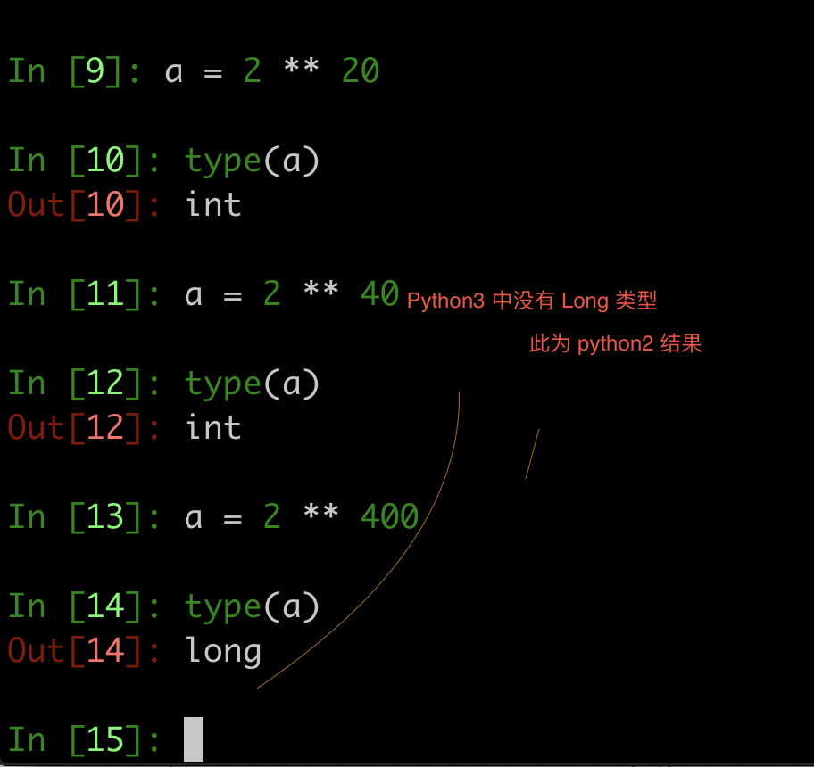
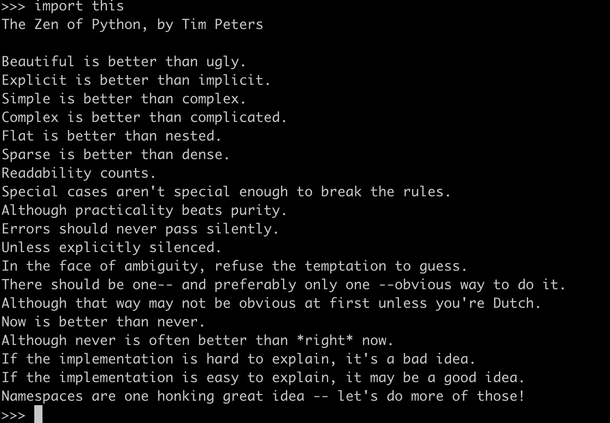

Python beijing chuanzhi. First day

Before video

Begin 9:40

## python develop

Web top: 25k, 人工智能，起薪高，3月中旬，web 开发结束，工作，余20人左右


> 职业 规划


一年两万多，两年两万多，选择重于努力。

## 上午科普

### 计算机组成原理

- cpu 电阻小 运算快

- 内存 (临时存储)

- 硬盘 (相对永久存储)

#### 计算机硬件组成原理

#### 计算机软件组成原理

操作系统可以操作硬件，可以直接和硬件打交道，10% c | c++, 90%, 80% 汇编, 如大江无人机（树莓派购买与编程）


## 下午基础知识，变量

## python 简介

python 创始人，Guido von .. 龟叔,

汇编 1 + 1 需要六行, 80 年代, 内存(RAM)只有 128kb, c 语言写代码都奢侈，

第二种方式 shell 脚本，c 语言实现 shell ls 都需要很多代码，(shell 只能完成简单特定的功能，但 c 可以实现飞机大战等，但很麻烦)

## TODO

- 找资料自学

- 资源群，90多人

- python 一天飞机大战，学习成本低，开发效率高

- 自学算法与数据结构，学生管理系统，自己写出来

> 讲的还不错, 严谨有条理

## python 变量以及类型


## python 数据类型的查看

## 标识符(由下划线字母数字组成，且不能以数字开头)

- 名字的总和, 如起的变量名


## python2 python3 对比

python2 中 int 类型 遇到很大的数字 会变为 long 类型

python3 中  int 可以存到 内存般大小的数据, 无long 类型



## Tip

- 计算机 世界上第一台计算机 ENIAC 硬件系统采用 冯·诺依曼体系架构

?补图

## FAQ

- （树莓派购买与编程）
-  计算机语言工作原理, - 图
  - 基本步骤，android ios(使用 c / 汇编太麻烦) 不能直接操作硬件，通过系统调用
- 编程语言是什么

  - 给计算机发布相对应的命令, 目前是开发应用软件(应用层), 不到系统层

  - 二进制 逢二进一， 电脑只能识别的就是 二进制， 计算机最高奖图灵讲(破译了德军密码，图灵机，使用的是二进制), 计算机作为机器识别数据，使用 01可以让计算机拥有读取数据的能力，根据 01 长度 组合配合编码完成数据识别

  - 安装的 python3 是 python 解释器，起如下编译的作用，将python编译成  二进制

  - 算法导论 800页，100页放弃，从入门到放弃, 作死

  - 算法图解

  - alt + command + l 格式化 python 代码

```python3

print('123') ---编译---> 计算机语言(0101)

```

- 操作系统承上启下作用

- ipython3 是啥

  - 相比 python3 perl 多了代码提示自动缩进

  - https://ipython.org/install.html

- RAM 是内存吗

    - 是的, 随机存取存储器（random access memory，RAM）又称作“随机存储器”，是与CPU直接交换数据的内部存储器，也叫主存(内存)

- 颈椎操
- 现在处理 速度，抢用户时代，比如都想到了 共享单车, 更期望使用开发速度快的，龟叔既希望像c那样调用到诸多接口，又可以像shell 那样简洁，abc 让龟叔看到了希望(abc最终未被接受，过于创新了)

- 现在之所以使用智能手机，3 - 4 年前，毕业 17 - 18 左右，ios android 学院倒闭了，大数据火，对数据进行处理，进行精确广告投放，数据过了，进一步数据分析，数据分析到一定程度，人工智能发展.1989 年为了打发圣诞节，Month Python's Flying Circus, 历时 3 年 开发出 python 解释器(将python 翻译成 0101), python 语言吸收了很多 abc 语言的优点，遵循当前市场行情

- 区块链为了保证数据准确性，为人工智能提供数据

```python
  HOW TO RETURN words document:
  .....
```

- 人生苦短我用 python, c 语言诞生于想玩联机游戏

- python 解释器源代码

- python 产生因为 c 语言过于麻烦

- RAM

随机存取存储器（random access memory，RAM）又称作“随机存储器”，是与CPU直接交换数据的内部存储器，也叫主存(内存)

- c 语言 开发慢，运行快，（编译成 01 不一样吗，非先编译边解释边执行）

- 腾讯两周多，吃鸡..加上线, 年终奖50月..最早 网易先开始做的

- 最终项目量化交易，可以去做金融方面的，一个项目做好了，分红越多

- 创建python社区，图形化数据工具，根据需求，定制实现代码

- 大多数量化交易使用 Python, 风控等

- 类似python内存管理也是类似代码封装

-  python 由于是解释型语言所以执行效率低些, 由于可以边解释边形成二进制，所以
可以跨平台, 而编译型语言之所有快(因为要提前编译好，再给到机器运行所以很快)

- c Gcc 编译成 什么? 对比 Java 字节码虚拟机运行

- 简单易学 开发效率高   开源 工具社区多，随着硬件发展 解释型语言已经不是问题

- php 和 Python 解释型语言所以 当初算 9999999 编译完和解释肯定是不一样的

- python 有很多 计算语言库

- python 在多方面优于shell脚本




- 爬虫实现 爬取电影天堂连接，60个网站频繁注册，一s 一条信息

- 住房公积金，1000， 公司1000，相当于 多给1000，按照最低 3500 交300， 工资多300，实际上亏了

- 两年未到两万 退步。。

- 三年未过两万.....， 10000 工资干8000 工作压力低长进少

- 五险一金部分, 一金交多好

- Python 2 在 2020 年元旦正式停止官方支持, 目前公司正在过渡(40%左右)，过渡流程用了 10年

- 阿里技术人， 阿里所有开源代码..

- 变量本身是没有类型 数据才有类型

- python pep8 编码规范

    https://blog.csdn.net/ratsniper/article/details/78954852#class-names-%E7%B1%BB%E5%90%8D

- \n \ 转义符，\n 将 n 转换为 换行

    print 函数源码中 增加了  \n

```python

print()
# 第一个参数边长
def print(self, *args, sep=' ', end='\n', file=None): # known special case of print

```

```python
# 注意 % f
>>> print('height %f' % 1)
height 1.000000

```

- %s 可以格式化 其他，%d 只能格式化数字

- %d %d 多个时 // %() 加() 包含值

- c ** = a;

```python3
c //= a 类似于 c = c // a 之前体会不深

```

- input 检测输入值

- python 飞机大战

- 视频补  5:10 - 5:18

- 11：26 - 10 28 重听

- 树莓派 体会硬件工作原理