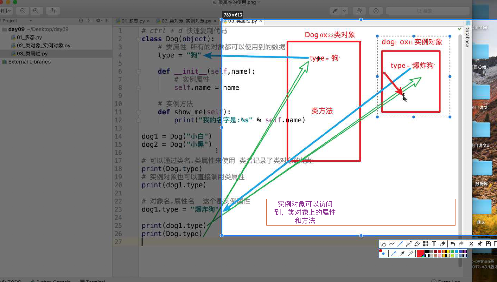

## python2 到 Python3 95% 都是一样的，很多小的软件和程序会自动名帮你转化，python3 兼容很多 python2 的东西

## 回忆

### 封装

- 封装进行 人员分工， 功能

- 继承 代码复用

- 多态 提高代码调用灵活度, 也是一种解耦合的思想，如下

> !注意耦合度，某一方工作影响到另一方工作，使用接口式编程来解决，比如 狗不管怎么变，都保证拥有 walk 方法，(使用父类或者接口), 这样人这个class 就不用变了，这叫解耦


- 实例对象可以访问到类对象空间，所以实例对象可以访问到类对象上的属性和方法，如静态，类方法，类属性





## 异常

- 程序运行过程中崩溃则停止，我们需要捕获异常


> 像如游戏过程中，即使出错了也不会崩溃

### 异常类型

> 我们需要知道异常是什么类型的才能更高地去处理错误, 按照异常类型来捕获异常


### 假设刚写的代码不知道准确异常是什么，怎么处理

#### 使用 Exception 可以捕获绝大多数异常


```python3

# Exception 直接进行处理
def test1():
	try:
		func01()
	except Exception  as result:
		print(result)


```

### 异常准确信息

```python3
except Exception  as result:
	print('有异常正在处理 =', e)

```

#### 常见异常

### 在我捕获 Exception 进行处理时，不能像 补获单个 异常一样直接进行处理， 但是  Exception as e 便可以根据 e 中内容识别不同异常了

### 错误类型的原因

> 所有的错误类型都是继承于  Exception 这个类型的，与 Object 很相似

能够很快地帮我们找到错误的原因

### 代码错误导致异常执行不到


### 异常自动上抛传递


### 异常传递性的好处

- 可以是的我们没必要做那么多异常的处理, 只需要在最顶层做异常的处理就可以了


### 异常捕获的完整语法

```python3

try:
	pass
except:
	pass
else:
	# if no exception
	pass

finally:
	# 不管有没有异常都会走的
	# 但是你不用 finally 直接关闭也可以啊?
	# 如 f.close()
	pass

```

> 使用try...except捕获错误还有一个巨大的好处，就是可以跨越多层调用，比如函数main()调用foo()，foo()调用bar()，结果bar()出错了，这时，只要main()捕获到了，就可以处理：

```python3

def foo(s):
    return 10 / int(s)

def bar(s):
    return foo(s) * 2

def main():
    try:
        bar('0')
    except Exception as e:
        print('Error:', e)
    finally:
        print('finally...')

```

### 异常的调用栈

> 如果错误没有被捕获，它就会一直往上抛，最后被Python解释器捕获，打印一个错误信息，然后程序退出。来看看err.py：


```python3

# err.py:
def foo(s):
    return 10 / int(s)

def bar(s):
    return foo(s) * 2

def main():
    bar('0')

main()

# output 

$ python3 err.py
Traceback (most recent call last):
  File "err.py", line 11, in <module>
    main()
  File "err.py", line 9, in main
    bar('0')
  File "err.py", line 6, in bar
    return foo(s) * 2
  File "err.py", line 3, in foo
    return 10 / int(s)
ZeroDivisionError: division by zero

```

> ！Traceback (most recent call last): 告诉我们错误的跟踪信息


## 模块 如 random 

> 形式 xx.py

### 自定义异常


- 自定义异常，出现的原因，很多异常不是程序全考虑到的， 比如年龄大于 90 岁 就不适合玩过山车了，所以在这些情况下我们需要自定义异常

```python3

class ShortInputException(Exception):
    '''自定义的异常类'''
    def __init__(self, length, atleast):
        #super().__init__()
        self.length = length
        self.atleast = atleast

    def __str__(self):
        return '输入的长度是 %d,长度至少应是 %d'% (self.length, self.atleast))

def main():
    try:
        s = input('请输入 --> ')
        if len(s) < 3:
            # raise 引发一个自定义的异常
            raise ShortInputException(len(s), 3)
    except ShortInputException as result:  # x这个变量被绑定到了错误的实例
        print('ShortInputException:' % result)
    else:
        print('没有异常发生.')

main()


```

### 异常关闭文件


### python 作为工具 + 金融，工资会非常高

## 模块 一个 py文件(前人写好的很好的，很常用的很好的模块，如 random)

### 先从当前路径找，找不到 再从 sys.path 中去找

> 不一定都在一个包里，路径在一个搜索列表的路径中，比如后边我们要学习的 flask 框架，模块就在 flask包中


> 搜索路径. 之所以配置环境变量，Pycharm 会从 sys.path 目录依次去找所需要的模块


> 两种使用 使用别人写好的模块，自己写模块让别人导入

- 

> 模块原理


### 模块的导入,  fff ii as *  

> 使用快速记忆法 提高效率 10倍左右, import import as, form  import 方法 as, from import 方法, 还有最后一个 *

> 模块导入实际上就是把一个写好的，py 文件导入到当前的py文件中进行使用， 使用方式 模块名.方法名

> 模块名也是标识符，要遵循标识符的书写规范

> import 和 from 有本质上的区别 高级时再讲

- import 模块名1， 模块名2   # 最常用的也是最安全的，其他导入模式都有自己的不足，都有可能产生自己的不足
- import 模块名 as 别名 # 接解决 命名冲突的问题, 使它简洁, 注意一旦起了别名必须使用 别名，原名不好用了将
- from 模块名 import 功能名 # from 模块名 import 方法 
- from 模块名 import *  # 可以直接写模块的方法 调用
- from 模块名 import 功能名 as 别名

> ! 注意写模块名的时候 不要 和关键字冲突, 否则则无法导入, 但是 系统级方法是可以重名导入的 如 random

### 导入不同目录的包

```python3

  有一个文件夹/home/a, 里面有个模块叫b.py, 我怎么把他import到程序里？

方法一:    (属于刚开始分析的代码里第一种情况)

import sys; 
sys.path.append(“/home/a/”) 
import b

方法二：

  在目录里面增加__init__.py文件，里面可以写import时执行的代码，当然也可以留空就可以. 
import home.a.b

方法三：

from home.a.b import * 
  前提 home、a中都包括__init__.py 即：要导入的文件的当前目录和父目录都要有init.py文件

import ran.ran1

# e.checkAge()
# hi()
# r.ran()
ran.ran1.func1()

```

## 包


### 包中的 __init__.py


> 解决模块之间名字易冲突问题，可以把完成共同某一功能, 如之前 import random & import zhangsan.random

## python2 python3 的很多特点

### python2 vs python3

- python2 不支持直接输入汉语，需要指定编码格式

```python2
# 文件首部, 一定要放在最上边
# coding = utf-8

```

- python2 print 无 () python3 有

- python2 中会把 输入的 字符串当成代码执行，python3 就是输出 字符串跟 Python3 中的 eval 很像(input 模式下)

- python2 中的 raw_input 和 python3 中的 input 是一样的

- python2 和 python3 中的经典类和新式类，python2 中如果不写继承 object python3 默认就是继承 object

- python2 中字典键的判断  有 has_key python3 中没有

## TODO

- 9.49 - 953 再复听下

- 把 廖雪峰的 Python, 以及 github 上的 python 开源项目多看看嘛


## ------------------- 下午 -------------------

## Better world

- 一个父母让孩子去美国学金融，孩子要学医学，去非洲无国界医生，父母说，是不是年纪大了进步慢了， 父母想给孩子一个 better life, 孩子想要一个 better world

- 3D 打印技术总监，40 左右，离职协议，一年不能找本行工作，照常开工资, 婚姻边缘，来学python

## FAQ

- finnally 关闭文件，以及 Python try 作用域问题

- 所有程序在找什么的时候都会有默认搜索路径，如环境变量

- finally 作用

- 现在可以做贪吃蛇，飞机大战

- 解决模块异常导入的现象, pycharm 中输入 __main__ 即可出现

```python3

if __name__ == '__main__':
    test()

```

- __all__ 的使用 仅仅针对 以 * 的方式


```python3


```
 - 4:47 重听必须 __all__ , 不想让人知道，但它通过all的方式很可能无意中调用到了，如加工资，虽说不通过 * 可以使用，但是也要我告诉你才好~


- 包以及使用，导入思考清楚，上一级，导入写到包，与写到模块 _pycache_文件

> 有没有 __init__.py 并不影响，除了 from 包名(注意是包名，不是到 .py 文件) import * 时 ，必须要有 __init__ 方法 以及 __all__

- __pycache__ file & empty condition

__pycache__ 在pycharm 下隐藏了，内容为缓存 模块被导入时，生成的 pyc 文件(字节码), 如果下次运行未发生更改直接使用

在 sublime 下看不到，这个文件夹的内容，Pycharm 下这个文件设置隐藏了

# 导入模块注意事项

需要 当 import * 一个 模块时，需要 __init__.py(必须要加 __all__), 以及当引入相对目录外层 模块时需要 __init__.py
