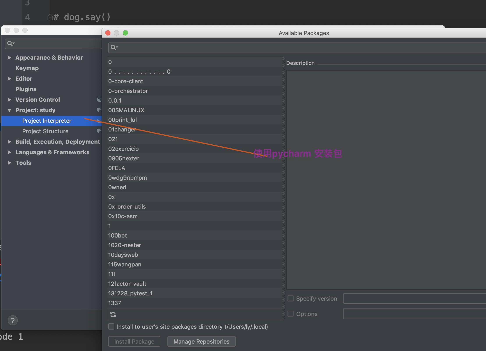

## python 中一切皆对象

## 回忆

- php 异常上抛，一直到捕获异常的位置

- 为什么要有自定义异常，可以提示程序未提供出来的异常信息(如年龄不合格)

## 一切皆对象，类 10,.. 都是由对象创建的

```

x.__class__ # 获取创建这个对象的类

a = 10
a.__class__  # int

# 元类 会用的时候 就会用了 不会的时候就不会
# 类也是对象  __class__ 为 type（元类，所有的类都是由它创建的）

```

## 飞机大战, 飞机大战只是基础原理，可以根据此写自己其他的东西, 如贪吃蛇等是一样的

- 视觉残留

如果一张图片 24-60张/s  就不会有视觉残留，这样就是动画了(游戏一般都是 60 贞，很多电影都是 24贞的, 一张图就是 1 贞)

- 分辨率


- 有个问题k

> 这里讲的应该是重绘原理


> 游戏开始

- 1 画图图片


## Tip
- 修电脑整个屏幕都是花，应用，电脑修好了
- 通过pycharm 安装包


- 以后写python 先写 if \__name__ == '\__main__'

## Faq

- \__class__ 属性来源 以及 如 \__name__ 这些属性记忆

- 11： 47 重听， 因为聊天走深 from pygame.locals import *  11:57 多个重影那里


- pygame.__file__ 以及这个文件的由来 对比 __class__

- conda 使用以及原理

  - 为何解决了问题

```sh

软连接

ln -s /Users/ly/miniconda3 /usr/local/bin/conda

```

https://blog.csdn.net/qq_24909089/article/details/83542526

- 飞机大战体会如何设计类，条条大路通罗马

- 深刻体会飞机大战的类，以及逻辑执行，以及多个不同对象在内存中存储工作,每一个类是每一个啊，如子弹，如飞机


- pygame 测试

```sh
python3 -m pygame.examples.aliens
```

- 补  11:00 - 11:44 基础视频

- 读源代码

## Faq

- break 跳出(当前)循环

- 出了 random.ranint 基本都是左闭右开

- 字符串 [-4, -1] -1 代表最后一个位置，因为左闭右开, [-1, -4] 取不到 因为 范围是错误的 所以最后一位也取不到，而 [-1, -4, -1]可以 第三个参数出了步长还有方向
