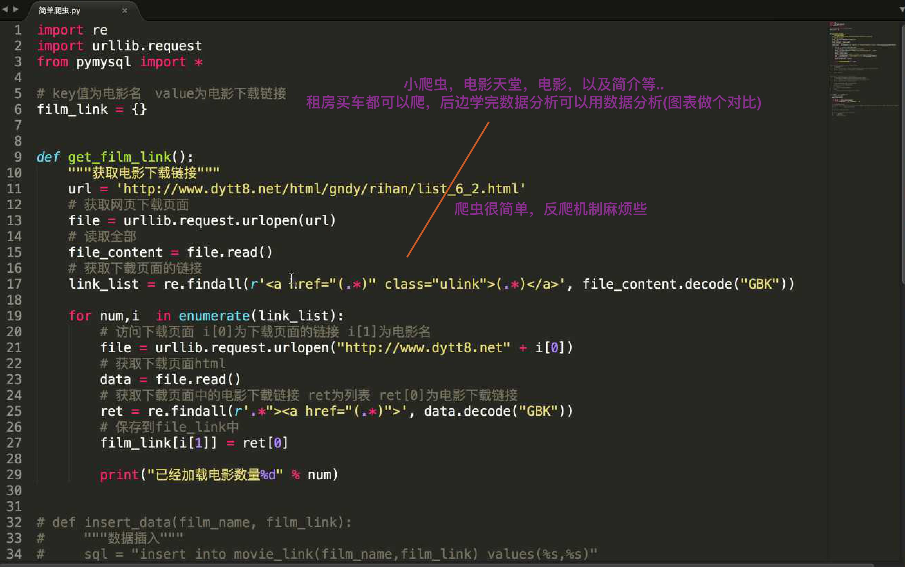
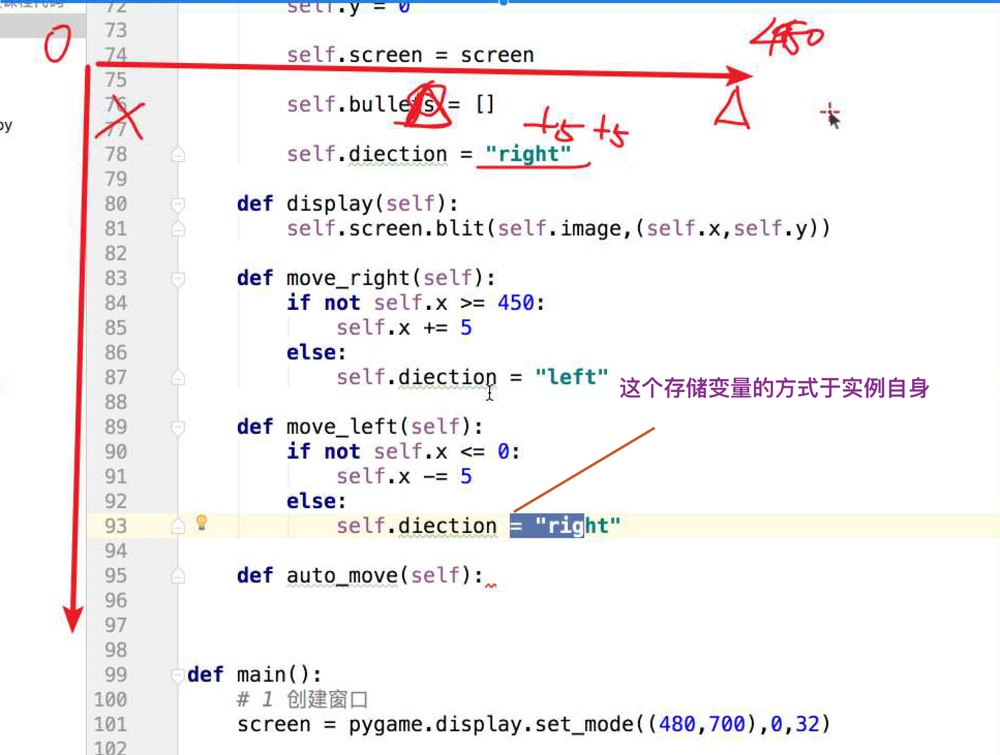

## Tip

- command + b 跳转， 和 vim 向上找到字符, command + b 可以查看源码

- 体会容器中放对象，容器中对象是可变的， 如 飞机容器中放子弹， 类和实例都是一个容器

- list 增有 insert 方法

- 元组可以相加，但是返回一个新的元组，列表也是可以相加的

- 字典 键位 必须是可哈希的 不可变数据类型

- 今天默写下吧

- python 函数 不写 return 时 给你的 是 None, 不是没有东西

- hash 加保证一个唯一值

- 都能干活 就只能通过其他方面来筛选了，像公务员一样不是干不了 而是筛选下，再难也就把数据结构和算法提一下，冒泡，选择，快排

- 基本算法 几种就好了

- 数据结构会讲一下

- 最基础的二进制方式可以读取任意数据

- 先看算法 在看数据接口，800页算法导论，苦涩无味

- 数据结构是有限的 就那么多

- 对于私有属性的 名字， set get 只是约定俗称

- 调用父类方法 父类名加父类方法(多继承使用), 多重继承使用 Super() 较好

- 算法图解

- 补发资料

- 人工智能 ，，日本留学 学霸

- 笔记?

- python 实例

- 原来是强用 Php7.3 的原因, 为什么 7.1 这样?
