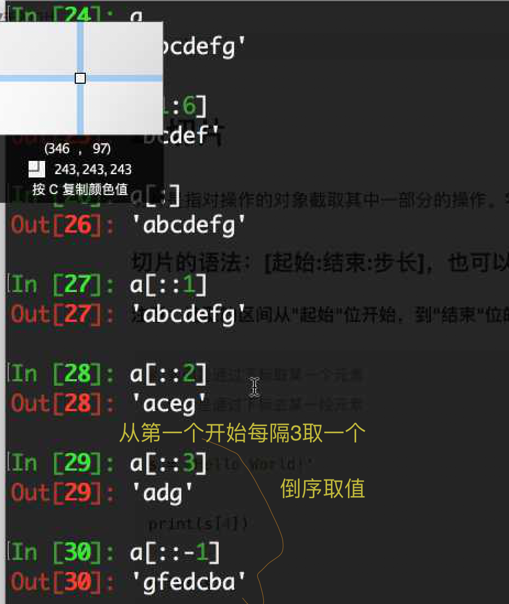
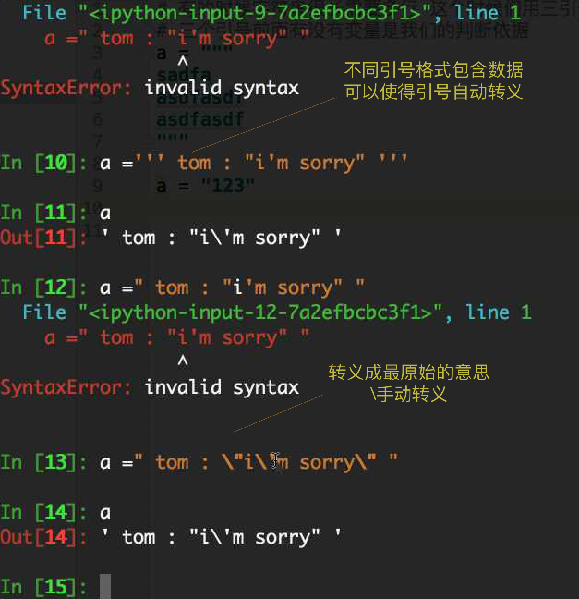

## 11.9


## 现在开始 加入一些原理，如 for 循环原理， 字符串  数字类型底层区别


## While else

> 如果 while 中没有  break, 执行完循环后会走 break, 如果执行了 break 则不走else

## 字符串

- 定义

- 方法

  - count() 取位数
  - replace(source, replace_str, times)
  - find(source_str, start, end)
  - index(source_str, start, end) 找不到报错
  - split(' ', TIMES) TIMES 切割几次
  - title() 不仅将所有单词首字母大写而且还矫正了不规范的大小写
  - ljsut rjust center lstrip rstrip
  - partition 以xx分割为三部分
  - splitlines 以 \n 分割
  - isalpha(判断是否全是字母) isdigit(判断是否全是数字)
  - isalnum() 判断是佛全是数字字母有空格则报错
  - join

  ```Python
    str = '123'
    list = ['a', 'b', 'c', 'd']
    str.join(list) # output 'a123 b123..'

  ```
```Python
>>> a = 'TiTLe hEEllo'
>>> a.title()
'Title Heello'
```

- 切片

切片是前闭后开的，包含开始，不包含结束

> * 切片 : 是按照从 0 开始的下标开始的

> 默认从左往右取，以下标取(从0开始), 步长为负数 从 右往左走，前闭后开

> 字符串反转 str[::-1]

> 字符串截掉第一位 str[1:]




## 下午讲列表(数据存储容器增删改查)

> 参照本章尾表


## Tip

- c 语言中并没有字符串这些方法

### 语音检测，中移动联通

## 名片管理系统，现在版本，函数版本，升级版本

## FAQ

- 列表通常用来存储一类信息，字典存储人之类的信息

- 字符串转义



```python
# 当内外引号不同时，内部引号自动转义， 转义成没有意义的 "
# \n 是将没有意义的 n 转义成 有意义的 n
# 或者手动转义，思考下🤔
b = ''' hello, "i'm li_lei"'''

c = "hi, 'i'm wang '"

d = "hi, \"i\'m ha\" "

print(b, c, d)
```

- 计算机中最小存储单位是 字节(1kb = 1024 bit), 1个字节 = 8个比特('abcde', a 占一个字节?)

- python '123.123' 带小数的字符串无法直接 int() 转 需要 int(float('213.66')) 会直接丢失小数部分


- 离开 360, 滴滴，ofo，网易 好进, 小公司杂，东西多, 工资容易翻一倍

- baidu, tengxun, ali, 很难近，难进因为不社招了

- 先去大公司，一两年，再去小公司, 传智，阿里xx创基金投资

- 开始不知道怎么写的时候  先 pass

## python 容器操作

- python append 可将某个列表加入元列表中
- dict[] 取不到值时报错，get 返回默认值
- 字典其实无外乎三种，dict.keys(), dict.values(), dict.items()
- 字典 元组 集合 列表 公共方法 pop, in, clear
- \+ * 字符串 列表 元组

|      | 列表 []    |   元组 (1,)    |  集合 Set{}    | 字典 {}|
| :------------- | :------------- | :------------- | :------------- |
|  添加       | insert append extend   | No | | dict[key] = value,  |
|  删除       | del pop remove  clear    | No | | del, pop, clear |
|  修改       | [index] = new_val  | No | | [{key} = value] |
|  查询       |  in, not in, index('source', start, end), count       | tuple.index(ele), tuple[index], tuple.count | | dict[], get() |
|  遍历       | for..in, while  | for..in, while | | for...in, while, (dict.keys, dict.values, dict.items) |
|  其他       | [::-1], reverse(), sort(reverse = true)  |  | | ||
