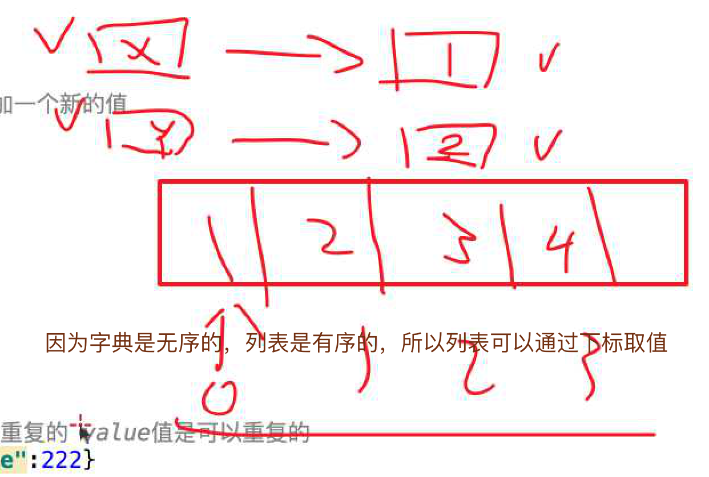
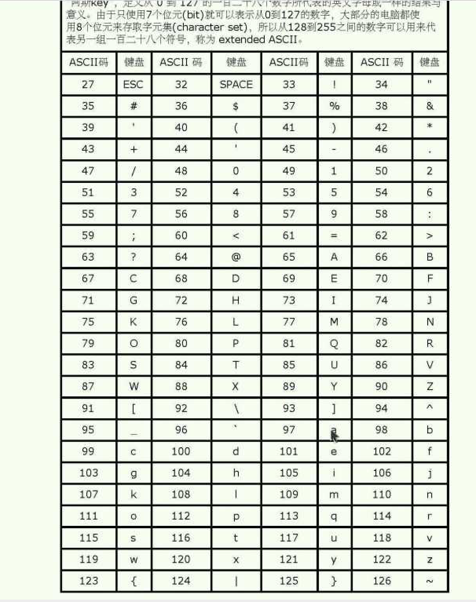
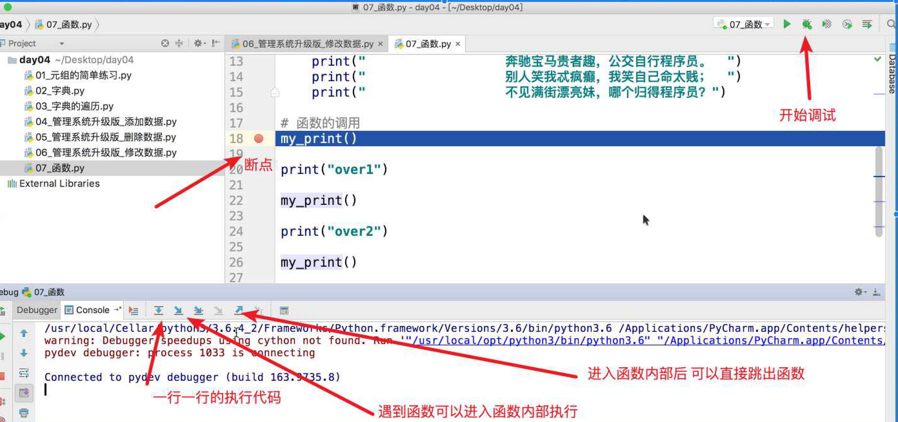
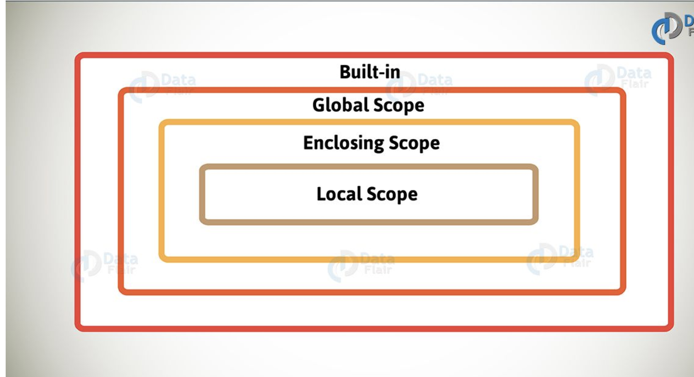
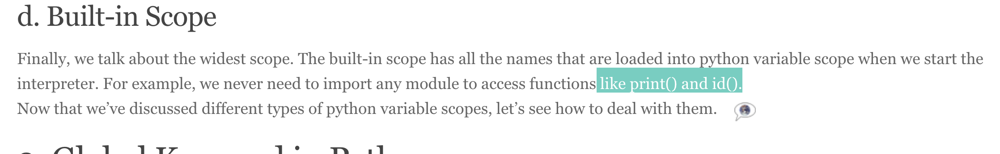

## 元组(Tuple)

> 列表通常存储相同数据，元组提供的数据不可修改

- 在定义一个元素的元组的时候 需要加 ,

```Python
tuple_ = (1, )
```

## 字典(无序) {key: value ....}

> 字典 for in 遍历默认打印的是 字典的 Key 值

```python

dict.keys, dict.values, dict.items

```

## python 拆包使用语法

> 在字典遍历时，dict.items()   item in dict.items（） -> i,j in dict.items()

```python
a = (1, 2)
a, b = (1, 2) # a = 1, b = 1

# 用于字典上

for key, val in dict_.items():
    print('key %s, value %s' % (key, val))

```



## Ascii



> 不同二进制码对应了不同的数字，通过 Ascii 码来对照识别

## 进制

十进制 逢十进1，二进制逢2进1， 一个数字可以用 十进制 也可以用 二进制表示

参考昨日

> 字典强调点

- 字典无法通过下标取值
- 排序的意义是通过下标取值，所以字典中的数据存储是无序的

与生活中字典相似，你可以根据key(目录  ), 找到其解释

## enumerate, 将列表 序号 以及 值打印

- enumerate() 函数用于将一个可遍历的数据对象(如列表、元组或字符串)组合为一个索引序列，同时列出数据和数据下标，一般用在 for 循环当中。


```Python
>>> chars = ['a', 'b', 'c', 'd']
>>> for i, chr in enumerate(chars):
...     print("%d %s"%(i, chr))
...
0 a
1 b
2 c
3 d

# ----------------------------------
>>> list_ = [1, 3, 4, 5, 6]
>>> enumerate(list_)
<enumerate object at 0x10bd883f0>
>>>

0x10bd883f0 为16进制 表示一个内存地址

```

## 函数

> 在 python 中，类型属于对象，变量是没有类型的：如

### debug



```Python

a=[1,2,3]
[1,2,3] 是 List 类型，"Runoob" 是 String 类型，而变量 a 是没有类型，她仅仅是一个对象的引用（一个指针

```

## Pycharm debug

1. show execution point (F10)
显示目前项目所有断点

2. step over (F8)
下一步但仅限于设置断点的文件

3. step into (F7)
执行下一行

4. step into my code (Alt+Shift+F7)
执行下一行但忽略libraries（导入库的语句）

5. force step into (Alt+Shift+F7)
执行下一行忽略lib和构造对象等

6. step out (Shift+F8)
当单步执行到子函数内时，用step out就可以执行完子函数余下部分，并返回到上一层函数。

7. run to cursor (Alt+F9)
直接跳到下一个断点


### 参数

> 默认参数从后向前开始加，如果后边没有前边则不能有

- 必需参数
  - 必需参数须以正确的顺序传入函数。调用时的数量必须和声明时的一样。
- 关键字参数
  - 关键词参数可以让函数参数顺序和函数定义不一致如

```Python
  def print_(name, age):
    print('name is %s age is %s' %(name, age))
  print_(age = 13, name = 'js')
```

- 默认参数

### 函数 参数默认值给定 需要 从 右边开始给定，如果一个参数右侧没有默认参数 则此参数也不能有默认值

  - 调用函数时，如果没有传递参数，则会使用默认参数

```Python3
  def print_(name = 11, age):
    print('name is %s, age is%s' %(name, age))
  print()

# 如上写法是错误的
需要将默认参数放在后边
SyntaxError: non-default argument follows default argument


```

- 不定长参数

  - 加了星号 * 的参数会以元组(tuple)的形式导入，存放所有未命名的变量参数。

```python3

  # 默认参数
def print_default(name=1, *age):
    print(type(age))  # tuple
    print('name is %s age is %s' % (name, age))  # (10, 11, 12)


print_default(9, 10, 11, 12)

  ```

  - 还有一种就是参数带两个星号 \**基本语法如下：

```python3

  def print_dict(name=1, **age):
  print(name, age)
  print_dict(a=1, b=2)

  ```
> 如果单独出现星号 * 后的参数必须用关键字传入。

```python3


def cal_(a, *, c):
    print(a, c)


cal_(1, c=3)


```

- lambda

```python3

size = 20

# ？lambda 函数拥有自己的命名空间，且不能访问自己参数列表之外或全局命名空间里的参数。
def con_():
    age = 1
    # 可访问全局啊
    return lambda a, b: a + b + age + size


res = con_()(1, 2)
print(res)  # output 24

```


```python

# 内建函数
print()


```

## 变量作用域

>python 中只有模块（module），类（class）以及函数（def、lambda）才会引入新的作用域，其它的代码块（如 if/elif/else/、try/except、for/while等）是不会引入新的作用域的

global 和 nonlocal关键字

- 当内部作用域想修改外部作用域的变量时，就要用到global和nonlocal关键字了。


- L （Local） 局部作用域
- E （Enclosing） 闭包函数外的函数中
- G （Global） 全局作用域
- B （Built-in） 内建作用域

以 L –> E –> G –>B 的规则查找，即：在局部找不到，便会去局部外的局部找（例如闭包），再找不到就会去全局找，再者去内建中找。

## Tip

- 得失，高管离婚率很多，如俄罗斯留学，成就与牺牲


## FAQ

> 在存储结构上，字典见缝插针，不需要连续的空间存储数据，列表是需要的

- python r 保持字符串原意

- 后期有  Python 高级课程

- r python 中 r 表示 转移符  \ 保持原意

```python

print(r'\n')  # output /n 因为打印时  \\ 前 \将后转义
word = r'\n' # word '\\n' 因为 单个  \ 不能与 ‘ 连接存在所以 是 \\

```

- xxx.print IDE 可以直接输出

- non-default argument follows default argument

在编程中出现 non-default parameter follows default parameter 这种错误原因是将没有默认值的参数在定义时放在了有默认值的参数的后面,如下所示:

```Python
def test(self,a=1,b):
    self.a=a
    self.b=b
>>SyntaxError: non-default argument follows default argument

# right
def test(self,b,a=1):
     self.a=a
     self.b=b
>>Process finished with exit code 0
```


- 12306 图像识别哪个是凤姐，验证码状态，小视频网站，你每想看一个视频必须输入验证码，验证码来自我想爬的网站


- python 闭包函数作用域 与 内建 作用域

非本地全局内置的 就是 nolcoal 就是闭包作用域


https://data-flair.training/blogs/python-variable-scope/



