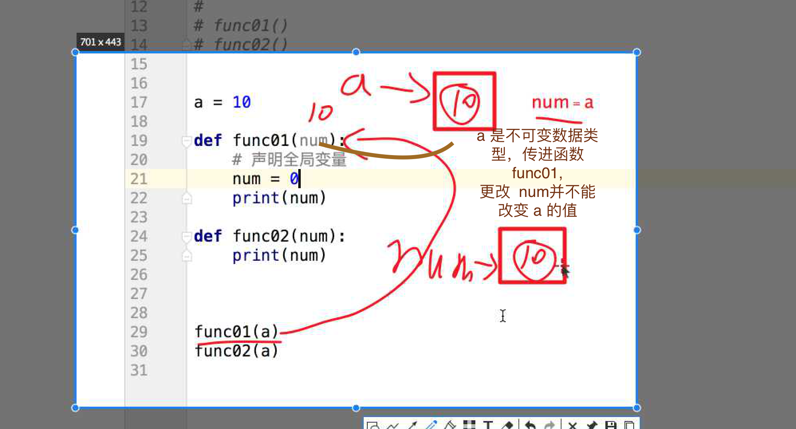

## 第一个投资传智的人 35岁，刘波明上位，传智创始人，于 35岁写讲义时，积劳过渡


## 函数

### 函数执行原理


- python 全局变量

python 中的全局变量访问不需要通过 global, 更改值需要 通过，global
Php 访问使用都需要 加 global

- 多个返回值

```python3

def call_():
    return 10, 20, 30


a, b, c = call_()
print(a, b, c)


```

### 不定长参数的拆包


### python 函数的参数传递：

不可变类型：类似 c++ 的值传递，如 整数、字符串、元组。如fun（a），传递的只是a的值，没有影响a对象本身。比如在 fun（a）内部修改 a 的值，只是修改另一个复制的对象，不会影响 a 本身。

可变类型：类似 c++ 的引用传递，如 列表，字典。如 fun（la），则是将 la 真正的传过去，修改后fun外部的la也会受影响

python 中一切都是对象，严格意义我们不能说值传递还是引用传递，我们应该说传不可变对象和传可变对象。


## Tip

- += 与 =+

- 'abc'.[0] 可取到数据，100[1]无法取到原理

- 函数多个返回值

-  定义默认参数要牢记一点：默认参数必须指向不变对象！

```python3

def add_end(L=[]):
    L.append('END')
    return L

add_end()
>>> ['END']
>>> add_end()
['END', 'END']
>>> add_end()
['END', 'END', 'END']

```

## 引用 不可变数据类型 可变数据类型

- 不可变数据类型




- 现在不学c 先不讨论内存区, 内存中最小单位 1 字节(=8个二进制位也就是 8个 比特，1kb = 1024 字节)

- 打印 function 实际上打印的 是 0x11 的地址值

## 引用

可以认为地址就是引用，引用就是地址

## 思考为什么字符串可以根据索引取值而数字不可以


## FAQ

- python 参数类型

- 必选参数、默认参数、可变参数、关键字参数和命名关键字参数(必默可关命)

```python3
ef f1(a, b, c=0, *args, **kw):
    print('a =', a, 'b =', b, 'c =', c, 'args =', args, 'kw =', kw)

>>> args = (1, 2, 3, 4)
>>> kw = {'d': 99, 'x': '#'}
>>> f1(*args, **kw)
```

- 编写函数时，参数类型错误要扔出异常

```python3

def multiply(nums):
    for i in nums:
        if not isinstance(i,(int,float)):
            raise 'typeError'
    sum = 1
    for num in nums:
        sum = num
    return sum

```

- 思考

```python3

a = 10

# never use sum_
def update(sum_):
    sum_ = 0
    print(sum_)  # 0

update(a)
print(a)  # 10

```

```python3
def fun1(a,L=[]):
    L.append(a)
    return L

print fun1(1)
print fun1(2)
print fun1(3)

def fun2(a,L = None):
    if L is None:
        L=[]
    L.append(a)
    return L

print fun2(1)
print fun2(2)
print fun2(3)

output

[1]
[1, 2]
[1, 2, 3]
[1]
[2]
[3]

# func2 每次都执行，func1 定义函数时，解析到 __defaults__

```

https://stackoverflow.com/questions/32326777/python-default-arguments-evaluation

- 拆包，列表也可以拆包

```python3
a,b = [1, 2]
a # 1
```

- 为什么 有默认值参数放于无默认参数后边

  完全可以 len(params) - 必传 = 可选参数, 可能设计时这样麻烦些吧，百度写的都不对, 当做设计如此吧。两种均可，设计时选了这一种

- 解包

```python
(1, 2, 3)  

# *(1, 2, 3) => 1, 2, 3

```

- 现在服务器适合用 go

- unity3d 开始 7000 开始你就学习就好了，签协议，3 年以内不可离职，有法律效力

- 内存中最小单位 1 字节

- 毕业 bit

- 一个 Int 类型 四个字节(byte)，float 类型 8个字节 （350 重听, 没听清楚存的是首地址，应该是, 不必了很确定）
    - 变量只存储内存的首地址，如, 函数 id, 存一个往后再找三个就是了
    - 为什么int类型占四个字节, 图


- 为什么要有数据类型，因为


- get到了int的表示范围，原理，虽然不像  java go, 分配多少就是多少

- 思考二进制，与十进制 字符串传入执行，如 255 -> 1111111 计算机识别 0, 1, 以后常用二进制！！！

- 虽然 1个字节(byte) 8位，但是会预留一个 位置表示正负， 7 个比特位 用二进制计算机算最大值为 127也就是 +127 到 -127 所以， 也就是 ascii 总共 127 个


- 对于不可变数据类型， 如果赋值相同则内存地址相同，而为什么 两个 id 用 is 判断不相等呢


- 那汉子怎么表示, 其实 可以用  utf-8(又称万国网, 码位大且长，但是不是用一个字节对应来对应一个汉子了~根据汉子转为 二进制文件)


- gbk 是 window 常用的编码格式, 有时候你用 window 存了一个数据，再用 Linux 打开乱码了，因为再 linux 上的编码，和 window上的编码格式不一样


- 对于 命令行中，输入 < -5 || > 257 的数字， id 值不相同

> 但是在一个py文件或是命令行的一个 def 中 1000 的 id 也是相同的
参考 https://www.cnblogs.com/lilz/p/9410319.html

  1. 一个模块文件、一个函数体、一个类、交互式命令中的单行代码都叫做一个代码块。
  2、小整数对象[-5,256]是全局解释器范围内被重复使用，永远不会被GC回收。(即使不符合1条件也可以)
  3. 对于字符串  字符串中单个*20以内他们的内存地址一样，单个*21以上，内存地址不一样

- python 对比 c

  - c 语言  a = 10, b = 10, 会新开空间，但是 c 依旧省空间, 因为Python 动态分配空间时，如果发现不够了，此时数越大，动态给的空间越多所以 c 更节省

- b +=b 对比 b = b+b

> 因为当是引用数据类型时， b += b; 时相当于在原先内存空间上扩展，此时相当于 b.append, b = b + b 相当于赋值 开辟一个新地址(此时打印a的值 a 不会变，前者a会变)


- 字典的 key 只能是 不可变类型不能是可变类型, 原因是可变类型是不可哈希的
```python
TypeError: unhashable type: 'list'
```

- 字典为什么用hash,  540 重听 聊天了 -> 551


```python
 除了字典，列表等都是连续性空间, 但是字典不是连续的, 字典内部其实是链表结构，一个key 里边存了
 下一个key的地址，以及他自己的value
 
 字符串和字符串是否相等判断原理是 先判断第一个字符，如果一样，继续往后走，如果不相等，直接返回不相等
 ，所以 dict[key], 在找Key时，速度很慢，于是使用 hash 转为数字，直接使用 == 进行判断,
 
 在字典中存的也是，对字典的键Hash之后的值
 
 >>> hash('a')
1718225531288867470

hash 必须作用不可变数据类型, hash的值不能变，会对相应字符进行编码，且值唯一

>>> a = {[1]:2}
Traceback (most recent call last):
  File "<stdin>", line 1, in <module>
TypeError: unhashable type: 'list'
 

```


- hash 加保证一个唯一值
