## 类，继承, 私有属性和方法，单继承多继承, 子类重写父类方法

### 继承的好处, 可以对重复的代码进行封装

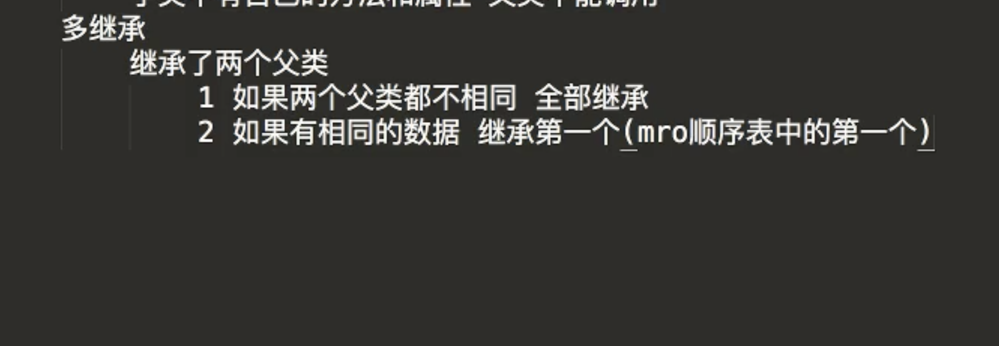


- python 中的私有属性是不安全的

- 作为一个 Python 一个程序员是不需要多态的，因为 Python 这个语言已经帮你优化完了， 考虑


## python 类

### 私有属性使用  & set & get


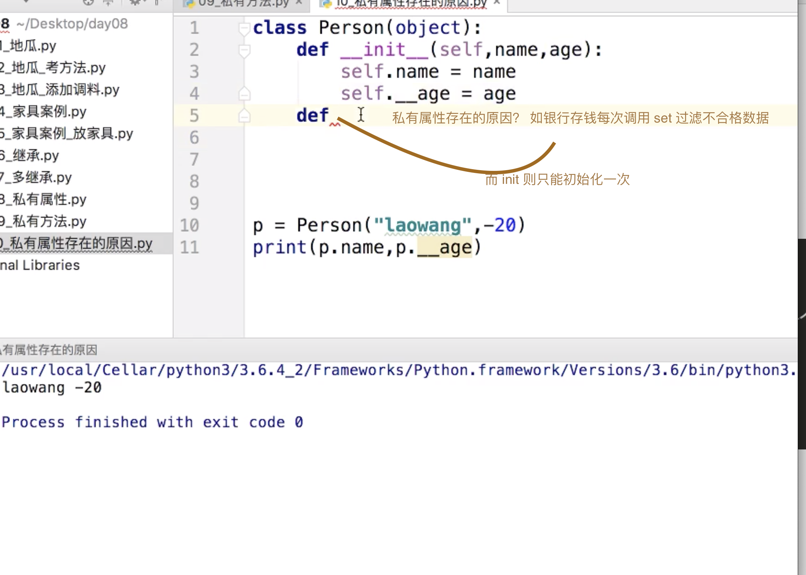

## lambda 使用

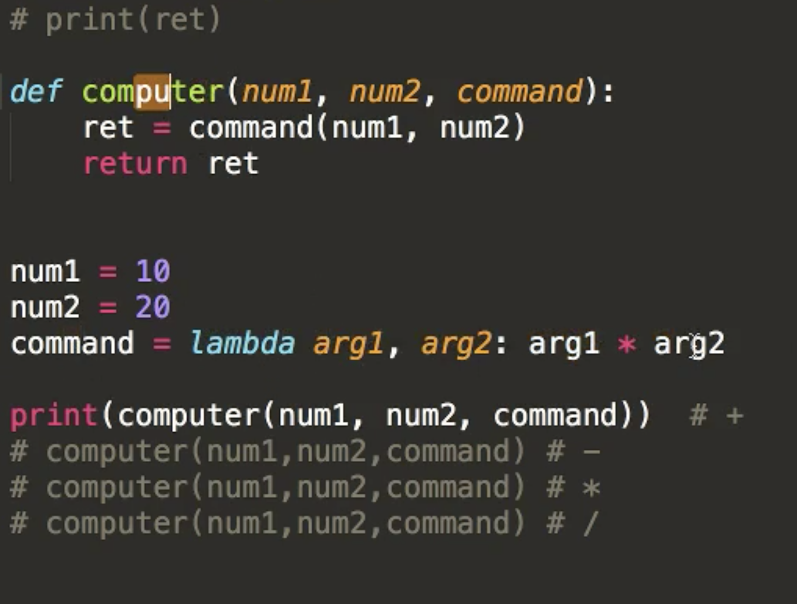


### 内置类属性 (ddnbm)

```

__dict__ : 类的属性（包含一个字典，由类的数据属性组成）
__doc__ :类的文档字符串
__name__: 类名
__module__: 类定义所在的模块（类的全名是'__main__.className'，如果类位于一个导入模块mymod中，那么className.__module__ 等于 mymod）
__bases__ : 类的所有父类构成元素（包含了一个由所有父类组成的元组）

```

## 继承

单继承子类可以调用父类方法， 父类无法调用子类方法，多继承若是继承的第二个类和第一个有共同的方法，则第二个类的方法被第一个类覆盖, 由c3算法mro数据表决定的

### 继承内存模型分析


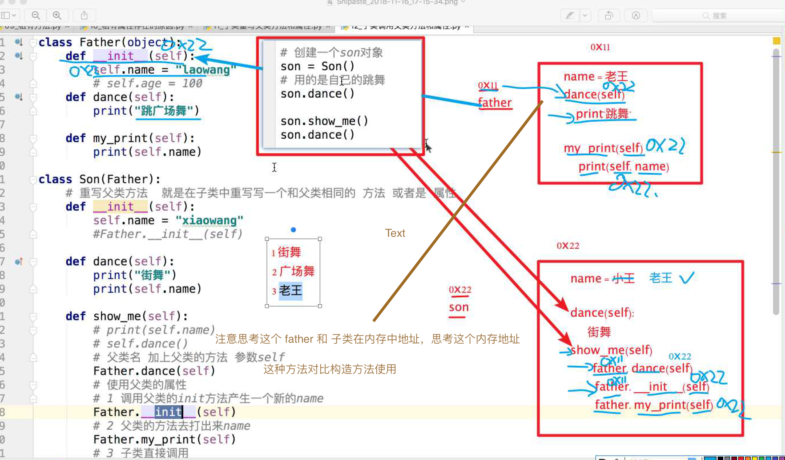

### 获取父类私有属性

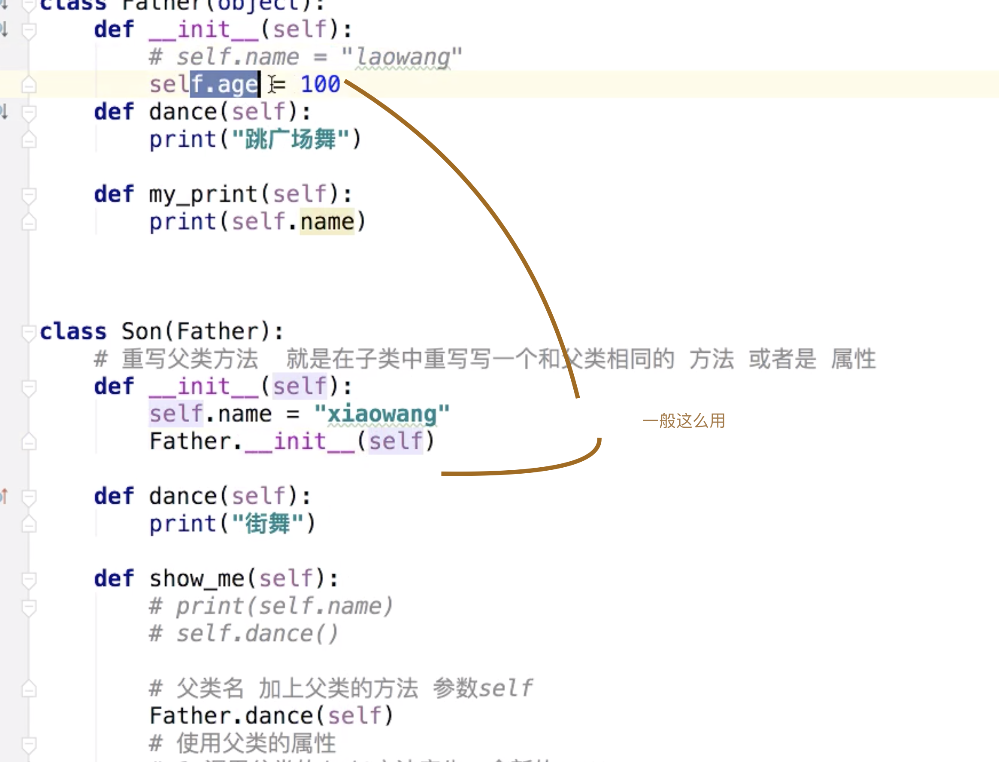

## 子调用父类方法

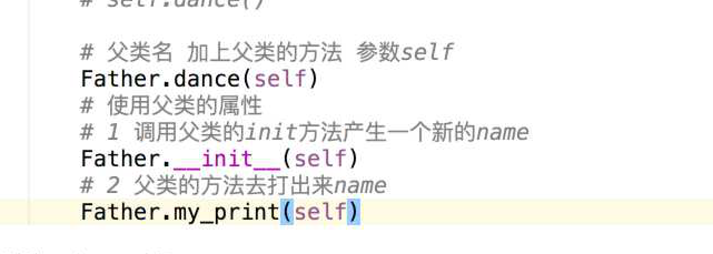
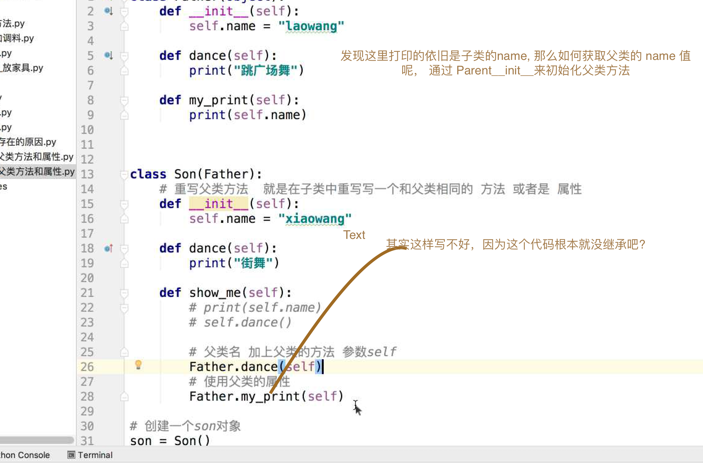

### 多继承


一个子类继承多个父类

- 若是父类方法名相同，从左向右找，找到第一个为止

### 多层继承 

- 和继承基本一样

派生类的基类有自己的基类，如 子 -> 父 -> 爷

## 类的私有属性和私有方法

- 只需要在函数名或者属性名前加两个 __ 即可

### 私有属性和私有方法特点

- 私有属性和私有方法都无法在类之外访问

- 不能被子类继承

- 私有属性 和 私有方法 往往用来处理类内部的事情，不能再类外部访问 起到 安全作用

- 可以通过访问一个方法 间接访问私有属性

### 私有属性存在的原因

- 不想让别人使用

- 私有属性可以设置  set get 函数来获取和设置

### 重写

- 子类写一个和父类方法名一样的方法


## 私有属性可以从外部获取到，因为 Python 不是非常严谨，所以可以从外部获取到，仅作为拓展


## 记忆

> 当子类继承父类， 不写 __init__ 方法时， Python 会默认帮你在子类上调用父类 __init__, (可以手写 子类 __init__ 方法父类)

```python3

class Parent:
    def __init__(self, name):
        self.name = name


class Child(Parent):
    pass


child = Child('qi')


```

> 类的专有方法：
__init__ : 构造函数，在生成对象时调用
__del__ : 析构函数，释放对象时使用
__repr__ : 打印，转换
__setitem__ : 按照索引赋值
__getitem__: 按照索引获取值
__len__: 获得长度
__cmp__: 比较运算
__call__: 函数调用
__add__: 加运算
__sub__: 减运算
__mul__: 乘运算
__truediv__: 除运算
__mod__: 求余运算
__pow__: 乘方


> 使用实例
```python3

#!/usr/bin/python3
 
class Vector:
   def __init__(self, a, b):
      self.a = a
      self.b = b
 
   def __str__(self):
      return 'Vector (%d, %d)' % (self.a, self.b)
   
   def __add__(self,other):
      return Vector(self.a + other.a, self.b + other.b)
 
v1 = Vector(2,10)
v2 = Vector(5,-2)
print (v1 + v2)


```


## TODO 

- 记忆 laravel php & go nodejs，leetcode

- python 命名等，通过读 github 代码方式

- 类的内置属性 ddnbm


## FAQ 

- 类似静态方法直接调用的属性

```python3


In [15]: class MyClass:
    ...:     """一个简单的类实例"""
    ...:     i = 12345
    ...:     def f(self):
    ...:         return 'hello world'
    ...:


 MyClass.i
Out[17]: 12345

MyClass.f()

TypeError: f() missing 1 required positional argument: 'self'

```


-  一个 python 文件  ./ 执行发生了什么事， 以及Python 文件首部的 /usr/local/bin

- 体会继承 调用 super 方法, 原理很像  js 的 call 和 apply

```python3

#!/usr/bin/python3
 
#类定义
class people:
    #定义基本属性
    name = ''
    age = 0
    #定义私有属性,私有属性在类外部无法直接进行访问
    __weight = 0
    #定义构造方法
    def __init__(self,n,a,w):
        self.name = n
        self.age = a
        self.__weight = w
    def speak(self):
        print("%s 说: 我 %d 岁。" %(self.name,self.age))
 
#单继承示例
class student(people):
    grade = ''
    def __init__(self,n,a,w,g):
        #调用父类的构函
        people.__init__(self,n,a,w)
        self.grade = g
    #覆写父类的方法
    def speak(self):
        print("%s 说: 我 %d 岁了，我在读 %d 年级"%(self.name,self.age,self.grade))
 
 
 
s = student('ken',10,60,3)
s.speak()

```

- 从家具和打地鼠 体会 python 面向对象

- 如下游戏不用面向对象你怎么说

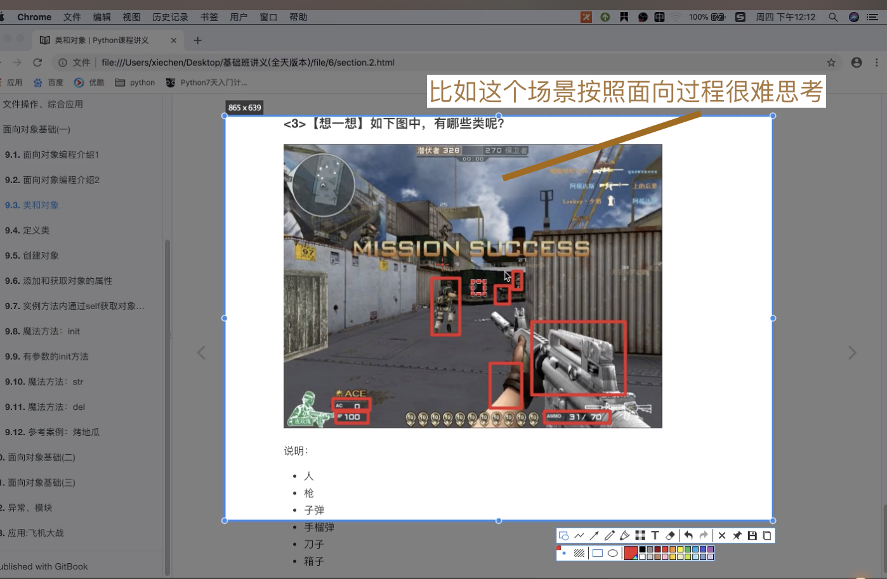

- super(Child,c).myMethod() #用子类对象调用父类已被覆盖的方法, 为何会需要两个参数呢
， 
因为调用父类方法时，有时需要传递父类方法的构造方法的参数, 如父类定义 __init__ 方法以及参数，此时需要子类传递相应值方可调用
, 如果父类有__init__ 构造函数子类不写也是可以的， 

- super


- ? 那个 del , 为何会全部执行， 继承综合案例，class 综合写法

- 多个引用同时存在，del 切断其中一引用


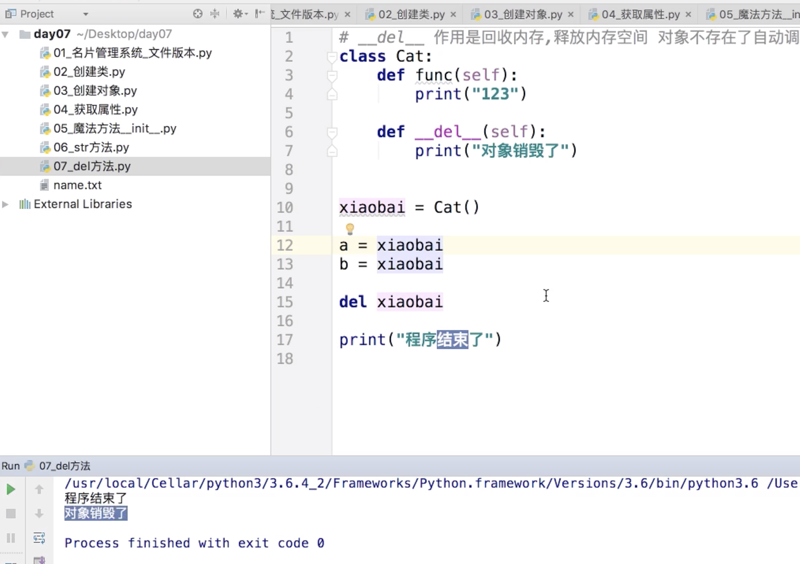


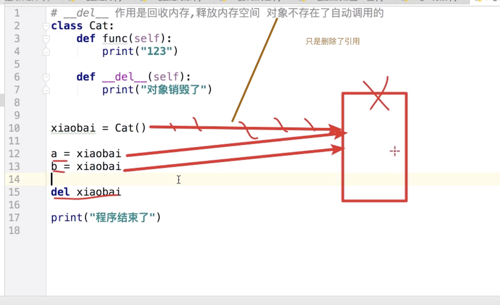


```python3

class Tem:
    def __del__(self):
        print('I was destroyed')


tem = Tem()
tem1 = tem
del tem
print('#*10)

# output : I was destroyed
# ##########
# output : I was destroyed

最后一次是执行完成所以销毁的

```

- 北京三年五年工作一个坎，在北京呆不下去了 很多事情是生活的原因，传智很多高层领导已经放弃生活了，四个大领导三个离婚了，孩子和加都不要了 很难搞过他的

- 做好一个规划一年两年， python 已经起来了，二线，启明星辰招 python 一次性招了100个人, 如张店，欢欢挪车，人都是有运气的，北京机会多，说不定飞黄腾达，很快，刚开始工资低点，退路等..., 也是恰好遇到这些问题

- 在python3中，无论是否继承object，都默认 继承object，即python3中所有类均为新式类


- 老师现在 30 岁了， 再干几年不用回去


- 类的实例属性和基本属性用法

- Python 中都继承 Object

```python3

In [1]: class Demo:
   ...:     pass
   ...:

In [2]: print(Demo.__bases__)
   ...:
   ...:
(<class 'object'>,)


In [5]: class Per(Demo):
   ...:     pass
   ...:

In [6]: Per.__base__
Out[6]: __main__.Demo


```

```python3'

#!/usr/bin/python3
 
#类定义
class people:
    #定义基本属性
    name = ''
    age = 0
    #定义私有属性,私有属性在类外部无法直接进行访问
    __weight = 0
    #定义构造方法
    def __init__(self,n,a,w):
        self.name = n
        self.age = a
        self.__weight = w
    def speak(self):
        print("%s 说: 我 %d 岁。" %(self.name,self.age))


```

- Parent.methodName({child}) 这种方法可以，但是不推荐使用  323 重听 以及查询

- python 方法可以写重复但是后边会覆盖前边

```python3

    def print_(self):
        print('name is %s' % self.__name)

    def print_(self):
        print('The name is %s' % self.__name)
```

- 讲的私有属性和方法 那里， set 作用? 为了加条件? set 可以多次， __init__ 只能初始调用一次吧

- 子类和父类同时有 __init__ 方法，会有限调用子类的 父类被覆盖，需要子类 __init__ 中调用下 父类方法

- 老师打开共屏边上课边直播

- 大公司是好的，起薪可能不高， 比如工资两万，一金 2400 个人 2400 一个月不用干就已经5000了

- 三年 python 人工智能发展计划， 达内来传智招学生做 python 少儿编程, 不行去达内试试, 华为澄清了，但是依旧不招，哥华为8年，内推360, 985 

一年工作经验，211 需要3年(华为)， 美团等都是 Ok 的, 该是屌丝还是屌丝，写代码，唯一区别见识牛人，一年十万和一年50万没什么区别，无非就是回家买房快点慢点, 是的，没有质把区别分开，无非就是买个包不用看价格了

- 基础班很多知识点都会被打断

- 继承 init 那里讲的是  继承所以  子类拥有父类的方法属性

- 引用清空计数算法

```python3
a = 40      # 创建对象  <40>
b = a       # 增加引用， <40> 的计数
c = [b]     # 增加引用.  <40> 的计数

del a       # 减少引用 <40> 的计数
b = 100     # 减少引用 <40> 的计数
c[0] = -1   # 减少引用 <40> 的计数

```

- Mro

思考 mro 以及记忆与 mro 相关的 class 属性

> 子类的魔法属性__mro__决定了属性和方法的查找顺序
print(Prentice.__mro__)

- 最后一节重听

# 必须要纠正状态了！


#! 如果 子类不写 __init__ 父类属性是会被继承下来的忘了差点，对比 Java

- 文件操作 使用  r w a 已经可以完成所有的功能了 r+ w+ a+ 这是为了更方便些

- 试试 eval 转换读取文件的 str  eval('ww = 1') 报错 对比 js eval


- python 的 exec 和 eval 


```python3

exec 类似 js 的 exec 

evcal 传入表达式并返回计算结果

# 防止和全局的  a 作用域冲突
In [35]: scope['a']
Out[35]: 4

In [36]: type(scope)
Out[36]: dict

In [37]: scope.keys()
Out[37]: dict_keys(['__builtins__', 'a'])

In [38]:


```

```python3
# 这个 __main__什么意思
In [53]: Tem4.__bases__
Out[53]: (__main__.Tem1, __main__.Tem3)
```

- mro 算法那块 再听下

- 上午第二节录屏查看，东南亚?
- Parent.methodName({child}) 这种方法可以，但是不推荐使用  323 重听 以及查询

看视频补: 两种方式都可以通常应用场景是，父类拥有和子类属性名不同的属性，子类 在 __init__ 方法中 使用，继承属性

# 你的 Php go  node c 呢 ?? 我擦  533 重听！

- !!! 补课下午， 刚开始 Object, 与 c3 算法。 

Object 实际上是 所有 python3 中类 如果不加 () 默认继承 Object(实现了  del str ... 等方法，所有类的祖宗类，所有类都具备继承来的初始化方法)

- 不写默认继承 Object， 这种都叫新式类，不继承object 的叫经典类， python3 中默认都继承 object 所以都是新式类，重听

- 说明： 每个模块都有一个__name__属性，当其值是'__main__'时，表明该模块自身在运行，否则是被引入。

说明：__name__ 与 __main__ 底下是双下划线， _ _ 是这样去掉中间的那个空格。

- __mro__ 属性哪里来的

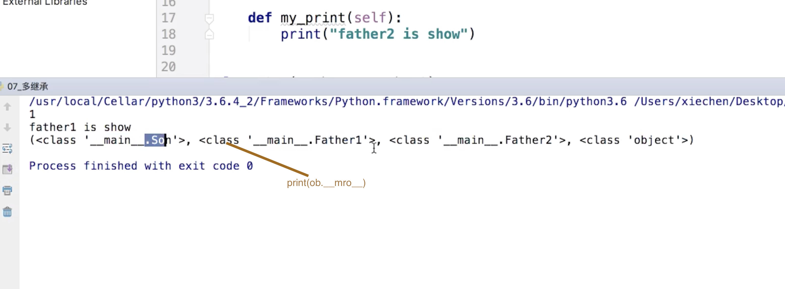

http://python.jobbole.com/85685/

    - 拓扑排序：入度为 到入度点的点未出现在之前的数量

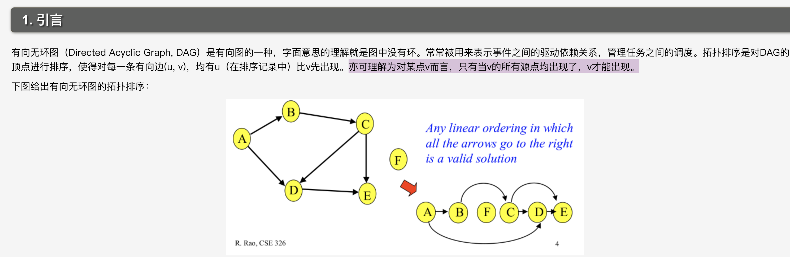

        https://www.cnblogs.com/en-heng/p/5085690.html

        https://baike.baidu.com/item/%E6%8B%93%E6%89%91%E6%8E%92%E5%BA%8F/5223807?frddin

## 私有属性通过set函数进行修改

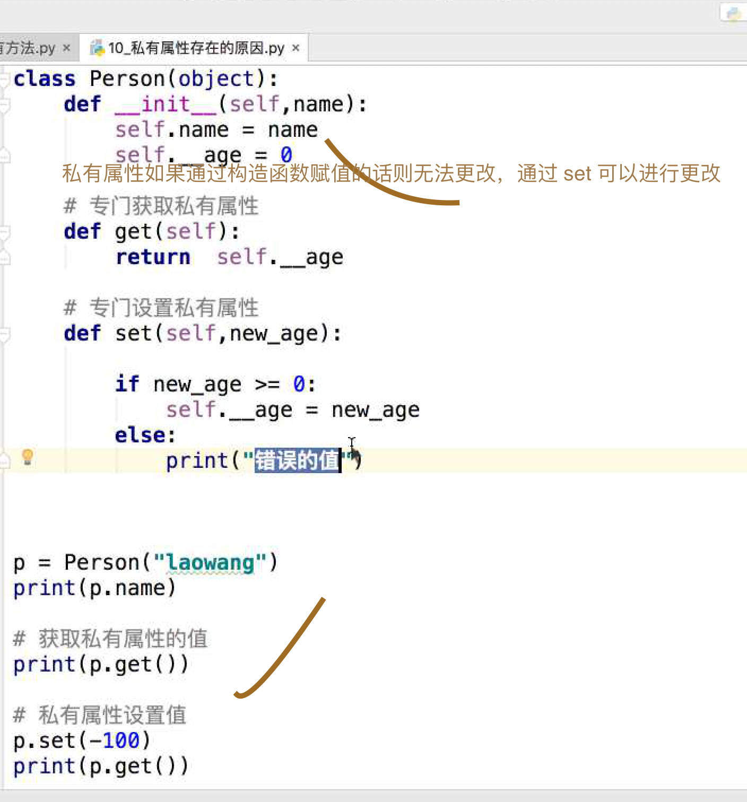

## 遗漏那点哪个方式更好的

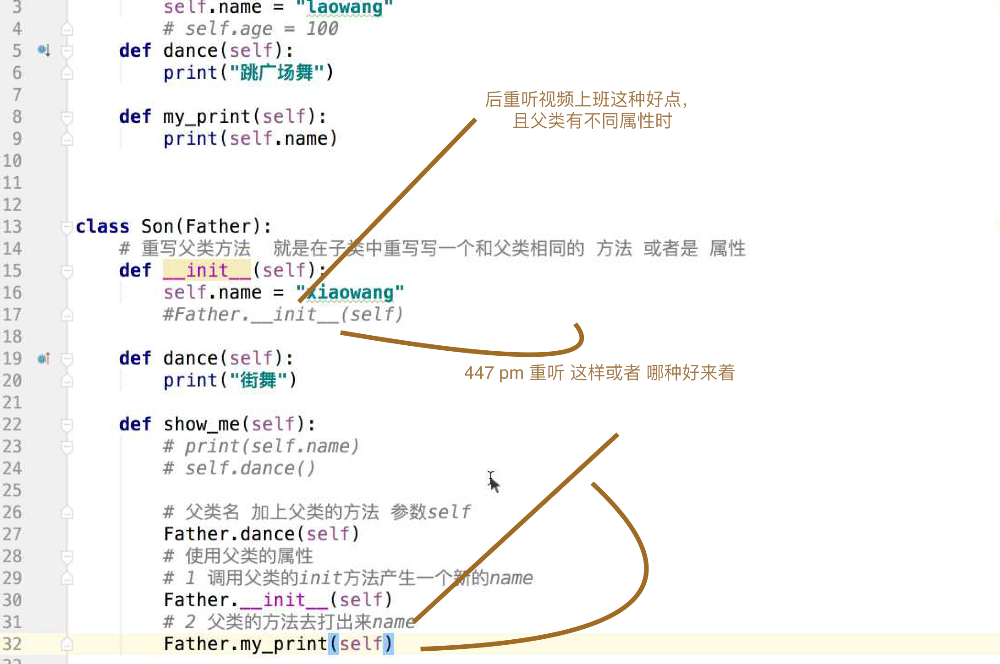

## IDE alt 键位进行多出修改

 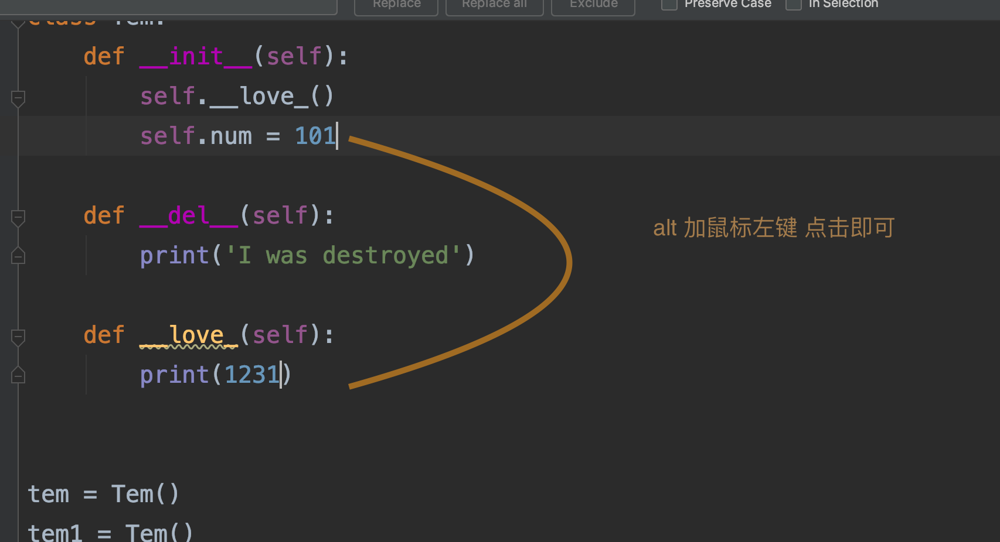

 ## python 继承 对比 java

 ### python中的继承和 java 只要 继承便能继承父类的属性和方法...

 super 方法只是为了调用父类方法的！，而同点在于 在 Python 子类写了 

 __init__ 方法后会对父类的 __init__ 进行覆盖，从而拿不到值，不对不对，Java 对于 父类 构造函数设置的值 不调用 super 是拿不到的，python 是默认可以拿到的！！！ java 中如果父类有参数的构造方法，子类必须调用 super 喽


## super(E, 实例)  E 表示父类，实例传的原因是 需要 self的不然你调用父类方法 它使用到了 self 如何确定slef 的值


# 线表相真网  -> 

## 总结单字技巧： 学习，思考: 进悟是怎为替

# 再补总结
