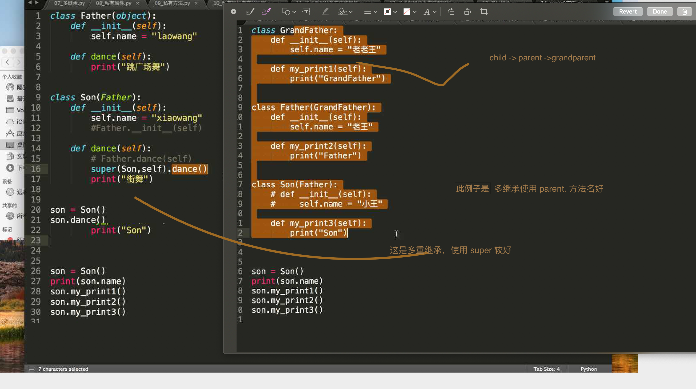

## 学会  50% - 60% 一万多薪资

## 类回顾


## oop think


## 类的专有方法： 为什么 __str__ 不位列  对比类的内置属性 内置类属性, __str__ 是位列的


> 典型记忆

> ps id lg cam sm art

__pow__: 乘方
__sub__: 减运算

__init__ : 构造函数，在生成对象时调用
__del__ : 析构函数，释放对象时使用

__cmp__: 比较运算
__call__: 函数调用
__mul__: 乘运算


__add__: 加运算
__repr__ : 打印，转换
__truediv__: 除运算

__setitem__ : 按照索引赋值
__mod__: 求余运算

__len__: 获得长度
__getitem__: 按照索引获取值


### 类方法


### 类的专有属性，重载

```python3
#!/usr/bin/python3
 
class Vector:
   def __init__(self, a, b):
      self.a = a
      self.b = b
 
   def __str__(self):
      return 'Vector (%d, %d)' % (self.a, self.b)
   
   def __add__(self,other):
      return Vector(self.a + other.a, self.b + other.b)
 
v1 = Vector(2,10)
v2 = Vector(5,-2)
print (v1 + v2)

```

## 实例属性和类属性

实例对象，实例所在的内存空间，类对象，类所在的内存空间

- 实例属性，所有实例对象单独享有的不共享的

> 为什么 __init__ 方法会放到类对象，而不是实例对象呢， 那实例方法呢? 应该是放在实例上吧

> ！ __init__ 实例是调用不到的 所以没有放在实例上


```
因为如果你放到实例对象上那么创建 10 万个 岂不是有十万个，所有共有的都应放在类对象上， 虽然放在 实例上 但不一定是 类方法哦~
！ __init__ 实例是调用不到的 所以没有放在实例上


```

### 类属性


## 多态

在python中体现的很弱，因为Python自动识别类型，Python 多态 内部已经实现完毕了，所以从语法上看不出来了

当子类和父类都存在相同的run()方法时，我们说，子类的run()覆盖了父类的run()，在代码运行的时候，总是会调用子类的run()。这样，我们就获得了继承的另一个好处：多态。 -> 不同子类调用相同的父类方法可能会产生不同的结果


## 实例方法，类方法和静态方法

### 实例方法


### 类方法

类方法，静态方法存在类的空间里，谁都可以调用,因为实例上找不到会向上找


### super 的使用



## cs 游戏反恐精英


## 烧死情侣


## Tip

- 错误查看


- 老师之前做的 c++

- 面向对象的三个特性，继承 封装(将共同属性封装到一起) 多态

- 多继承的时候 使用 父类名 . 方法名即可， 多层继承的话 使用 super 可以

- 纯做开发 web 端 3 万多的很少，薪资到头了，所以转，再往上升就不不容易，因为 我找个 1万5的一样可以干，凭什么要你，爬虫上线稍微高点，阿里有个扫地僧，纯做技术，全国最牛逼的 开发，（不过有股份）, 所以做开发到顶，要转，这次学完Python1 年后就转， 百度上班后边单干，勾勾斗地主，适用于全国，但是他做了本地，家里的玩法，然后 ~~~

- 复制一线城市的项目针对市里区县去搞

- 广岛走引流赚钱，自己收游戏币，平台虽然没有提供虚拟货币的交易，但是用户就会认为平台的币是值钱的，去买一个，代码整整，自己赚，小城市反而更高旋转

## TODO:

- 11 24 重听下吧 实例方法类方法 __init__ 方法属于, __init__ 以及父类 __show__(自定义方法放在哪个内存地址上)， 
！ __init__ 实例是调用不到的 所以没有放在实例上

- 实例方法 的内存地址是在方法上的吗，如果是 1000个实例岂不是就是1000个方法了, __init__ 通过  instance 是不可以调用的，所以不是位于实例上的

- 如何自己写一个装饰器或语法糖

- 考的中国国防科技大计算机专业研究生没考上, 压力很大赚钱了，说什么都是对的，那时候想，现在已经这么次了还能次到哪里去，可口可乐第一年只卖了25瓶，过了这段时间救护好很多了，每个人以不同的方式偿还

## 代码写到再最后依旧是个小楼楼兵


## FAQ

> 物以类聚，人以群分，一个群体有一个群体人的特性，于靖平，国防大，篮球，自媒体平台(根据流量), 新闻文章一篇300

- 类上的方法存在类对象上，实例的方法存在实例的对象上，__init__ 魔术方法存在?

- 问题, 走神的那个 类方法

```python3
class Dog:
    type = 1

    def update(self):
        self.type = 2

    @classmethod
    def show(self):
        self.type = 2


dog = Dog()
print(dog.type)
# dog.show() # 122
dog.update() # 121
print(dog.type)
print(Dog.type)


```

- randomint(0, 4) # 含有 4 吗 是的 含有 4

- 面向对象就是按照人的思维去想，如筷子问题

- 面向对象按照你正常的思维走就好了 不要一步一步想，这样很累

- 再思考下筷子问题 体会 oop

- 当超今日之境，择于新境

- 原来概率很低，10家会有三四家， ios 刷楼

- python 一年半 到两年, 大学 学生会.. 面试不要写这个

- 写公众号， 村里妇女写生活，月入过万， 之前公司电话，就业指导，朋友，流水走淘宝，内推很愿意，双赢

- method memory python 类 实例化后 方法内存中位置


- python source


- 微信公众号


- plan


