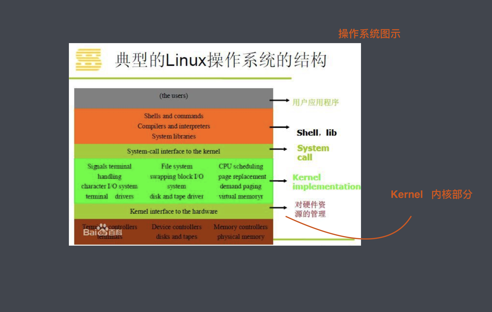
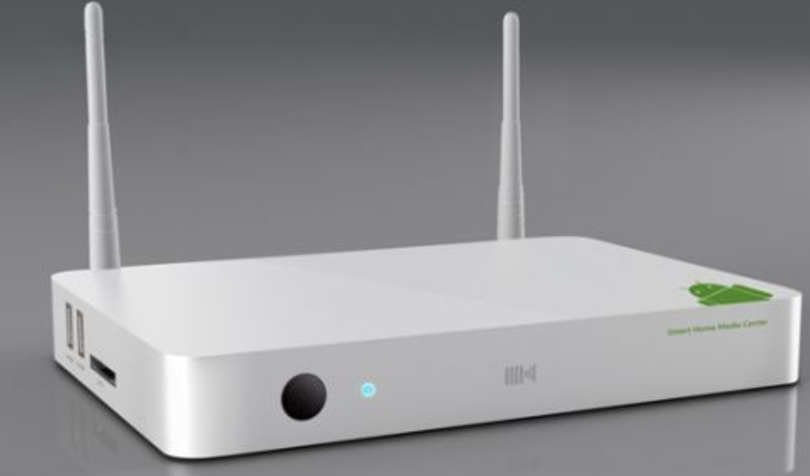
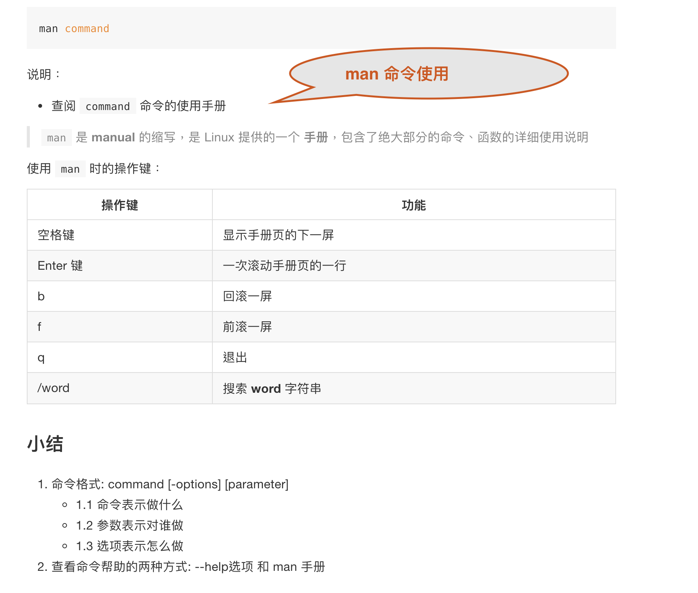
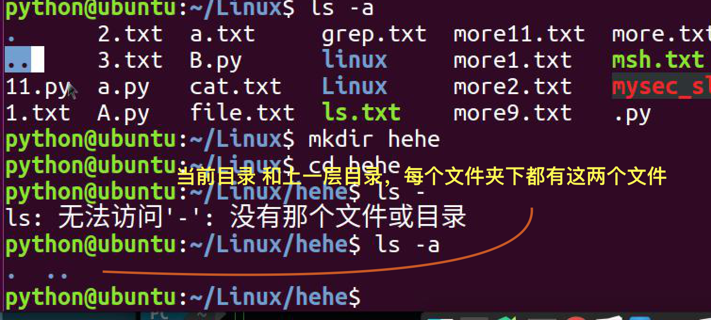
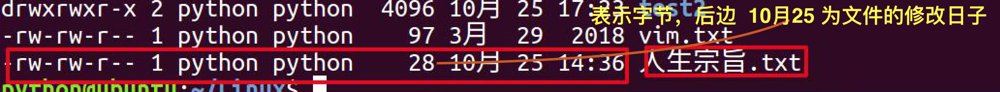
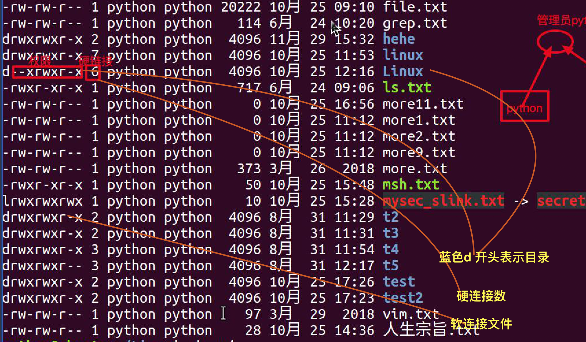
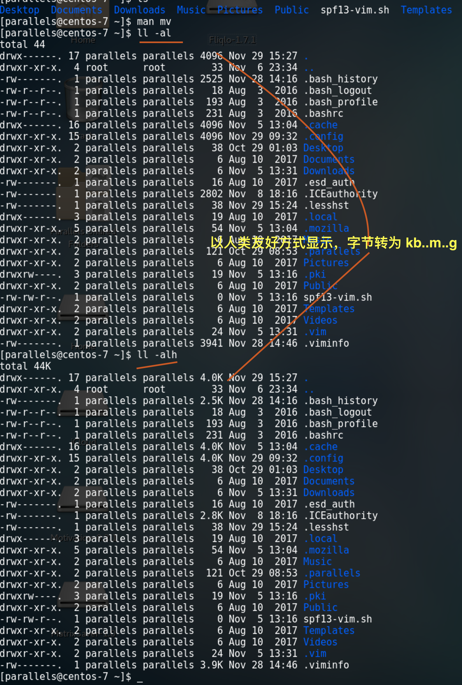
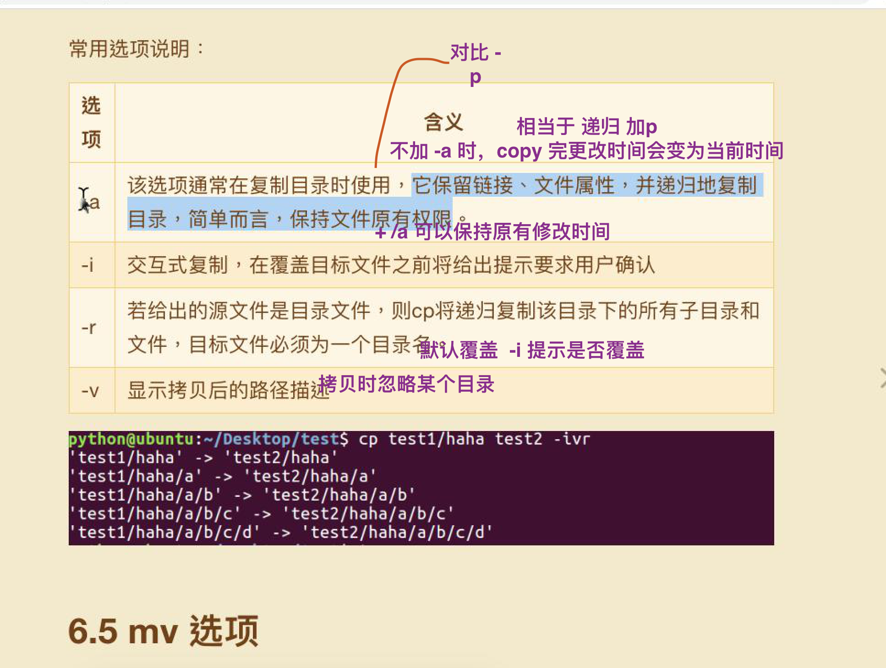
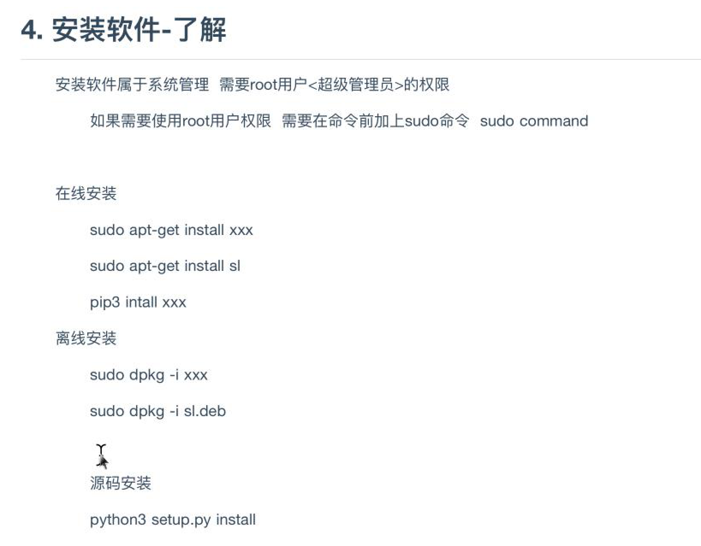

## 补9:25 -> 9:35


## Python 高级 第一天

- 类似手机微信等软件，电脑等软件是 ui 层，需要运行在操作系统之上

- 操作系统呈上启下，提供硬件调用接口

### 操作系统



- 桌面操作系统

- 嵌入式操作系统




> 很多路由器内运行的为 Linux 系统

- 服务器操作系统


- 移动设备操作系统

## linux 文件目录， 单  / 目录

- /opt 用户安装软件

- /etc 系统配置文件

- /bin 系统可执行二进制文件

### 内核，只包含很小的部分，不包含用户的应用程序

> 硬件上的地一层封装，是操作系统的核心. 通常都很小

> *发行版为在内核的基础上包装了一层软件

## Linux 发展史

> 1973 年第一款 c unix 操作系统， 后被 贝尔实验室 闭源

>  1987 年自行开发与 UNIX 兼容的 Minix 操作系统

>  1991 年, 林纳斯(Linus) 就读于赫尔辛基大学期间, 受到 Minix 的影响, 并在 Minix 操作平台建立了一个新的操作系统的内核, 他把它叫做 Linux.(最初9000行，后9000万行。。)

>  1994年3月，Linux 1.0 按照完全自由免费的协议发布.j

## 类 unix 系统

> 由 unix 演化出来的系统

## man 命令使用简介



```sh

SYNOPSIS

       mv [OPTION]... [-T] SOURCE DEST
       mv [OPTION]... SOURCE... DIRECTORY
       mv [OPTION]... -t DIRECTORY SOURCE...

# option
DESCRIPTION
       Rename SOURCE to DEST, or move SOURCE(s) to DIRECTORY.

       Mandatory arguments to long options are mandatory for short options too.

       --backup[=CONTROL]
              make a backup of each existing destination file

       -b     like --backup but does not accept an argument

       -f, --force
              do not prompt before overwriting

# -T 表示  当目录下  存在 a.js b(folder) mv a.js -T b 为将 a.js 重命名为 b 而非将 a.js 移动到 b 下


```

## Tip

> 小米硬件 利润 < 5%, 软件社区赚钱

> python 解释器为 操作系统上应用程序


## TODO


## 命令

```sh

cd - # 进入上一次命令所在路径

cd #  不加参数 进入 ~ 目录

ctrl + l # 清屏幕

tab # 自动补齐， 未输入目录时 显示所有

rm -r # -r 要加在前边

rm -fi # 是冲突的

rm -d # 删除空目录的 时候验证下 目录里边是否有东西

mkdir -p # p parent if parent not exit, forbid create

rm -f # 文件不存在时不提示, 忽略不存在的提示，直接强制删除

# 命令格式, 无参数 父 pwd, ll...

command [-option] [parameter]

[-option] 可选，控制命令怎么执行

[parameter] # 对谁做

[command] --help # 查询命令的帮助信息


NAME
     mv -- move files

SYNOPSIS
     mv [-f | -i | -n] [-v] source target
     mv [-f | -i | -n] [-v] source ... directory
```

## 命令再补充

```sh

[parallels@centos-7 ~]$ cp -rav a e
‘a’ -> ‘e’
‘a/b’ -> ‘e/b’
‘a/b/c’ -> ‘e/b/c’
[parallels@centos-7 ~]$


cp 拷贝 默认会覆盖如果已存在， -i 可以加提示是佛覆盖（yes || no ）

mv # 同样具备 -i, 但是mv 不能用来覆盖目录, mv 是以判断 是否是文件夹 而不是有没有 /

```

- 林纳斯与开源社区

- 林纳斯 github

## FAQ


- 汇编开发

- inux系统,主要分debian系和redhat系,还有其它自由的发布版本

- 红旗和中科院的那些事

- 前同事 debain 开发团队

- 注意听与笔记 思维分配

- 类unix 架构 bash 很多通用

- vmware 用在商业 很稳定

- Linux 所有的文件 挂载再 / 目录下

- mv 可以理解为  移动不过是 ..

- 每个文件夹下 都有 . .. 表示 当前和上一层目录

- 大数据处理不局限于语言 Python 也可以做大数据处理

- 组规定一组的权限





- /-l 表示以列表形式显示详细信息， -a 表示所有(包含隐藏文件), -h (human being friendly, 将文件大小字节 转为 响应  kb..m 等单位)




- ls 【path】, 显示路径下的文件信息

> 注意 ll 是 ls -lh 默认 linux 系统中是没有这个命令的是个别名

> rm -rf / (有权限的已经干掉了)

- cp -a 差不多 cp -rp, 注意值 cp -r 文件的修改时间会变成当前时间



```
-a ：相当于 -pdr 的意思（参数pdr分别为：保留权限，复制软链接本身，递归复制
）；
-p ：连同档案的属性一起复制过去，而非使用预设属性；
```

> mv # 同样具备 -i, 但是mv 不能用来覆盖目录, mv 是以判断 是否是文件夹 而不是有没有 /

- mv不允许覆盖已经有的目录, 只能覆盖文件, 用cp可以

- gedit gnu(GNU是一个自由的操作系统，其内容软件完全以GPL方式发布) edit

- more fileName 查看文件

- 软件安装



