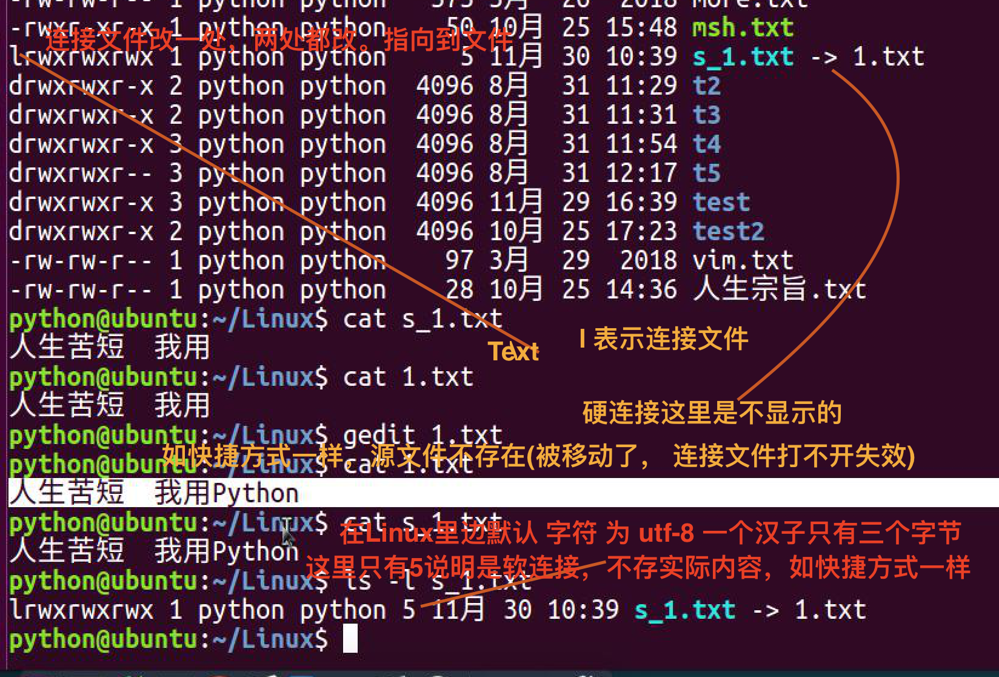
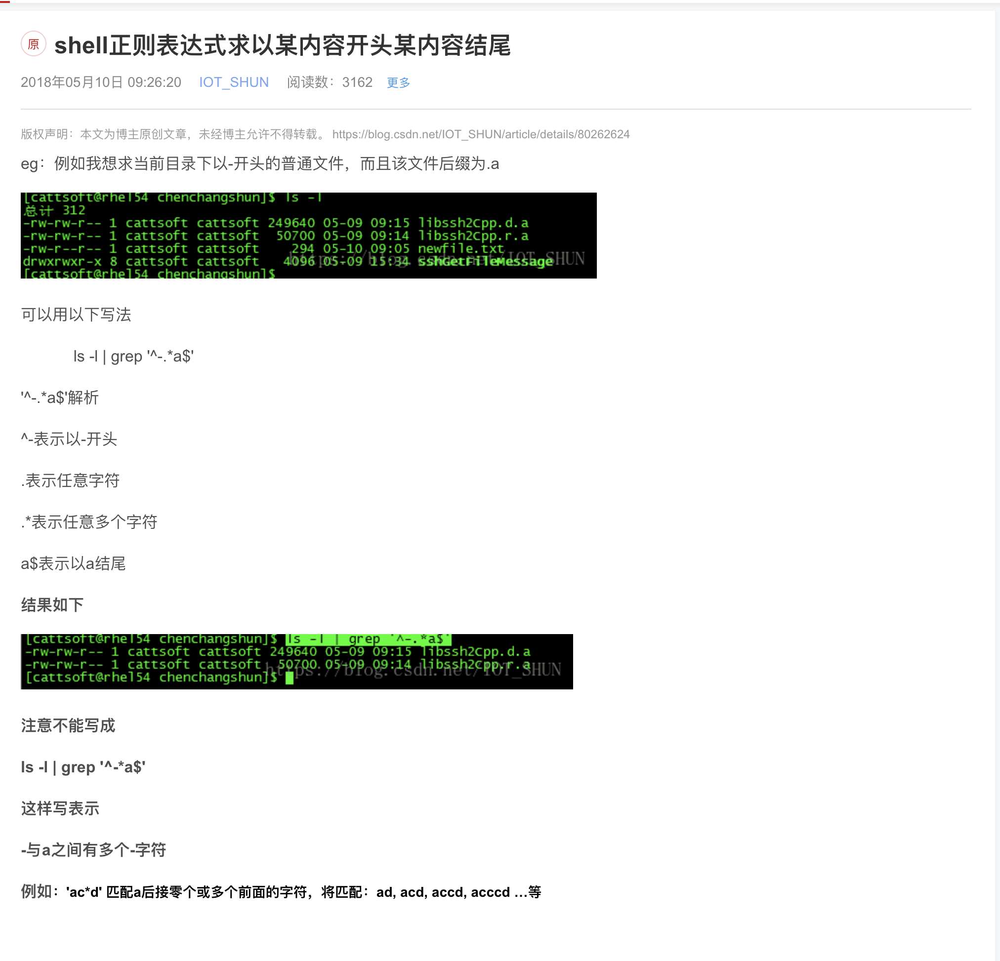

## linux 第二天

> 实现上传，下载文件，远程操作


## 重定向
把原本要输出到终端的结果，重定向到其他文件

```sh

# 如果之前没有这个文件会创建新的这个文件
> 覆盖输出重定向

>> 追加重定向

#

```

## cat 合并文件 覆盖输出重定向

```sh
# cat 本就可以合并多个文件到 stdout
cat file1 file2 file3 ... > [newFileName]

```

## 管道流

```sh

# 在屏幕上输出信息为 stdout 流，可以将这个流 | 交给 "|"  右侧进行处理, 相当于 右边命令执行 左边结果, 如:

ls /usr/bin -alh | more

```

## linux 快捷方式 软连接（symbol, ln -s..）， 与 widnow 快捷方式是一样的

- 修改一处，两处都改
- 源文件不存在失效
- l 开头
- 像极了 window 的快捷方似




### 在使用软连接时，如果源文件和目标文件不在同一个目录下，目标文件目录要用绝对路径


```sh


```

### 硬连接

> 其实硬链接的数据和源文件数据是一份，其实是同时一个文件

> 验证是否是不是一个文件 ls -i, 如果编号相同则 说明是同一个文件


> 硬链接是看不到 xx -> xx 的， 文件 ll 时，开头显示的为 l


> 硬连接和复制文件的区别

- 硬连接 改一个文件两个都改，复制的话并不会，所以在 front, admin一套代码时，要用硬连接, 这样不行，硬链接只可以连接 文件 🚫


# 软连接可以连接目录，硬链接只能连接文件
> 原因分析

```sh
LINUX的硬链接不能链接到目录是因为引入了对目录的硬连接就有可能在目录中引入循环，

在目录遍历的时候系统就会陷入无限循环当中，这样导致无法定位到访问目录

在目录符号连接中，有防范措施

连续遇到8个符号连接后就停止遍历，这就是为什么对目录符号连接不会进入死循环的原因了,但是对于硬连接，由于操作系统中采用的数据结构和算法限制，目前是不能防范这种死循环的。

```

## grep 命令详解

```sh

# -v (条件取返，取不匹配的) Invert the sense of matching, to select non-matching lines.
# - n 显示行号
# -i 忽略大小写

ps -ef |grep -v grep |grep node

```

## which 查看命令路径

## 正则(remember)

> grep 加正则

```sh

# 以 xx 开始 以行为判断 ^a, 如果行中第二个单词以 a 开始则没有匹配到

[parallels@centos-7 ~]$ ^C
[parallels@centos-7 ~]$ echo asdasdh hellow > t.txt
[parallels@centos-7 ~]$ grep ^a t.txt
asdasdh hellow

# 以 xxx 结束  xxx$

# 匹配其中一个 [a, b, c]

# 匹配大写字母 [A-Z]

# 不管是什么都可以 用 . 如 hello > grep  h.o hello

```

# !grep 重点


> . 貌似不好用

> 如何匹配以 xxx 开始且 以 xx 结尾(已答)




```sh
# .* 表示任意多个, 注意 $ 表示行以 xx 结尾， a.w 是单词
[parallels@centos-7 ~]$ grep ^a.*w$ t.txt
asdasdh hellow
```

> 为什么如下 ^a 匹配不出 aww, 如下， 而 a.w 可以如下（因为 ^ 匹配的是行）

```sh
[parallels@centos-7 ~]$ cat t.txt
asdasdh hellow
wqeqweaddd
wqeqwe aww
[parallels@centos-7 ~]$ grep ^a t.txt
asdasdh hellow
[parallels@centos-7 ~]$ grep a.w t.txt
wqeqwe aww
[parallels@centos-7 ~]$

```

-  \. 问题解决, 一个 \.代表一个字符

```sh

[parallels@centos-7 ~]$ grep 'w....e' t.txt
wqeqweaddd
wqeqwe aww

```

```sh

# 如下 第二行的  wqeqwe 是以  e 结尾的但是是匹配不到的
parallels@centos-7 ~]$ grep w$ t.txt
asdasdh hellow
wqeqwe aww
[parallels@centos-7 ~]$ grep e$ t.txt

```

## |wc -l

显示行数

## tar, 类似归档， tar 命令很特殊，可以不带 -, gzip, bzip -C(表示解压路径) + [path],

> tar [选项] 打包的名称 文件

> tar 打成一个包后，这个文件的 大小比 加起来都大，默认只打包不压缩

> tar -vcf [file1] [file2]

```sh

# 指定档案文件名称，f后面一定是.tar文件，所以必须放选项最后
# 如果 tar -f xx.tar -v -x 也是可以的，主要是 f 选项后必须紧跟归档文件名称
tar -vcf   加压缩 tar -gvcf xxx.tar.gz [sourceFile]
# 解开包
tar -xvf   解包解压缩 tar -gvxf xxx.tar.gz

# 假如使用 bz2 算法
tar -jvcf xxx.tar.bz2 [sourceFile]
tar -jvxf xxx.tar.bz2 [sourceFile]

# zip 算法

```

### 实际使用为 打包压缩，解包解压缩

> 在打包压缩时要选择压缩算法， gzip -> -z, bzip2 -> -j

```sh

tar -zvcf xxx.tar.gz filename

```

### -v 会显示压缩过程如下

```sh

[parallels@centos-7 d]$ tar -zvcf home.tar.gz *.txt
t1.txt
t.txt

```


## find


> grep 是文本搜索，grep 是查找文件

```sh
find [path] -name [fileName]

# 注意要加  '' 否则可能与想的结果不一致
find [path] -name '*.pypy'

```

## 修改文件权限

### 虽然是修改了，但是 用 sudo 和自己的密码就可以了啊 ?

- changeMode
- changeGroup chgrp
- changeOwner chown

### 权限别称 user -> u, group -> g, other -> o, all -> a

```sh
chmod u+rwx [fileName] # 其他同理
chmod a+rwx [fileName]
```

### 有时候需要给某些加 权限，某些减权限

```sh
chmod [number] [fileName]
chmod u+x,g-x,o+x [fileName] # 注意 , 与之前没有空格


```

### chown 使用, 结合 cat/etc/passwd, cat /etc/group

```sh

[parallels@centos-7 d]$ chown nobody:root home.zip

-rwxr--r--. 1 nobody    root        406 Nov 30 15:32 home.zip
```

### chgrp

```sh
[parallels@centos-7 d]$ sudo chgrp root t1.txt
-rw-rw-r--. 1 parallels root        492 Nov 30 15:19 t1.txt

```

### 补充 目录的 读写权限有什么意义

# 目录的 x 权限 去掉后就进不去了
# 目录的 r 权限去掉 可以进入但是 ls 就不可用了
# w 是否可以创建删除文件

```sh
[parallels@centos-7 d]$ chmod u+r b
[parallels@centos-7 d]$ cd b
[parallels@centos-7 b]$ ls
c  t1.txt  t.txt
[parallels@centos-7 b]$ ls
c  t1.txt  t.txt
[parallels@centos-7 b]$ mkdir a
mkdir: cannot create directory ‘a’: Permission denied
[parallels@centos-7 b]$

```


## 通配符(注意 通配符是通配符，正则是正则)

> ls rm mv cp 等都可以用

```sh

ls *.txt # 类似  ls |grep *.txt

```

- \*  可以通配任意字符, * 匹配任意多个字符
- ？ 匹配一个
- [a, b, c] 从中选一个


## Tip

### gedit 依赖 gnu， 纯服务器  用 vim

## 机房通常放在别的位置，因为挨着，散热，转速快，噪音高(因为服务器主要解决散热)

### 我们有可能和服务器通讯的数据被截获，所以使用 ssh, 对我们通讯的数据加密


## scp 文件拷贝方式

只要装了 ssh 便会有这个命令

scp -r itcast@192.168.1.100:/home/itcast/QQ_dir/ ./mytest/lisi


```sh
# 建议一直加 -r 因为你有时候会忘记了 是文件还是目录
╭─ly@lydeMacBook-Pro ~
╰─$ scp -r  a.mp4 parallels@10.211.55.7:~
a.mp4                                                                                                                                      100%   22MB 152.3MB/s   00:00
$ scp -r a.mp4 parallels@10.211.55.7:~

```

> scp 可以 使用 sftp 代替，那样何必再装 pure-ftp

## FAQ

- 如果是文件 Linux ll 显示的是大小，目录不是!

- grep 通配符 与  上边 通配符 对比区别(已答)

> grep 加的 是正则，通配符是通配符， 通配符只能用在 linux 里边，正则到处可以用


# grep 匹配时 .* 表示任意多个, 注意 $ 表示行以 xx 结尾， a.w 是单词

## 后边讲 shell 编程，shell 和 Python 一样是一门脚本语言，grep 是一个复杂的程序，在shell语言中用的比较多

## touch 的第二个作用，当文件存在时修改文件的最新修改日期为 当前


## history 会看到你输入过的所有命令, 查看数量为 history |wc -l

## 通配符尽量 用 '' 括起来 否则你可能会看到很多意想不到的问题

## pwd -P 显示出非连接的真实路径

```sh

[parallels@centos-7 ww]$ pwd
/home/parallels/ww
[parallels@centos-7 ww]$ pwd -P
# 本是在 ww 下 但是路径显示的是它实际文件的路径
/home/parallels/c
[parallels@centos-7 ww]$

```

##  cat t.txt |nl  nl 显示行号

##  |head -n

```sh
[parallels@centos-7 ~]$ cat t.txt |head -3 , tail 倒着取几行
123
asdasdh hellow
wqeqweaddd
```

## 在工作中压缩比最高的是文本 100M 差不多可以到 10M, 视频的话很小，甚至压缩完可能会更大

## rm *.tar*

## zip 命令要牢记, zip 目标文件名(不需要 写扩展名) [source], unzip -d [path] 即可

## zip bzip2 gzip 三种方式对比, 压缩比


## 为什么权限都分开了 用户依旧可以 sudo 操作其他用户文件 (已解答)

```
/etc/sudoers # 发现wheel

## Allow root to run any commands anywhere
root	ALL=(ALL) 	ALL

## Allows members of the 'sys' group to run networking, software,
## service management apps and more.
# %sys ALL = NETWORKING, SOFTWARE, SERVICES, STORAGE, DELEGATING, PROCESSES, LOCATE, DRIVERS

## Allows people in group wheel to run all commands
%wheel	ALL=(ALL)	ALL

# 如下用户属于 wheel 组所以 可以 提权到 sudo
[parallels@centos-7 b]$ id
uid=1000(parallels) gid=1000(parallels) groups=1000(parallels),10(wheel) context=unconfined_u:unconfined_r:unconfined_t:s0-s0:c0.c1023

```
## which 查看命令位置，但是有的命令不可以 如 cd 这是因为 cd 命令是在系统运行的时候加载入内存中的, 而不是以某个可执行文件存在

## 如何安装一个软件

### 源是我们下载软件的地方，如果想下载的快更新源即可

- 下载软件源，备份source.list, 下载文件拷贝到 /etc/apt/source.list

### 安装卸载软件

```sh
apt-get install xx
apt-get remove xx
```

### deb 包安装

```sh
dpkg -i xxx.deb
```

## whoami who(可以看到查看到谁在线，和他的 ip), w

> who


```sh

reboot 没有提示

showdown -r now 会给到提示使用可以

reboot	重新启动操作系统
shutdown –r now	重新启动操作系统，shutdown会给别的用户提示
shutdown -h now	立刻关机，其中now相当于时间为0的状态
shutdown -h 20:25	系统在今天的20:25 会关机
shutdown -h +10	系统再过十分钟后自动关机

```

## mac 自带了 ssh, window 装一个 然后 才能在命令行中 ssh..

## mac which

```sh

╭─ly@lydeMacBook-Pro ~
╰─$ which ll
ll: aliased to ls -lh

```

## 在中国没有收费软件和商业软件的区别

## history |grep [terminal]

```sh

[root@centos-7 parallels]# history |grep c
    2    service sshd restart
    3  systemctl start sshd.service
    4  ifconfig
    5  vi /etc/ssh/sshd_config
    6  vim /etc/ssh/sshd_config
    7  service sshd restart
   18  history |grep c
[root@centos-7 parallels]#

```

## 既然 ssh 带了 scp 以及 sftp 连接，那么要 Pure-ftp, vsftp 有什么用

- (开启SSH默认就开启了SFTP)
- ftp 效率高些 因为，数据没有加密
- SCP（Secure Copy）：SCP就是Secure copy，是用来进行远程文件复制的，并且整个复制过程是加密的。数据传输使用ssh

FTP 基于TCP来传输文件，明文传输用户信息和数据。
SFTP 基于SSH来加密传输文件，可靠性高，可断点续传。
SCP 是基于SSH来加密拷贝文件，但要知道详细目录，不可断点续传。

## apt-get update

> 当本机修改了安装源后本机需要执行更新下

## vim :末行模式, a 光标后插入, 命令模式下 ZZ 保存并退出

## linux 文件挂载

```sh

# linux 目录是虚拟的，挂载如同 window c 盘 ...映射到我的电脑

# u 盘等可以自动挂载了现在

# 卸载挂载时， umount 即可

# 插入设备都会存在 /dev 中，但是 需要手动挂载


```

# trace route 问题，为什么百度那么多, route get

# 上博学谷地址让其走 内网

博学谷设置 ip 192.168.50.0 -> 到 usb 的route 地址不就好了 真是的

# 公网网关是 你走的无线 热点的 wifi 同段

# 重启wifi 失效

# 为什么要 .1 才可以

因为路由器再 192.168.0.1 你需要走路由器上网

Refs      给出当前活动使用的路由数目。面向连接协议在连接持续时间内保留单独的路由，而无连接协议在发送给同一目标时获取路由。

# 路由命令

# 查看当前路由表
netstat -rn

# 获取默认路由
route get 0.0.0.0

# 删除默认路由
sudo route -n delete default 10.2.0.1

# 添加公网网关
sudo route add -net 0.0.0.0 10.2.0.1

# 添加内网网关
sudo route add -net 194.0.0.0 194.2.100.254

# 为什么 traceroute 这么慢

那么多节点给你发返回信息，而且有防范设置的回成为 ***
