## python 解释器的实现，可以与老师讨论下，但是不要学地像 c 一样


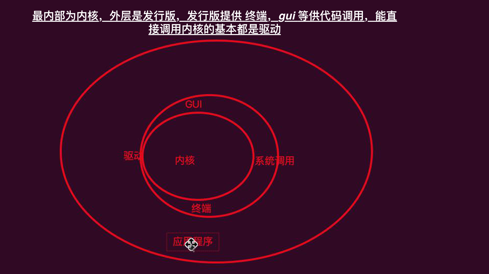


## vim

```sh
-r 替换当前文本
- ZZ 保存并退出
# s 表示替换
- :[start_num, end_nums/[aim_text]/[replace_text]/g]
```

## 怎么让学习更高效

-1 提前预习，不然在思维的时候，老师已经开始讲知识了
-2 知道第二天要学什么
-3 课上认真听
-4 动手实践

## udp tcp

### upp 不保证你发送的顺序和别人接收到的顺序一致

### udp 广播， 1 v 1 通讯

### udp 传输如电视 花屏了

## ip地址（就像写信的邮箱地址）


## 广播

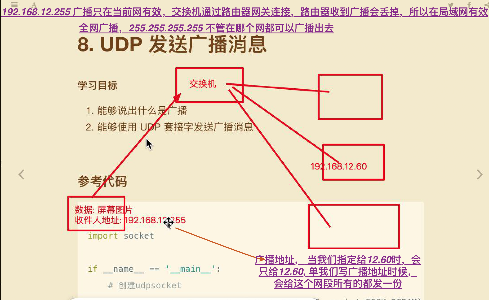

## 使用udp 编写广播

- 1 导入模块
- 2 创建udp 套节字
- 3 开启广播功能，发送消息
- 4 关闭套节字

## 广播设置


### ip 地址的构成

### 作用

标识网络中的一台计算机设备

### 点分式，四个字节组成，能表示 40多个亿(推算)
> 由网络号（网段）（192.168.12），加主机号构成 (60)

192.168.12.60 点分式，(能看到的 Ipv4一般都是点分支)

### Ip 显然不够用， ipv5 流产，ipv6 产生，由 8 个字节，
42亿 * 42 亿(每一粒雾霾都有一个ip), 中国在推动 ipv6, 中国在东南亚很多国家 建立了 ipv6 的服务器


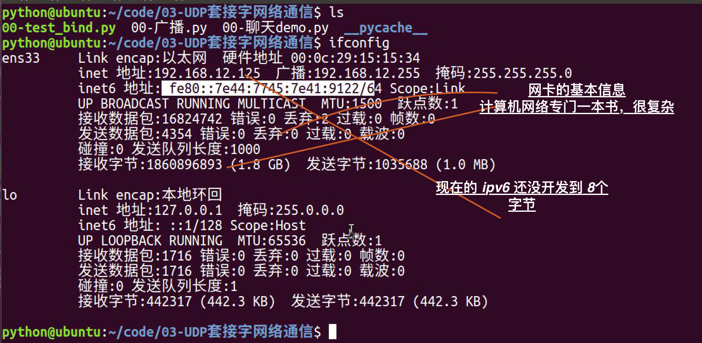

### ifconfig 每一个都是一个网卡，每一个网卡都有自己的ip

### ifconfig 设置 ip 地址

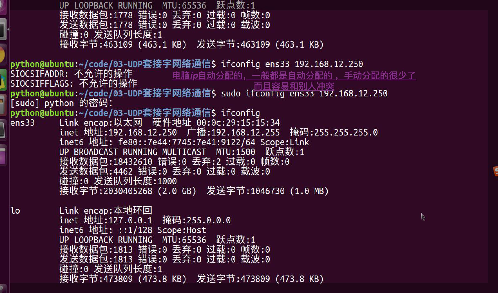

### 什么时候使用的 是 Udp, 什么时候使用的是 tcp


## ping

### 能 ping 通一定代表网络通畅，如果显示网络不可达，只能代表可能存在网络故障

#### 为什么 ping www.baidu.com 可以ping 通?

因为在网络上有 dns 解析服务，域名 ip 就像电话本电话


> 在工作中基本不使用 udp 而是使用 http, utp 不是属于 http吗

## 端口

- 只靠ip 只能找到对应的计算机，通过 端口，找到对应的哪个程序

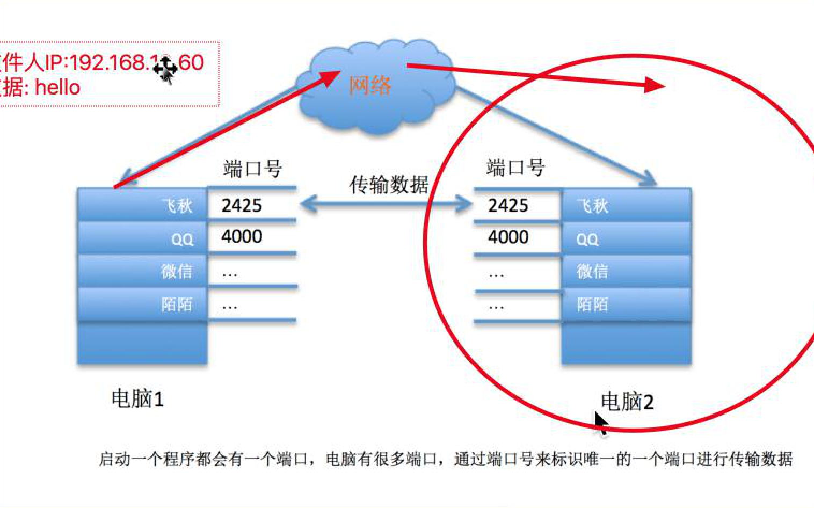

## 编码 (调用字符串的 encode 方法)

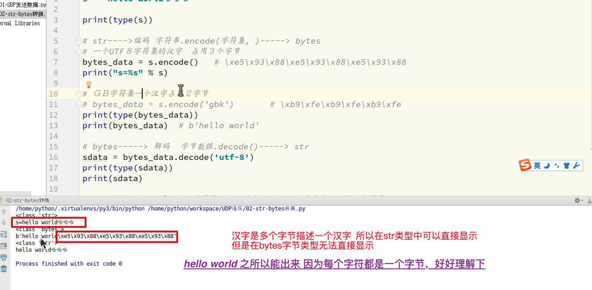

### ignore 会忽略掉不认识的
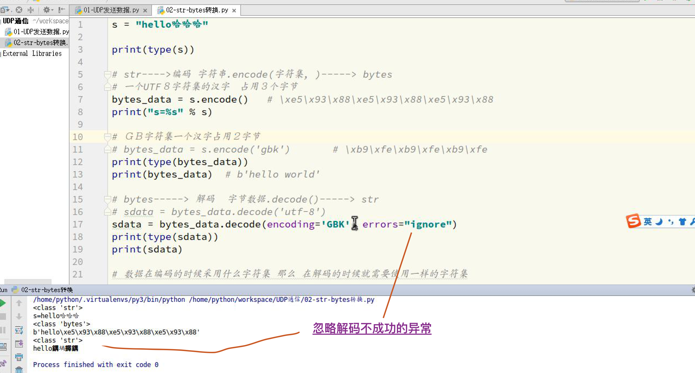

> 汉子编码为如下

类型为 <class 'bytes'>, 值为 b'\xe5\x93\x88\xe5\x93\x88\xe5\x93\x88 hello'

> 编解码格式不同报错

```Python
txt = '哈哈哈 hello'

print(txt)

byts = txt.encode('gbk')

print('类型为 %s, 值为 %s' %(type(byts), byts))

print('转str后类型为 %s, 值为 %s' %(type(byts.decode()), byts.decode()))
```

```
UnicodeDecodeError: 'utf-8' codec can't decode byte 0xb9 in position 0: invalid start byte
```

### 端口分类

- 知名端口，动态端口(1024 - )

- http 默认 80端口，80 可以省略

http://www.baidu.com:80

- https 默认是 443 端口

https://www.baidu.com:443

## 套节字(像插座，提供了网络通讯的插口)(不同进程之间的通讯, 如两台电脑上的 fq 怎么通讯的)

### 飞机大战使用套接字发送分数到别人的电脑上就可以了

### 底层封装了很多网络通讯的底层实现

- 使用 socket 实现网络通讯就可以了

- 还没有网络通讯不是用套接字的，http 用的是吗(不是不是常链接吗)

### 套接字补充

网络传输需要遵循规范，socket 对这种规范进行了封装

### 套节字绑定端口

- 当套节字创建的时候需要申请绑定端口, 不然系统会在很多端口之间随机转换

```sh
# 如果 ip 处填写为空, 则小助手发任何ip 给到 port 都会收到了
bind(ip, port) # 填写了 ip 表示接收哪个网卡的数据
```

#### bind 方法

为应用程序固定一个端口，如果没有申请，系统随机分配，绑定时机必须在 数据收发之前

如果要绑定所有的网卡，写一个 '' 即可


## udp((User Datagram(数据报) Protocol) 通讯

### 使用方式对比手机发短息即可(很多可以类比于此)

- 拿起手机
- 发送输入的信息
- 放下手机

```sh

import socket

'''
 create socket

'''

remote_address = ('192.168.12.250', 8080)

upd_socket = socket.socket(socket.AF_INET, socket.SOCK_DGRAM)

upd_socket.sendto(('nice boy'*1000).encode(), remote_address)

upd_socket.close()

```

# udp套节字, tcp 是一种套接字?

SOCKET：不属于任何层，也不是协议，只是一个接口，为了方便开发人员对TCP/IP协议栈的使用。

### udp 优点

-  无连接，传输速度快，可能丢包，没有流量控制(这样容易丢包)

## TCP

###


## udp

udp 更像是收音机


## i_1查看端口

netstat -anp |grep 80
netstat -an |grep :80

```sh
lsof -i :80

netstat -an |grep :80

```

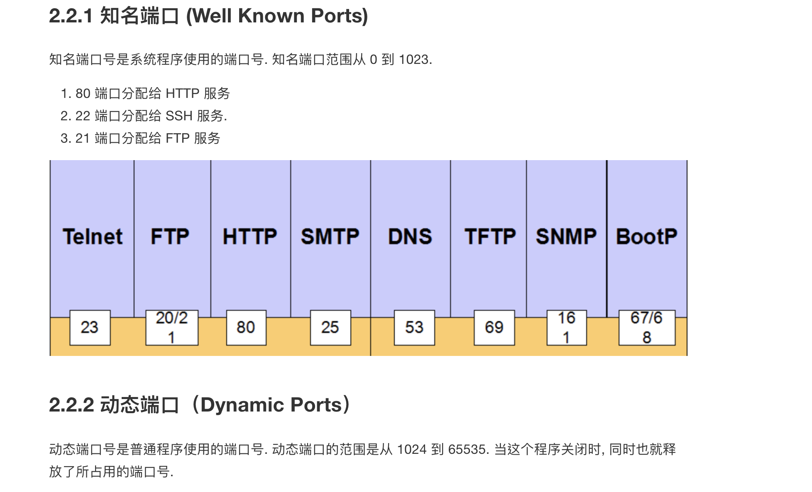

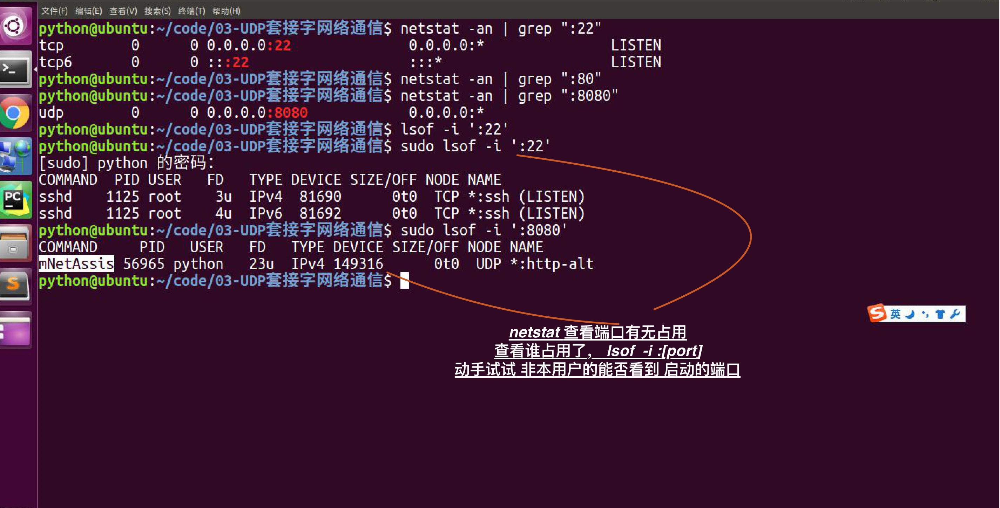

## FAQ

###  在工作中基本不使用 udp 而是使用 http, utp 不是属于 http吗

### 路由表

### 路怎么选的

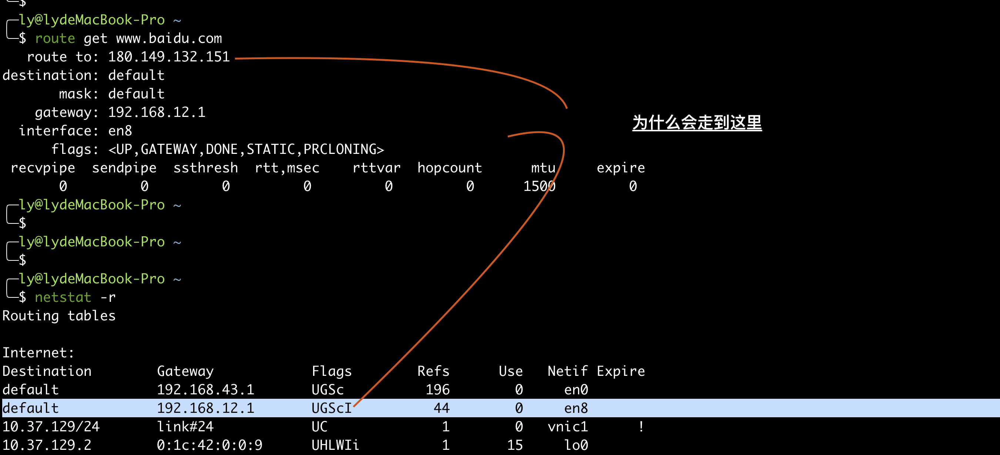

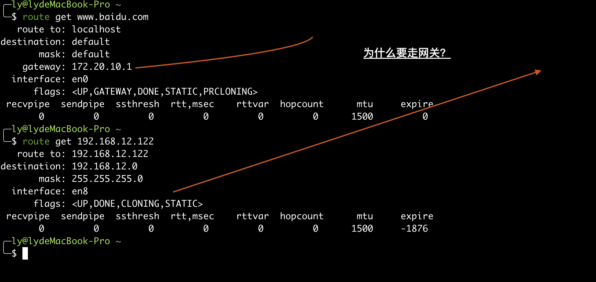

### 连上 vpn 后怎么走的


## mac 抓包 课堂直播地址

## 点分式，四个字节组成，能表示 40多个亿(怎么推算的)

## 看下计算机网络

## 计算机网络，路由的书

## 截图工具下载

## 单知识提升意义已经不大，思维如 leetcode 提升问题至于解决

## 试一试非本用户启动的服务当前用户能否看

## 我们是面向需求的不是面向技术的，如需求是做一个飞机大战，而不是要你研究飞机大战原理是什么样的

##  还没有网络通讯不是用套接字的，http 用的是吗(不是不是常链接吗)


## i_1查看端口

netstat -anp |grep 80
netstat -an |grep :80

```sh
lsof -i :80

netstat -an |grep :80

```


## FAQ

###  在工作中基本不使用 udp 而是使用 http, utp 不是属于 http吗

### 路由表

### 路怎么选的


### 连上 vpn 后怎么走的


## mac 抓包 课堂直播地址

## 点分式，四个字节组成，能表示 40多个亿(怎么推算的)

## 看下计算机网络

## 计算机网络，路由的书

## 截图工具下载

## 单知识提升意义已经不大，思维如 leetcode 提升问题至于解决

## 试一试非本用户启动的服务当前用户能否看

```sh
[parallels@centos-7 home]$ netstat -anp |grep nfs
(Not all processes could be identified, non-owned process info

```


## 我们是面向需求的不是面向技术的，如需求是做一个飞机大战，而不是要你研究飞机大战原理是什么样的


## mac nfs 挂载

```sh

centos 关闭fiewalld,selinux

yum install yum install nfs-utils portmap

vim /etc/exports

文件写入时使用anonuid用户写入owner,anongid组写入文件，用户或组id在/etc/passwd里面找


添加内容：/home *(insecure,rw,async,no_root_squash,anonuid= 65534,anongid=65534)

:wq

 service.rpcbind start

service nfs start


Mac

sudo mount -t nfs -o resvport,rw  centos:/home  /rhome


```

## 文件挂载

- 因为 Linux 要挂载到 /, 而 window 则是多个盘

## python 看到的源码 encode 中没有 deafult utf-8


## 写注释的方法

```Python

"""
方法名
 Encode the string using the codec registered for encoding.

  参数
   encoding
     The encoding in which to encode the string.
   errors
     The error handling scheme to use for encoding errors.
     The default is 'strict' meaning that encoding errors raise a
     UnicodeEncodeError.  Other possible values are 'ignore', 'replace' and
     'xmlcharrefreplace' as well as any other name registered with
     codecs.register_error that can handle UnicodeEncodeErrors.
 """

```

## 写任何模块不要和标准模块重复

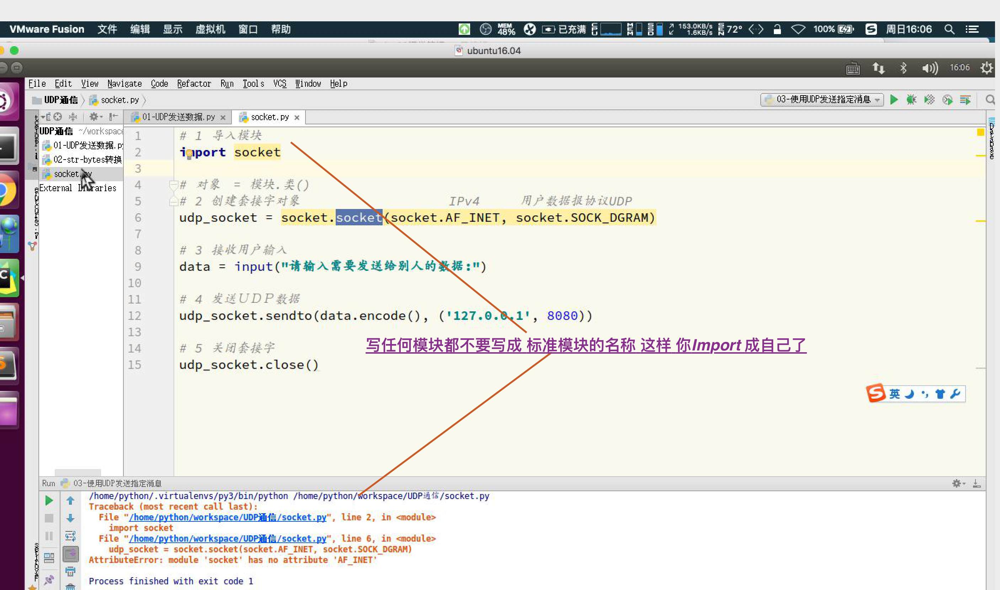

## 1000 一看就是小白，写个 1024 因为程序员的整数是  1024

## 思考

```
# 2 << 9
upd_socket.recvfrom(10<<10)

```

##  bind 方法绑定端口只能绑定本机已有的网卡的

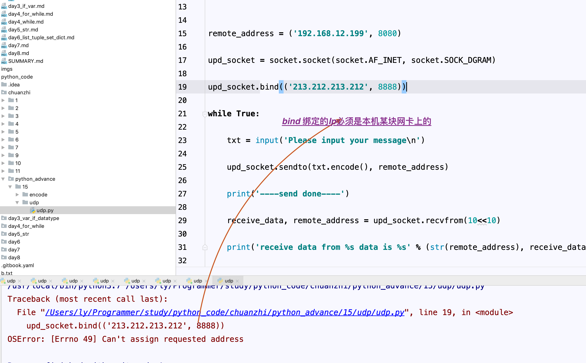

## 还有那个 class 'class int'

## 如

## 单任务模式


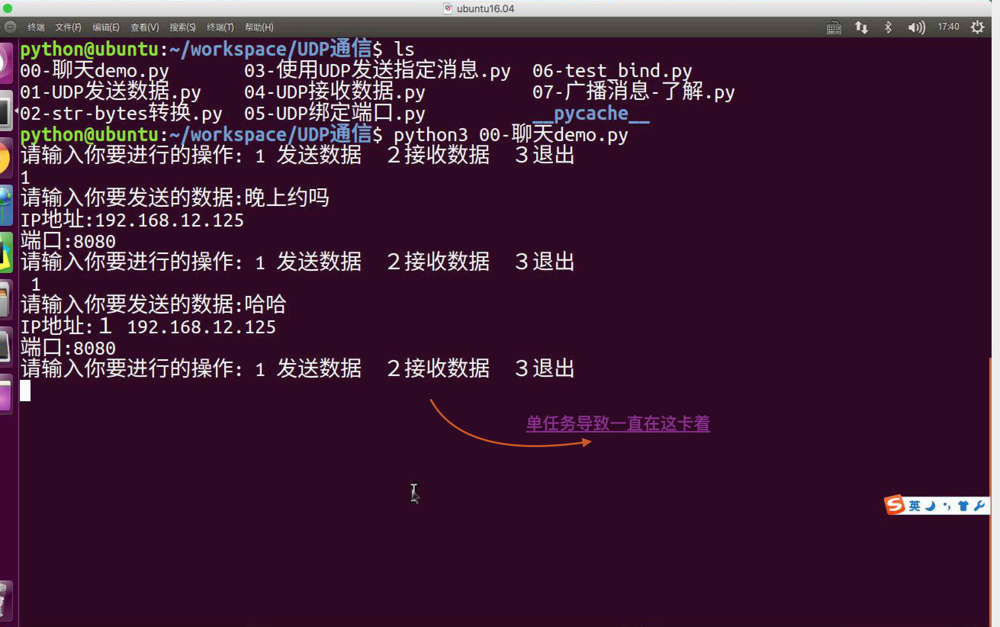

## str_byte

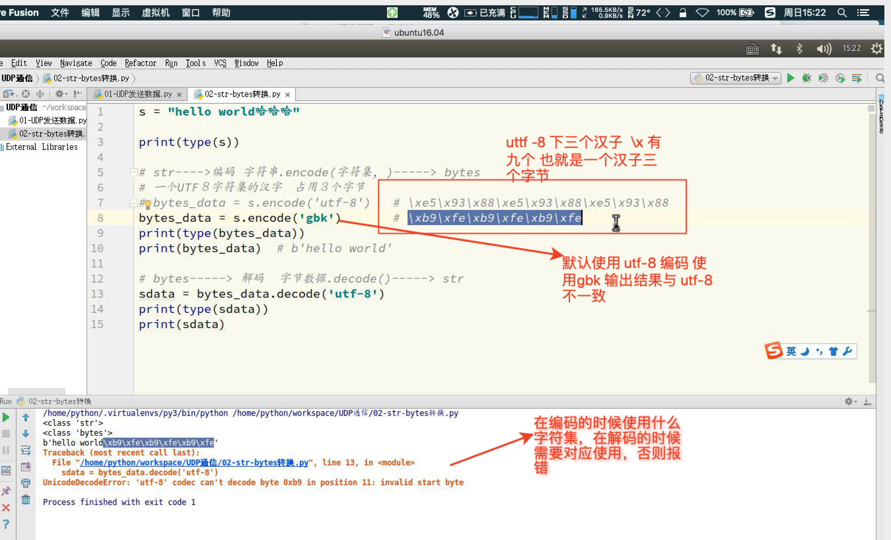
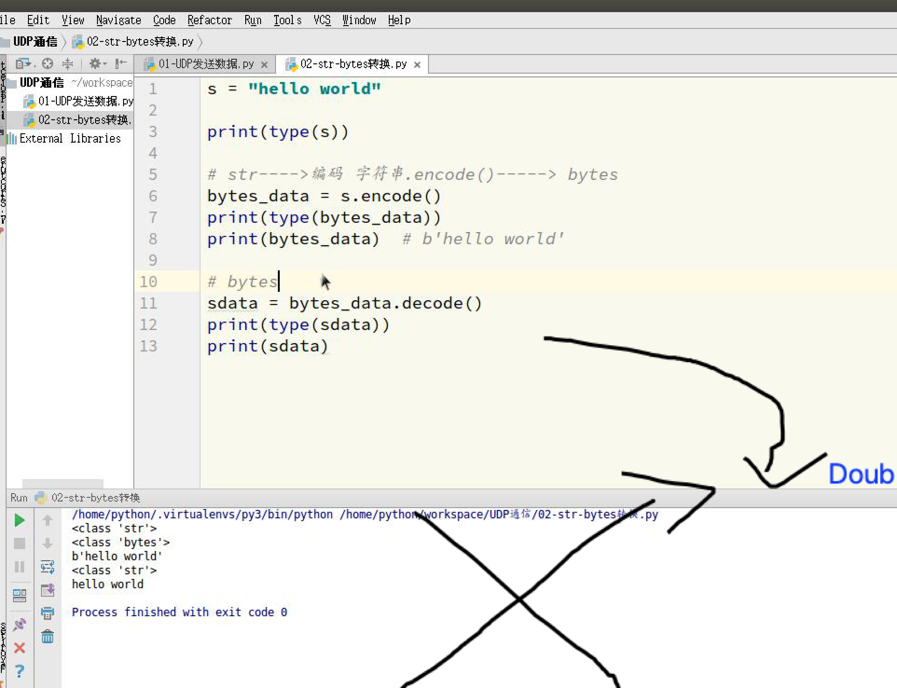

##    res_data, res_address = socket_ins.recvfrom(10<<10) 不收到一条消息就阻塞，同 input


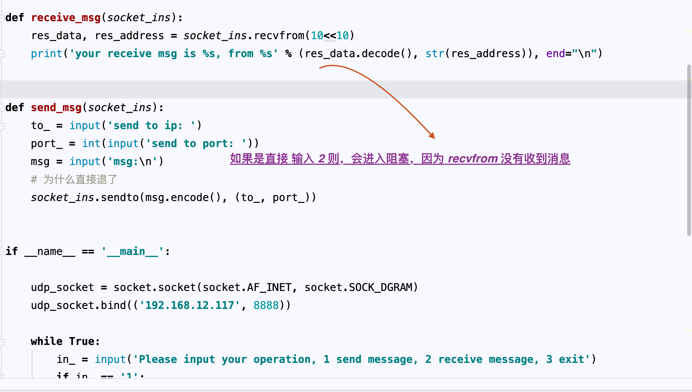

## 为什么在消息发送完成后，再去接收也能收到!!!
