## 核心在改变思维，而不在强制

## 套节字

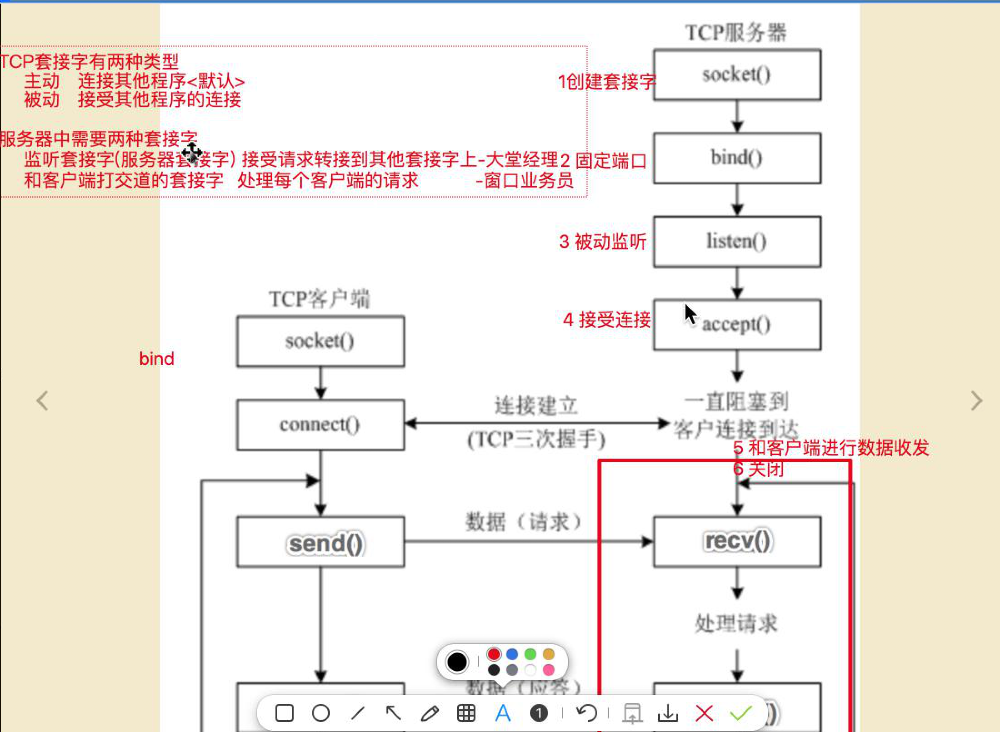

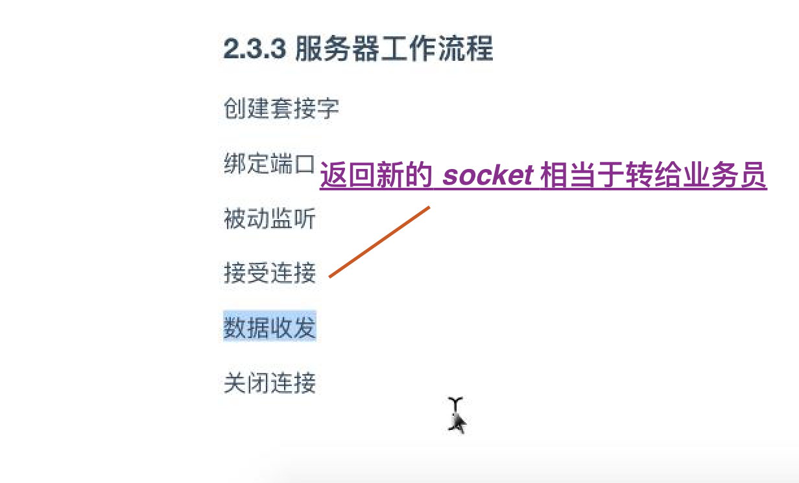

### 服务端 socket 的写法

```python3
# 等待被服务连接的数量(类似 银行排队可等待的人数)
# 如果超过 128 则连接被拒绝
server_socket.listen(128)
```

### 同时为多个用户服务


### 服务器为什么分两种套节字?

- 一种负责监听 如大堂经理
- 一种负责处理 如窗口业务员

每个窗口需要一个套节字，每次客户端的连接 需要一个 socket 与 客户端的 socket 对应(服务器的第二个 socket 是 sk.accept返回来的)

## http 步骤

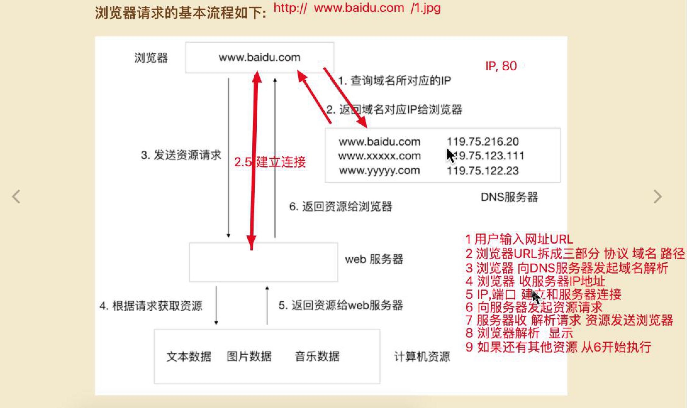

## Tcp Http

### Http 协议本身就是基于  Tcp 协议实现的

### Tcp(Transmission Control Protocol), 传输协议，面向连接的(udp 不需要建立连接 用  socket 直接发即可)，可靠的，

- 面向连接的(udp 不需要建立连接 用  socket 直接发即可)

- 可靠的
    - tcp 每个报文都必须经过对方应答后，才认为这个tcp 报文上传成功
    - 超时间后再重新发送(终端1 一定时间内为收到回应(ack))

    - 错误校验(检测数据报是否被变动准确等, 如果是，则认为数据不对)

    - 流量控制, 拥塞控制(如果发 1000M/s 收为 1M/s 则发送方会降低传输速度， 再慢慢加速，动态调整), 根据实时情况，动态调整传输速度

    - 包有序号 可以排 包的顺序 Udp 不可以

#### tcp 缺点

- 传输速度慢
- 占用系统资源高

### tcp 对比 Udp

- tcp 面向连接，可靠，不能发广播，有序, 流量控制
- udp 不面向连接，不可靠，无序，没有流量控制，可发送广播


### tcp 协议应用场景


如HTTP、HTTPS、FTP等传输文件的协议，POP、SMTP等邮件传输的协议。

在日常生活中，常见使用TCP协议的应用如下：

浏览器
QQ文件传输

#### tcp 不能用来广播，广播用 udp

## tcp 实现文件下载服务器


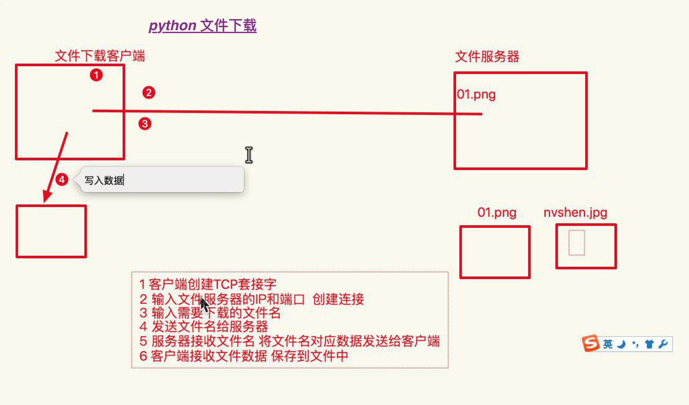


### 服务端实现

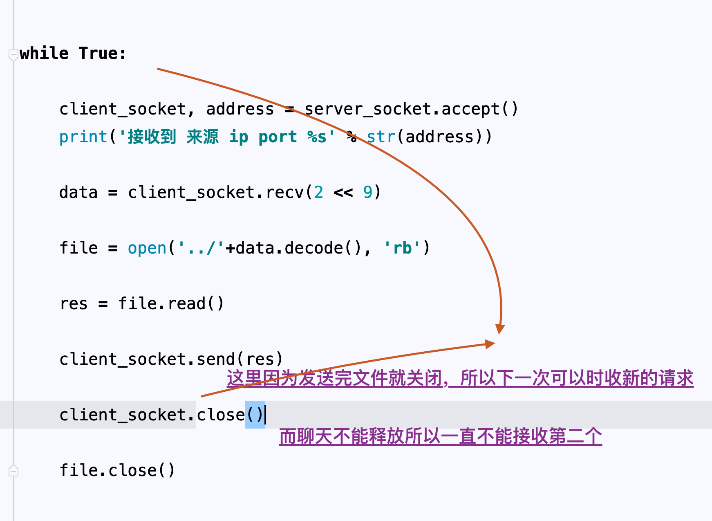


# 以上是一个原始简单的服务器实现

## 三次握手

- 发起时机

- 相对安全，A -> B, B -> A, A -> 此时A 知道 B 收到了， B 知道 A 收到了
双方都确定能知道对方确实收到自己的消息了！

客户端调用 connect 方法时建立

## Tip

### 熟练掌握 tcp udp 后对以后网络会有清晰认识

### htts 本质上也是 Http 只是多了一层加密

### 本身理解也是一种记忆

## FAQ

### tcp udp 在 http 中的体现

### python 中 if '' else : ... '' 表示 False

## 系统默认解压编码 gbk, 压缩时压成 utf -8 则解压出错，所以用第三方解压即可(中文乱码问题)

## 把 github 上的 python 库，php库都读一读

## 2 << 6 二进制运算搞清楚！！

## 一个 Int 占据 4个字节 一个 str 占一个 根据 ascil 码表 / utf-8 表

C语言中左移<<表示乘以2，右移>>表示除以2，这是由计算机工作原理导致

2 << 1 = 2 * 2的一次方
10 << 1 = 10 * 2的一次方

## 8 进制 16 进制
```sh
- 8 进制以 0 开头，16进制 \x  0x
- 二进制，01 逢二进一， byte ? 读图片

```

### 为什么图片 二进制 不是 0和1 为什么是乱码

图片 python 中文件读时候 16进制, 也可以是二进制

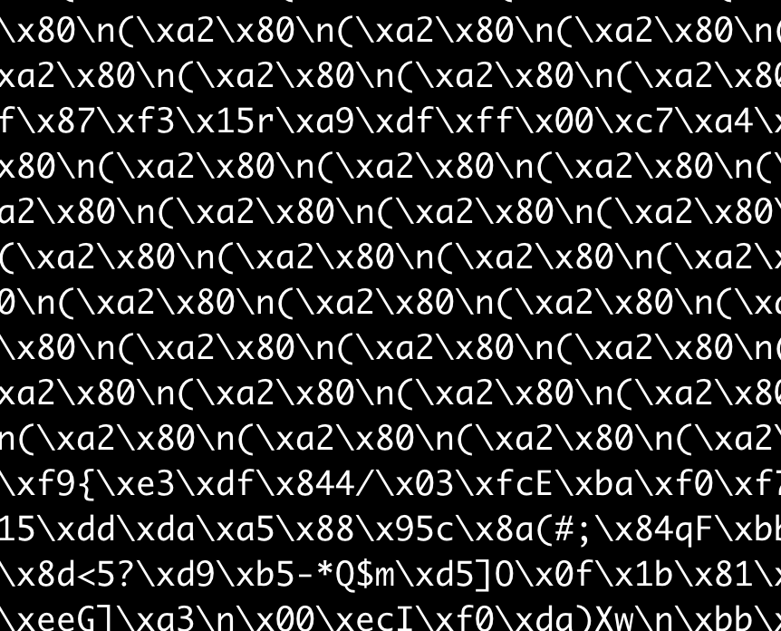

# 图片字符流是乱码, 二进制，字节数组，比特,二进制流, 流是什么(对比Java的流)（收到与转换, 流难道就不是string了吗?? 在 http 传输的过程中，??? 没有 byte 类型啊

## socket 服务器写法  导绑监接用 关

## 客户端  导连发收关

## 实际上服务器就是个死循环

## tcp & udp

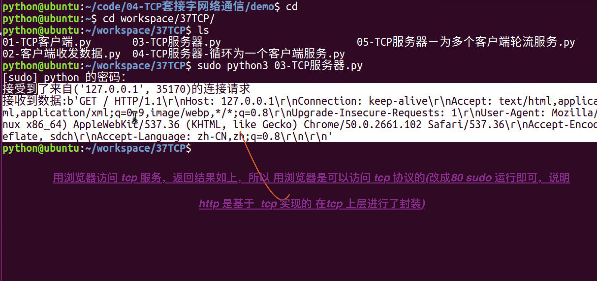

## 多人聊天


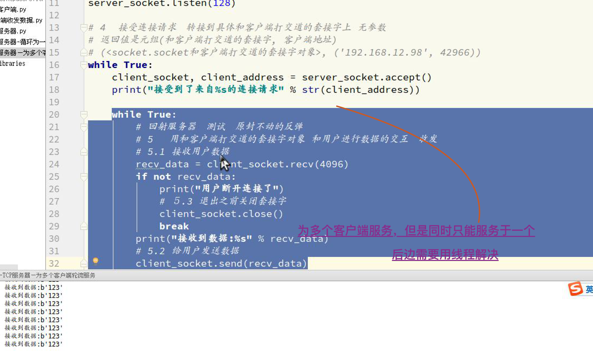

## udp 以 报文为单位，tcp 以字节为单位

## udp tcp 报文

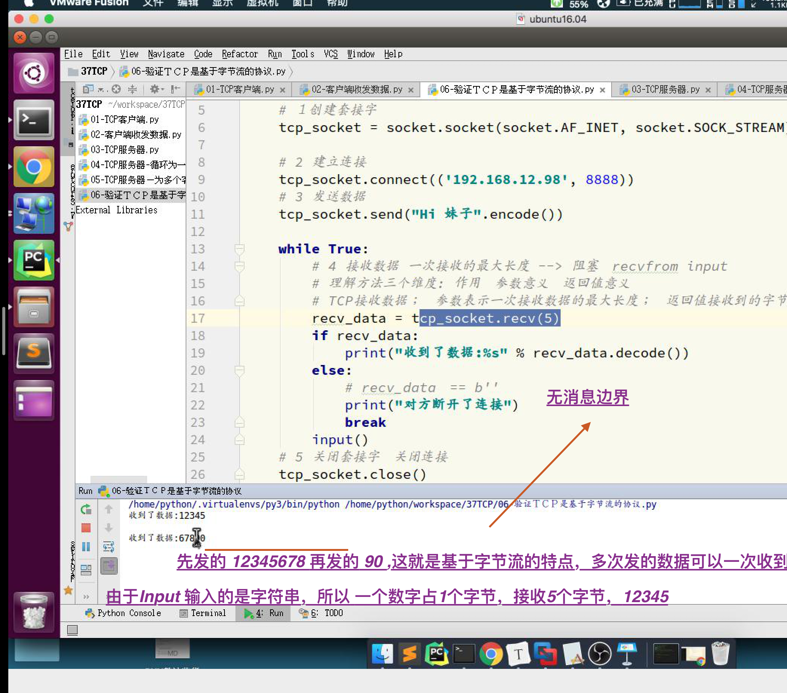

## 大文件要边收边写不然 如果文件件过大 则内存不够了


## 三次握手

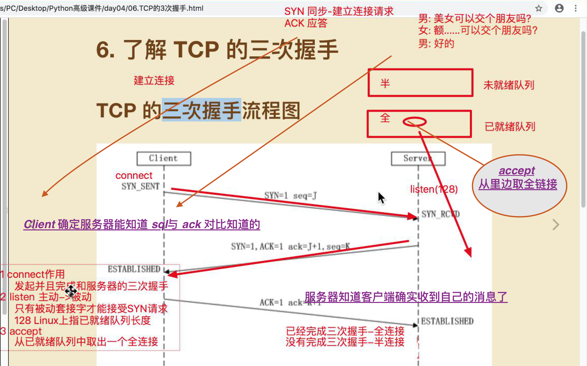
双方都确定能知道对方确实收到自己的消息了！

## ack 答复

## tcp 的四次握手, 2SML 问题 adress in use

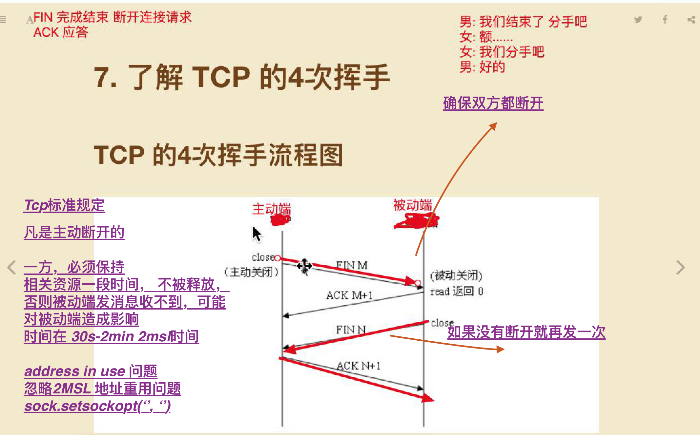

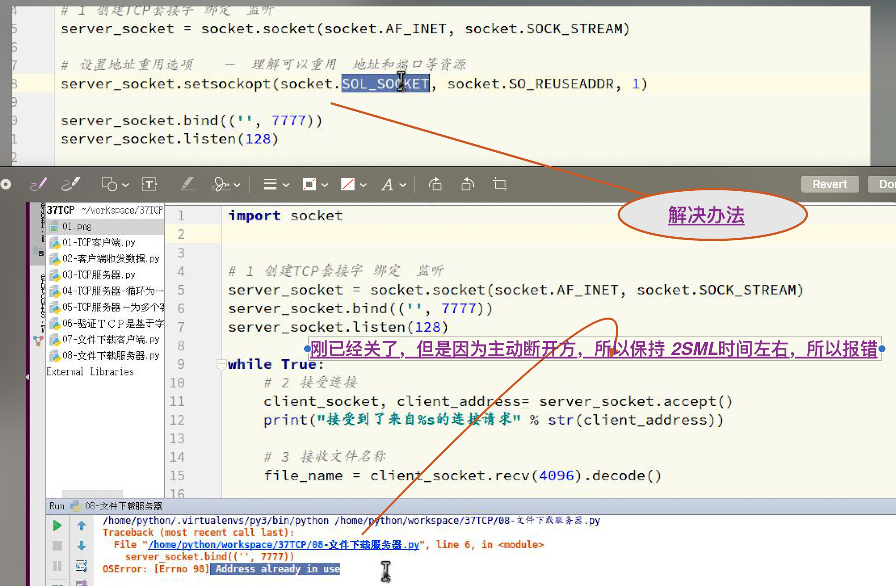

## 中国 拿过一个 图灵奖(计算机中的诺贝尔奖)

## 1997 年的 http 协议

## http 协议特点 应用层 ， ip 网络层，tcp, udp 传输层

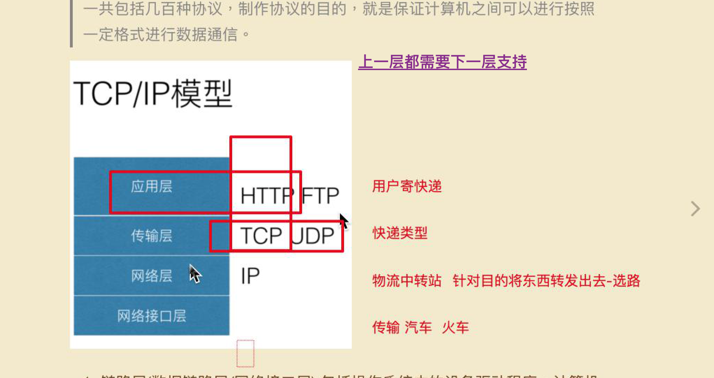
