## 回顾

### 当浏览器输入，网址，浏览器会把网站分为三个部分，协议，域名，路径，然后建立连接根据dns 解析域名


###


## http 请求报文分析, Request Header

### keep-alive 一会儿再释放资源

### Host：指定请求服务器的域名 或 IP地址和端口号。(不带协议哦)

### \r\n 连续收到两对，说明前边的请求头已经结束了

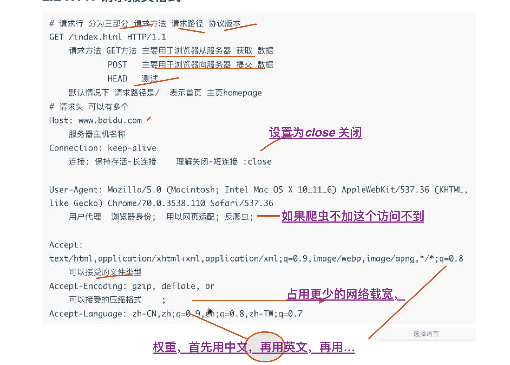
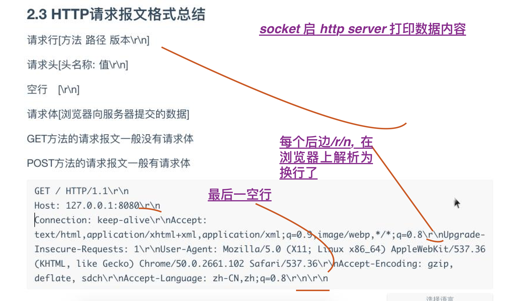

```
Content-Security-Policy: upgrade-insecure-requests
Upgrade-Insecure-Requests:1

在服务器从http 升级为 https 为了避免 手动替换所有的 http 资源为 https, 可以使用以上两个响应头,


```
在https的页面需要加载http的资源，那么浏览器就会报错或者提示，为了促进用户升级协议，同时不需要网站开发者劳师动众地把整个网站的http资源改成https资源，chrome增加一个Upgrade-Insecure-Requests: 1头，告诉服务器，浏览器可以处理https协议，然后服务器返回Content-Security-Policy: upgrade-insecure-requests头，或者通过meta头设置，告诉浏览器，对于页面的http资源，请求时可以自动升级到https，比如在https的网站上有一张图片url是http://localhost/1.jpg，浏览器请求时会把url变成https://localhost/1.jpg，所以这里首先需要服务器在端有相对应的资源。但是有一种情况例外，那就是https网站中a标签对应的外站资源不会被升级，比如a网站有一张b网站的链接，那么这个链接对应的url不会升级。


参考: https://blog.csdn.net/theanarkh/article/details/53441342

### 长连接短连接对比

> 短连接 每次连接 都要 三次握手四次挥手

长连接: 连接建立成功后，可以发送多次请求和响应，等双方不进行通信的时候，服务端做好断开连接的操作
短连接: 连接建立成功后，一次请求和响应完成以后连接就会断开，每次发送请求需要先建立好连接
长连接减少了用户的等待时间，提升了访问速度，但是增加了服务端的资源开销，如果用户量太大，容易导致服务器负载过高最终导致服务不可用

短连接不会占用服务端过多的资源，但是增加了用户的等待时间，减慢了访问速速

### 之前访问9999 加载不出
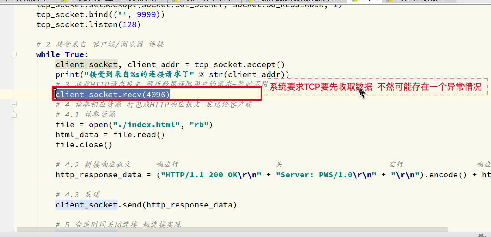

## 响应报文

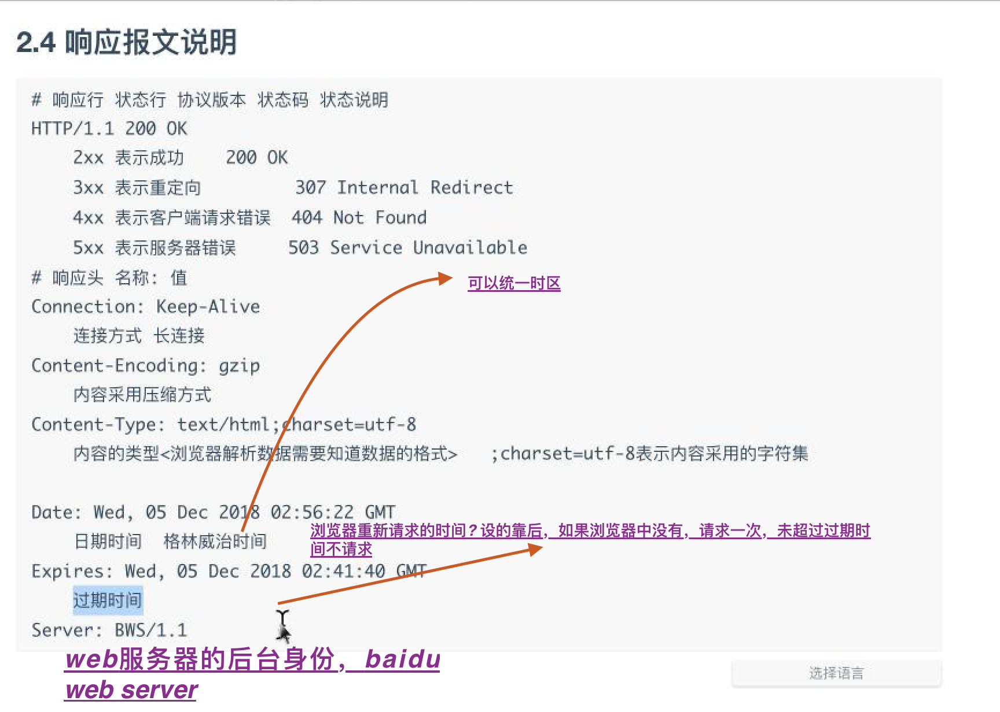

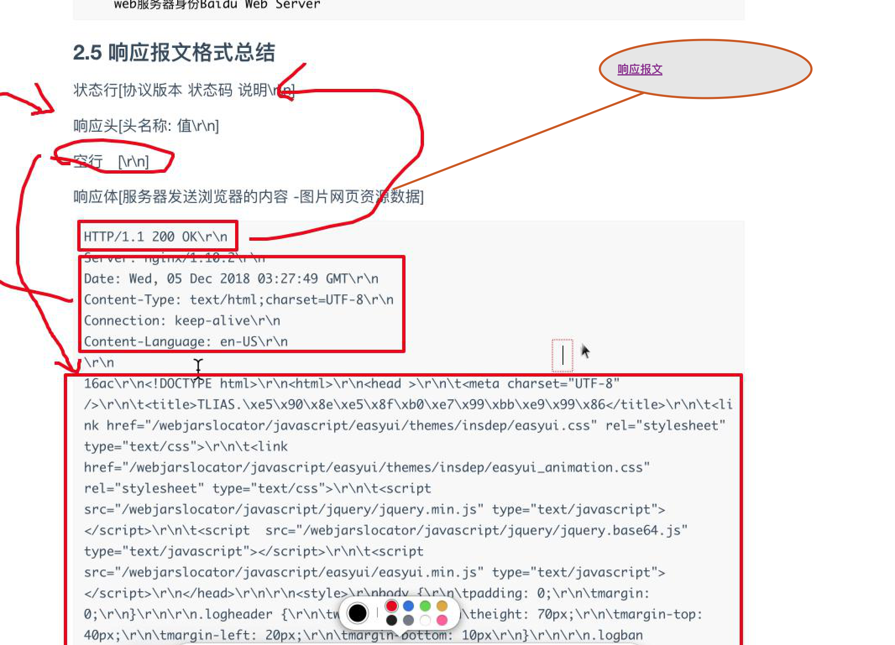

## web服务器工作流程

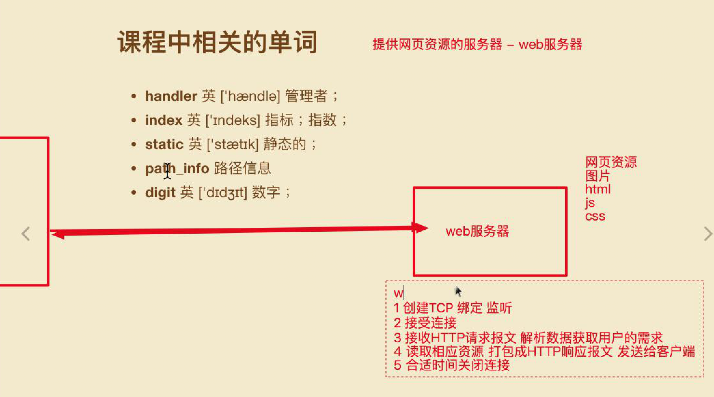

## 使用 tcp 一步步封装 http

### http 层层封装

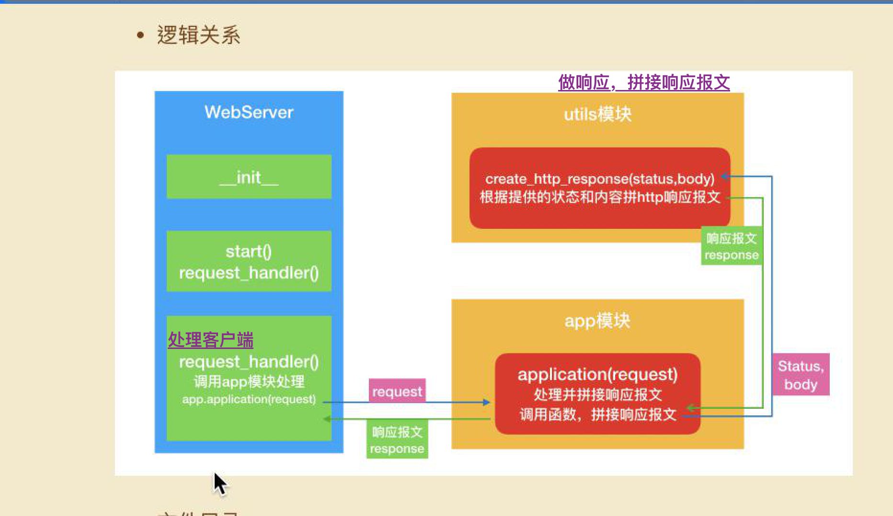

-1 初始版本
-2 根据用户输入返回页面, socket 获取请求头中 path
-3 增加容错 404
-4 面向对象重构(每个程序员有自己的认识), 在考虑下思维
   - 面向对象更容易体现在一个大型的场景里边，几十万行代码的
-5 封装 application 处理获取响应头
-6 封装 util 处理返回数据(响应报文)

## FAQ

### 服务器响应图片怎么走的
### expire 工作原理
### http 通讯是 类似 tcp accept 建立连接
### socket 写服务器时，直接用 二进制读， 这样就用再编码了(socket 需要传输 byte byte是二进制码 ??)

阅读: https://blog.csdn.net/changwilling/article/details/52065955

缓存阅读: https://www.jianshu.com/p/f331d5f0b979

### 服务器 返回 LastModified & expire
### 二进制问题, 结果如 encode 一样
### ？ 为什么会一样呢(因为 read 返回 anyStr)， encode 不过是使用 utf-8 编码，open('wb')
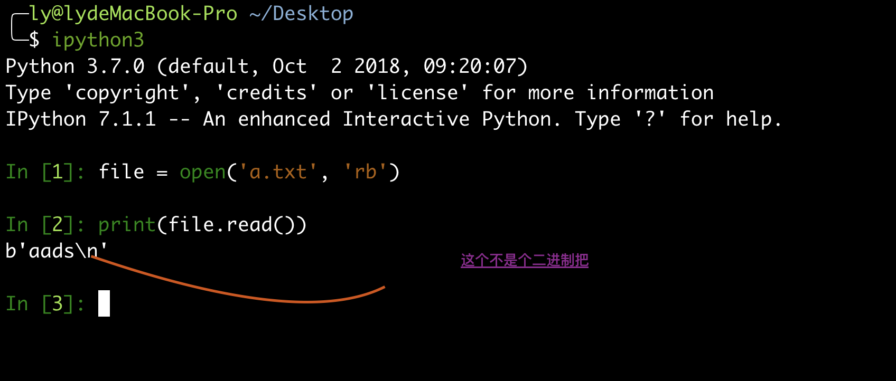


```
In [4]: 'aads'.encode()
Out[4]: b'aads'

In [5]:


```

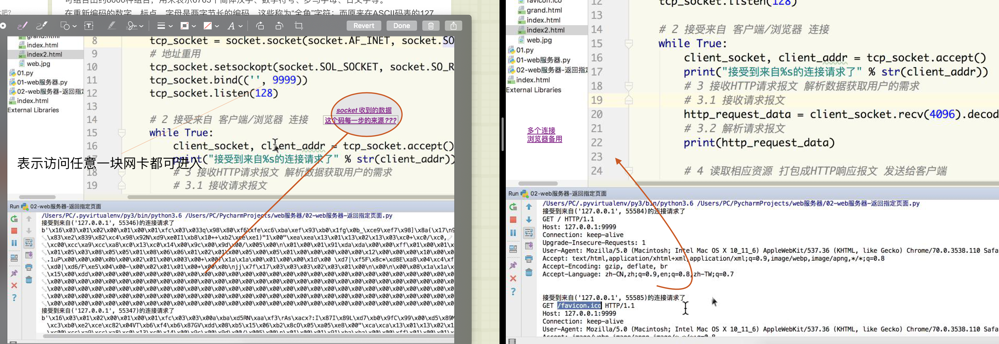
## 给任意代码执行流程

## 思考直接用tcp写http 返回

## 代码资源整理

## 服务器 tcp 协议 + http 协议，浏览器中访问网页，浏览器帮我们封装了 请求报文等

## 一个字节 8 位，一位一比特, 一个数字 多少位，-127 - 128 可以用一个字节表示?

```
一个字节 8 位，第一个是符号为，十进制, 最大值恰好 2 的 8 次方, 即 2 << 7

```

## vim 操作的时候 是直接转为 字符串，此时 根据你命令的编码打开, 因为图片实质上 二进制，vim 时会选取一个 编码，如 utf-8 很多内容找不到，则乱码

```
图片存储是二进制码，而文字用的是unicode或者ascii码，，你用文本打开图片，当然对不上了。
```

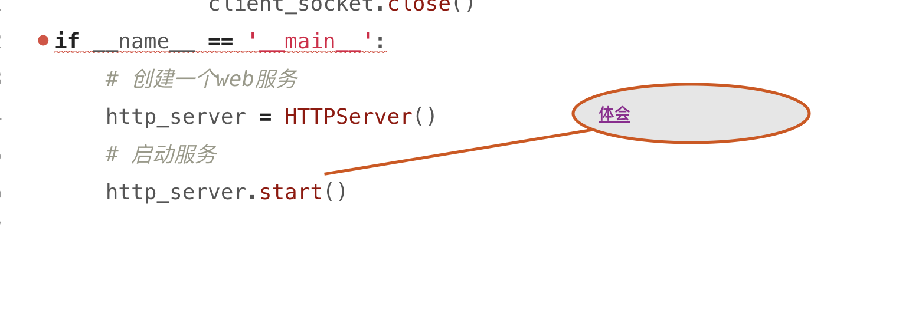

## 函数处理请求报文响应报文，再封装下，如 express 框架...

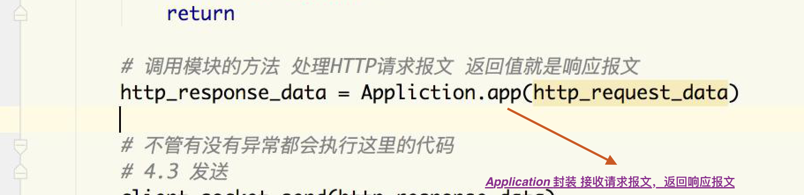

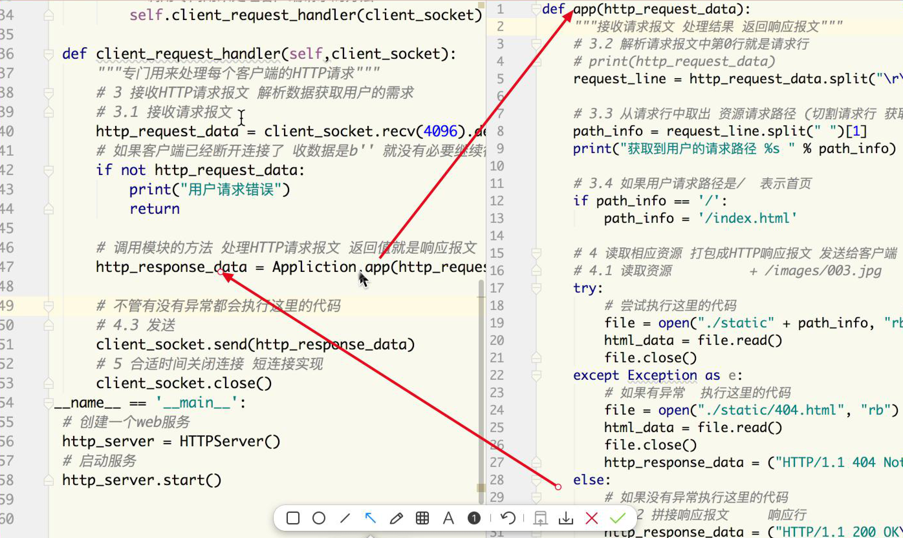

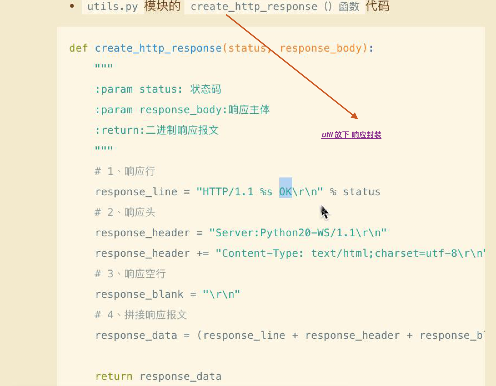


## 体会思考读源代码。。。。 补之前不足，

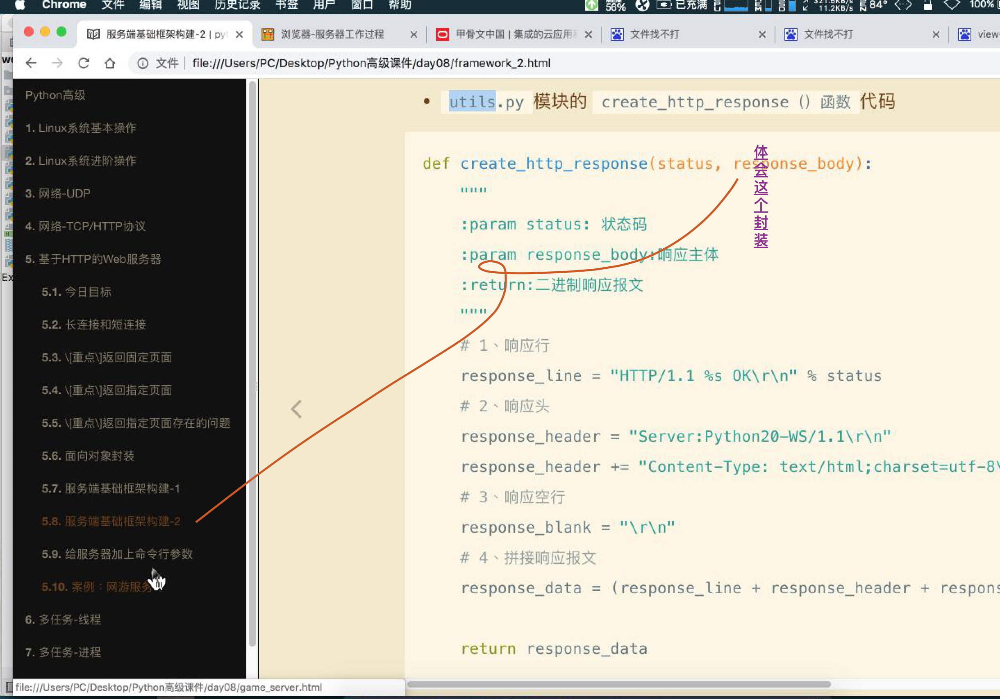

## 晚上代码参考  18, 增加 命令行参数版本
