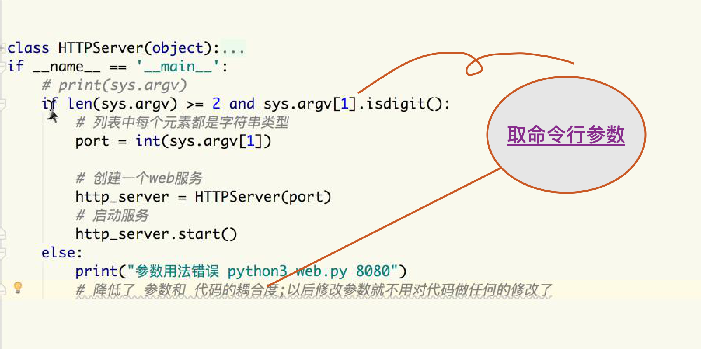

## 响应请求头

请求独有 hua, 响应独有 sd, 通用 cccc


# ======================================

## 从命令行中获取 Python  运行的端口并微程序设置




```python3

# test.py
import sys
print(sys.argv)

╰─$ python3 test.py
['test.py']
╭─ly@lydeMacBook-Pro ~
╰─$ python3 test.py 10086
['test.py', '10086']
╭─ly@lydeMacBook-Pro ~
╰─$
```

## 网游服务器

-

## 把每一种线程和跟他相关的代码封装在一个类里 - 自定义线程类


## 多任务线程

> 单任务，多任务, 电脑中既有并行，也有并发

### 时间片: 把每个任务执行的一小段时间，称为时间片

### 并发: 多任务在同一时间段内切换执行，基于时间片轮转

### 并行: 多核(每个核执行一个)，在同一时间点，执行的多任务方式

> 之前编写的代码都是在主线程中, 操作系统默认运行一个程序，都会创建一个主线程

cpu 无法在一个线程内 切时间片执行，所以 在之前 Python 中，udp, input 会卡塞。使用 多线程后，cpu(多核多线程电脑才可以多线程?j 应该不是，单核没法开线程了 ?), 新开的线程叫子线程

并发：指的是任务数多余cpu核数，通过操作系统的各种任务调度算法，实现用多个任务“一起”执行（实际上总有一些任务不在执行，因为切换任务的速度相当快，看上去一起执行而已）
并行：指的是任务数小于等于cpu核数，即任务真的是一起执行的

### 单个单进程，没有并行

### 线程使用（i t s import .Thread start）

```python3

# args 位置参数  kwargs 关键词参数
def __init__(self, group=None, target=None, name=None,
                args=(), kwargs=None, *, daemon=None):

```


#### 线程参数问题


### 等待线程执行完成，再执行主线程 xxx

```python


    s_th = threading.Thread(target=sing, args=('韩红',), kwargs={'song': '那片海'})
    d_th = threading.Thread(target=dance, args=('周杰伦',), kwargs={'name': 'let it go'})
    s_th.start()
    d_th.start()
    main()
    s_th.join()
    d_th.join()
    print('----I have got it----')

```

### 验证线程执行的顺序

- 多线程运行的时候是无序的，是随机的


### 线程常用方法

```python

  # threading.Thread(name = '')

    d_th = threading.Thread(target=dance, args=('周杰伦',), kwargs={'name': 'let it go'}, name='dance thread')

    # 打印当前存活的线程
    threading.enumerate())

    # 查看当前(存活)线程, 名字等属性
    # threading.current_thread().name     


```

### 主线程会等子线程执行完后再推出


### 守护主线程()

#### daemon

>   如果一个程序只剩 daemon 线程了，那么所有线程就会立即退出


## FAQ

### 异常捕获中没有作用域, 而 file close 问题如下

```
In [1]: try: name = 1
   ...: except Exception as e:
   ...:     print(e)
   ...:

   In [3]: print(name)
 1
```


### finally 异常关闭问题

- file.close 关闭不了，是说走不到这一步


### python 线程实现的原理

### 主线程(从上往下执行) 由操作系统创建， 我们创建的线程都是子线程!(其实就是一个封装)

> 将线程类和线程，所需要执行的代码，封装在一个类中

### 同一个进程内，多线程共享全局变量

#### 步骤

-1. 继承父类的 threading.Thread

-2. 重写 run 方法

-3. 定义一个子类对象

-4. 调用 子类 start 方法

```python3


import threading
import time


class MyThread(threading.Thread):
    def run(self):
        self.say()
        for i in range(5):
            print('Thread name', threading.current_thread().name)
            time.sleep(1)
        pass

    def say(self):
        print('I say...')


if __name__ == '__main__':
    MyThread().start()

```

### 多个线程同时操作一个变量导致数据错误

- 表现


### 死锁

### 死锁: 一直等待对方释放锁的情景就是死锁

### 解决： 在合适的位置加释放锁的代码


### 互斥锁

#### 优点

- 解决了 争夺资源的问题

#### 缺点

- 用不好容易造成死锁
- 多线程执行变成了同步，降低了执行效率


- 互斥锁，一种简单的解决方式（同一时间只能有一个任务占据锁）


```python3

# 1 申请锁
threading.Lock()

# 2 将锁传入线程 锁定 & 释放
lock.acquire()

# 3 释放
# lock.release()

```

## 补充 with（文件锁自动释放）

### 在文件正常使用完成，或操作异常时，都能正常关闭文件

```python3

lock.lock()
"""  Your logic """
lock.release()

# 使用 with 书写方式

with lock:
    """ your logic """"
    a += 1

```

with

## 将udp聊天器改为多任务

## 作业将 第三个 版本改成多任务 

## 把每一种线程和跟他相关的代码封装在一个类里，自定义线程类（工作中使用最多）


# 为什么 内网ip 都是 192.168 打头????
