## 进程

### window 任务管理器可以看到进程，linux ps aux

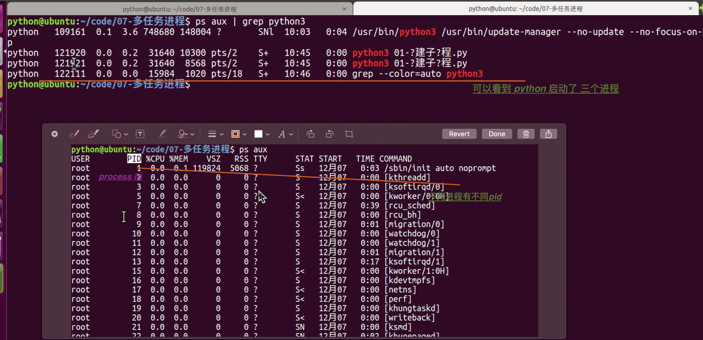

- cpu 最小调度单位是进程，但是如果一个进程只执行一个任务, 代价比较高，线程共享进程资源(?),
所以代价比较低

- 注意：一个程序至少有一个进程,一个进程至少有一个线程,多进程可以完成多任务.多线程也可以

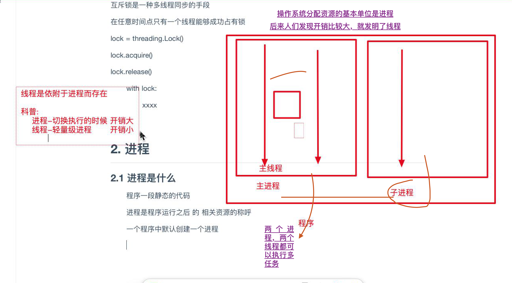

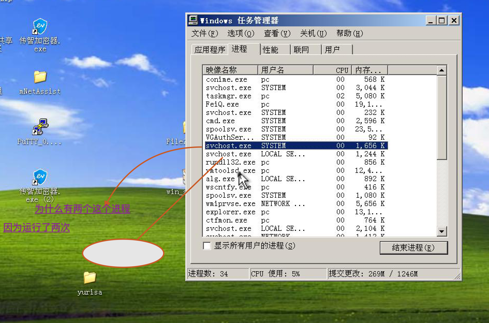

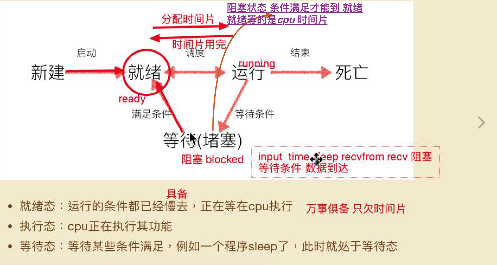

### 一个进程内的线程是 共享这个线程的资源吗


- 进程是系统分配资源的最小单位


- 线程是操作系统调度

- 资源分配给进程，同一进程的所有线程共享该进程的所有资源。


## 进程操作

### 获取进程id(通过 multiprocessing， 与 os), 父进程id(通过 os),


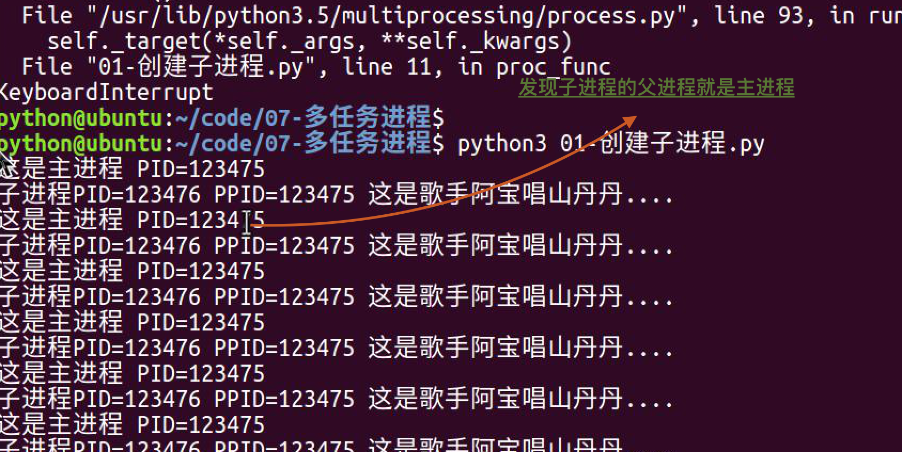

> 可以看到 子进程取到的 ppid 与 主主进程 pid 是相同的 

```python
import multiprocessing
import os
os.getppid() 
os.getpid()
multiprocessing.current_process().pid 
```

> 进程操作和线程基本一致

```python

import multiprocessing
import time


def c_process_func(name, play):
    while True:
        print('我是子进程, 我叫 %s 我演过 %s' % (name, play))
        time.sleep(1)


def main():
    """单进程 单线程 之前写的代码在主线程上"""
    c_p = multiprocessing.Process(target=c_process_func, args=('zhaobenshan',), kwargs={'play':'xiaopin'})
    c_p.start()
    while True:
        print('这是主进程')
        time.sleep(1)


if __name__ == '__main__':
    main()

```

### 进程相关的方法

- [child_instance].pid | name # 在 子进程 start 之前是可以有 name的，但是不会有 pid
- join [child_instance].join() 等到当前 instance 进程退出（只是表示等子进程多久，不会影响子进程执行）
- join([seconds]) # 父继承 等 子进程 seconds 秒后 如果子进程还没执行完成，退出
- [child_instance].terminate() 强制退出子进程

### 在线程中时，子线程执行不完，主线程不关，那线程中是否一致呢， 是一致的

> 主进程在代码执行完成后不会立即退出，而是等子进程结束后一起退出

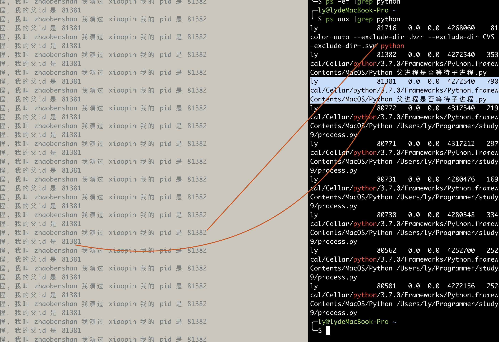

### 多进程执行也是无序的

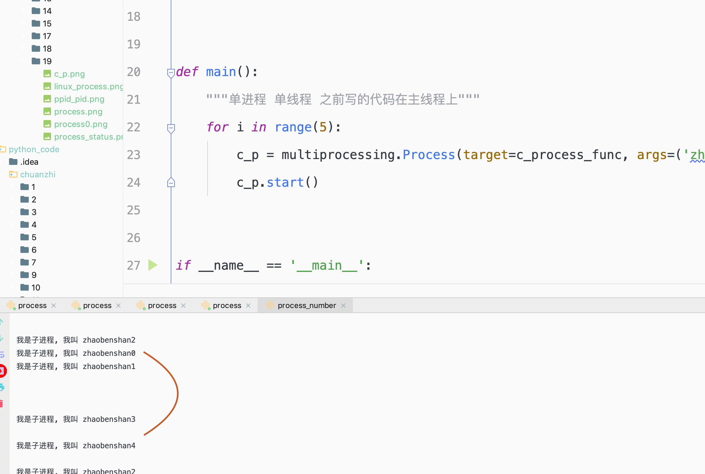

### 父子进程不同享资源

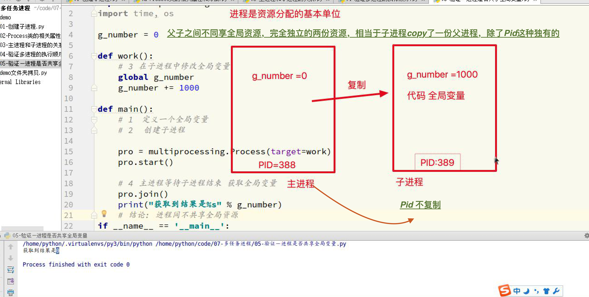

### 进程之间的通讯

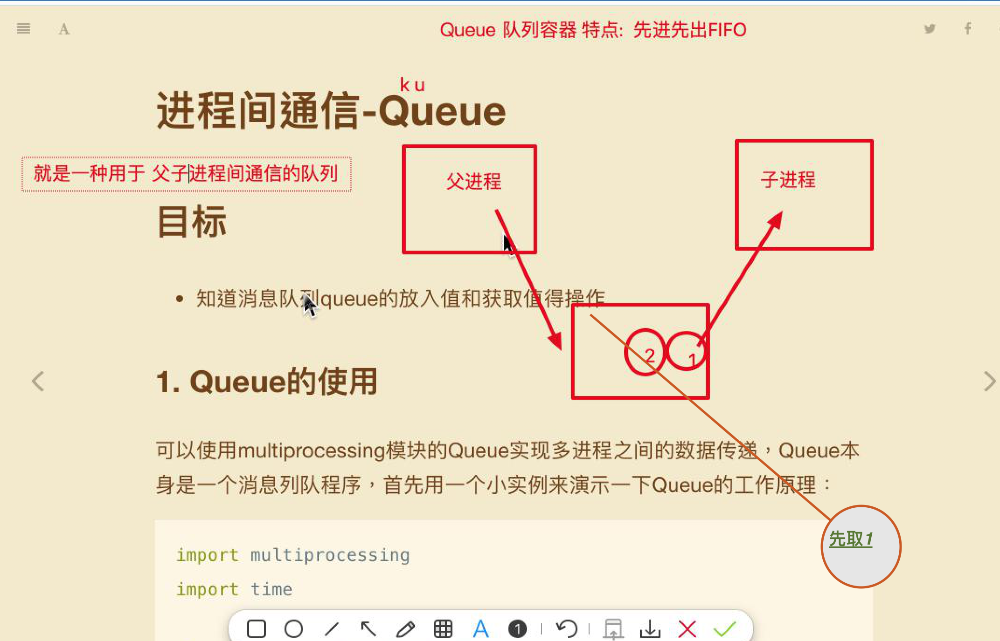

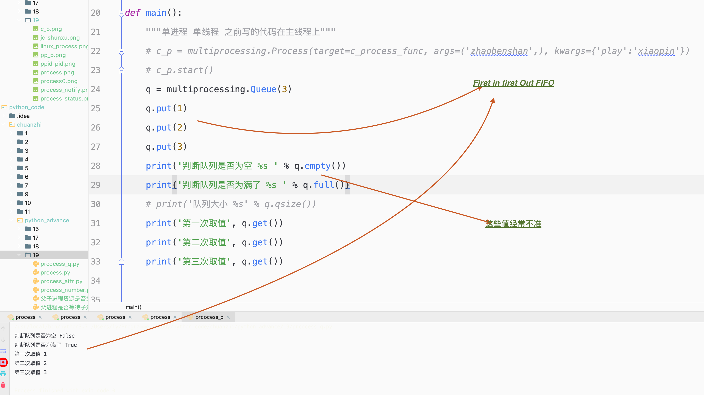

```python

import multiprocessing
import os
import time


def c_process_func(name, play):
    while True:
        print('我是子进程, 我叫 %s 我演过 %s 我的 pid 是 %s' % (name, play, multiprocessing.current_process().pid))
        print('我是子进程，我的父id 是 %s' % os.getppid())
        time.sleep(1)


def main():
    """单进程 单线程 之前写的代码在主线程上"""
    # c_p = multiprocessing.Process(target=c_process_func, args=('zhaobenshan',), kwargs={'play':'xiaopin'})
    # c_p.start()
    q = multiprocessing.Queue(3)
    q.put(1)
    q.put(2)
    q.put(3)
    print('判断队列是否为空 %s ' % q.empty())
    print('判断队列是否为满了 %s ' % q.full())
    # Raises NotImplementedError on Mac OSX because of broken sem_getvalue()
    # print('队列大小 %s' % q.qsize())
    print('第一次取值', q.get())
    print('第二次取值', q.get())
    print('第三次取值', q.get())


if __name__ == '__main__':
    main()


```

### Queue

- get 获取数据要求其中有数据

- set 设置数据要求其中有位置

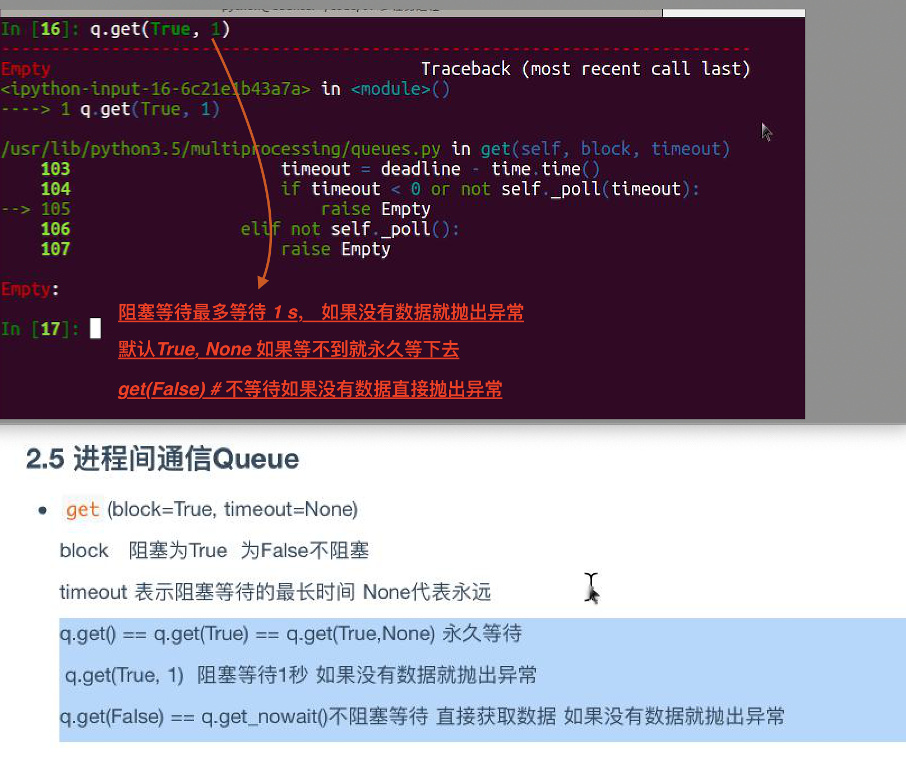

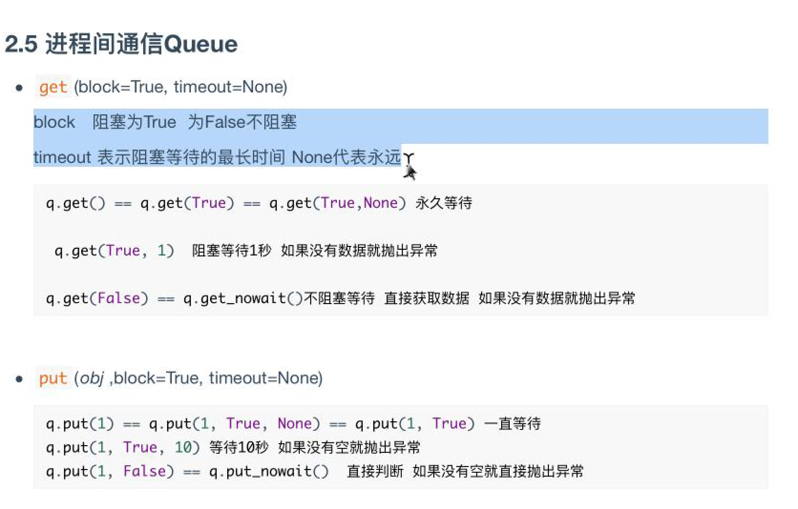

```python
In [5]: q = multiprocessing.Queue(3)

In [6]: q.put(1, False)

In [7]: q.put(1, False)

In [8]: q.put(1, False)

In [9]: q.put(1, False)
---------------------------------------------------------------------------
Full                                      Traceback (most recent call last)
<ipython-input-9-d24fc8a295c9> in <module>
----> 1 q.put(1, False)

/usr/local/Cellar/python/3.7.0/Frameworks/Python.framework/Versions/3.7/lib/python3.7/multiprocessing/queues.py in put(self, obj, block, timeout)
     81         assert not self._closed, "Queue {0!r} has been closed".format(self)
     82         if not self._sem.acquire(block, timeout):
---> 83             raise Full
     84
     85         with self._notempty:

Full:

In [10]:
```

## 进程池(如用户与船), 注意是进程池 ！ 是不是线程池, （创加关等）
> 在大多数情况下, 以下后者优点远大于前者
- 用户来创建一批，用户走销毁一批
- 先创建一批在那等着

- 用户来的时候，提前准备好了一小批进程

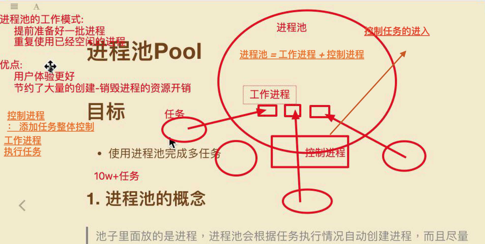

### 同步方式添加进程, 添加任务后，需要等待任务执行完成后才能继续往下执行

### 异步方式添加进程, 主进程不会等待, 主进程关闭后直接关闭   

#### 异步不等待源码

```python

    def apply(self, func, args=(), kwds={}):
        '''
        Equivalent of `func(*args, **kwds)`.
        Pool must be running.
        '''
        # get 处等待
        return self.apply_async(func, args, kwds).get()
```

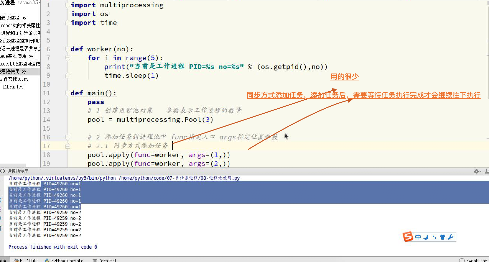 
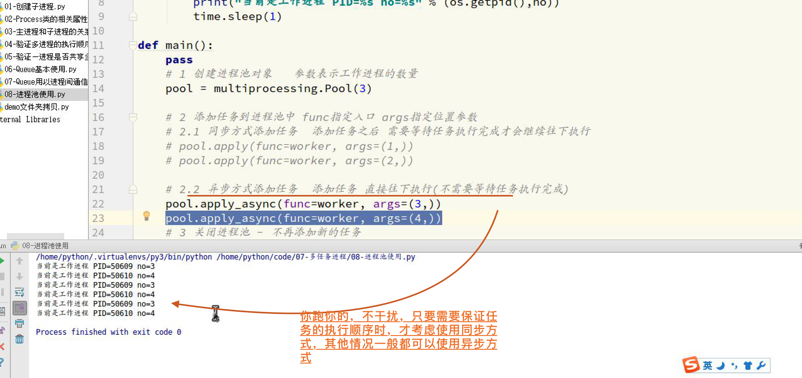
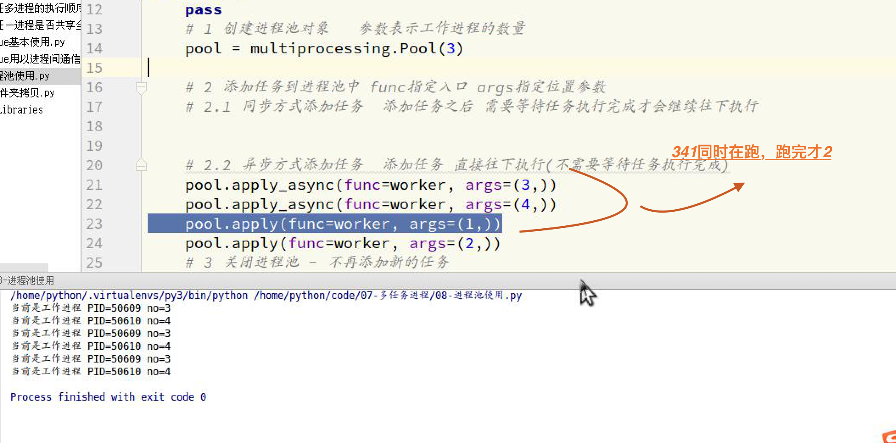
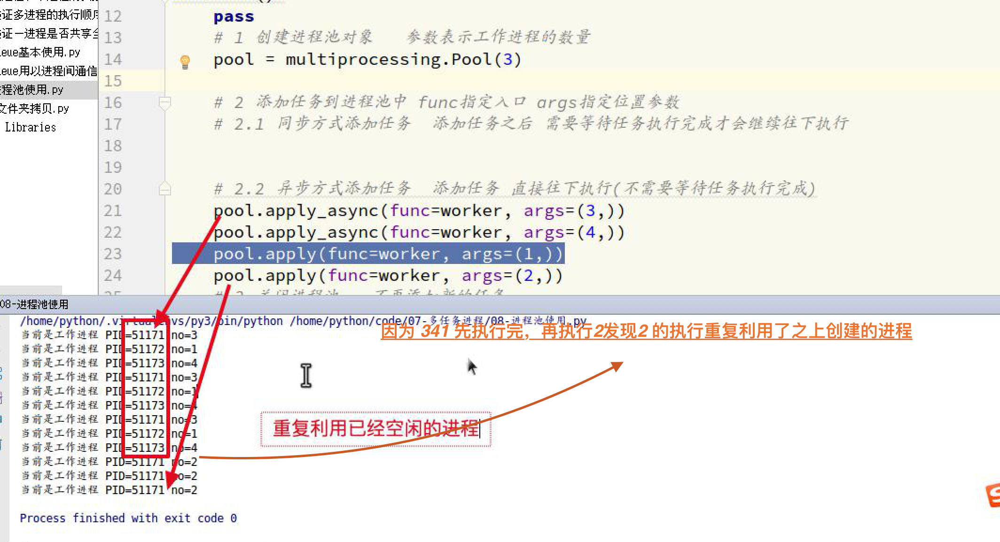
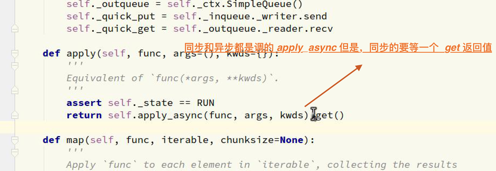


## FAQ

- 子进程中的图 默认


- 一个进程里，默认有有一个线程，这个线程是主线程吗，线程是依附于进程存在的

###  资源分配给进程，同一进程的所有线程共享该进程的所有资源。

### %s 是万能的

### 进程不同享cpu资源，线程共享 cpu 分给进程的资源

### 考虑 q.empty full 不准的原因

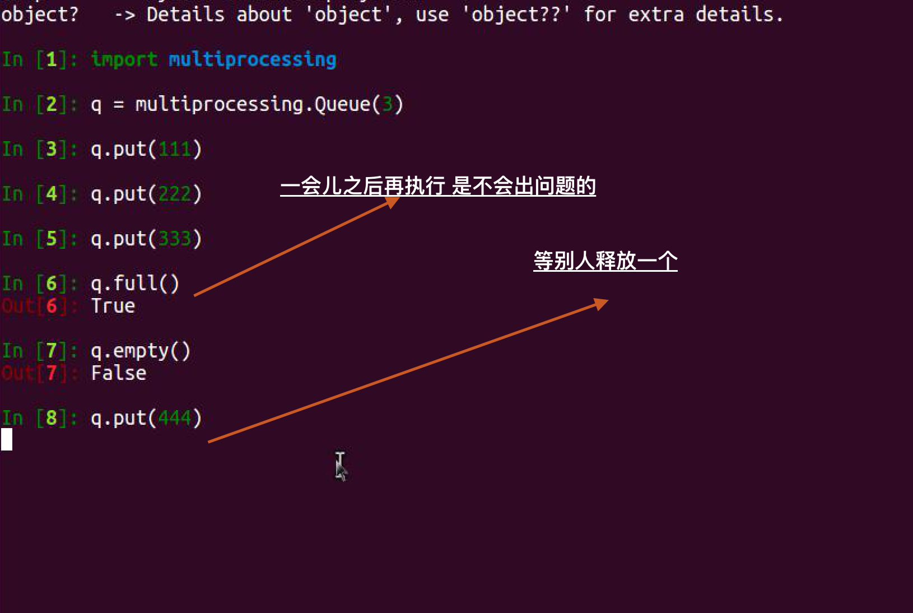

### 五十年前可能没有线程

### 封装的好处屏蔽了某些细节，但也会损失某些功能，python 进程封装导致，无法在子进程中，使用 input, 但实际上 c 是可以实现的

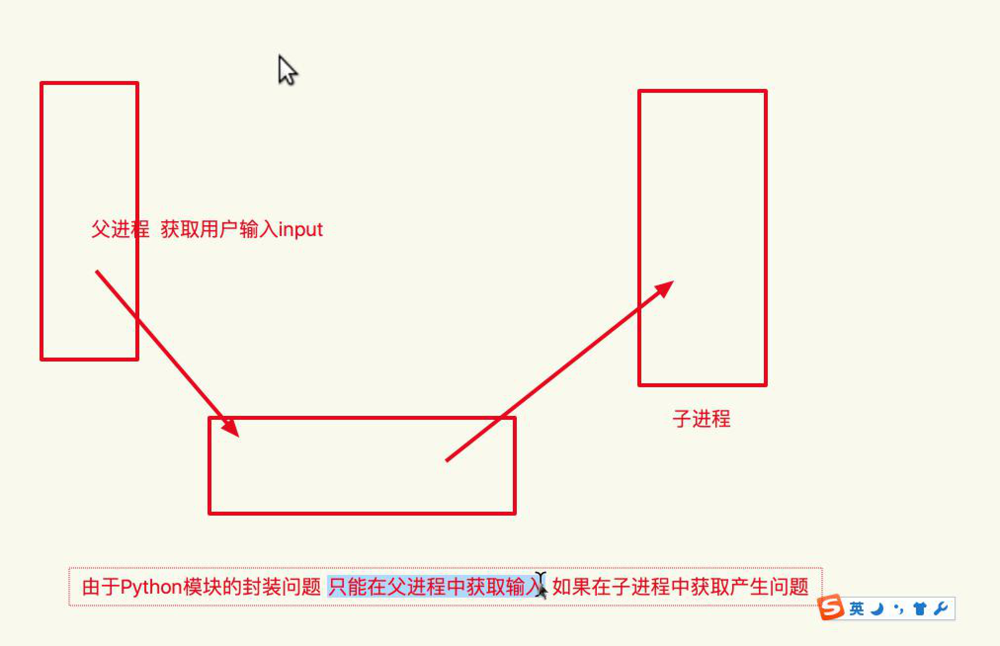

### input 在子进程中无效（会抛出错误）

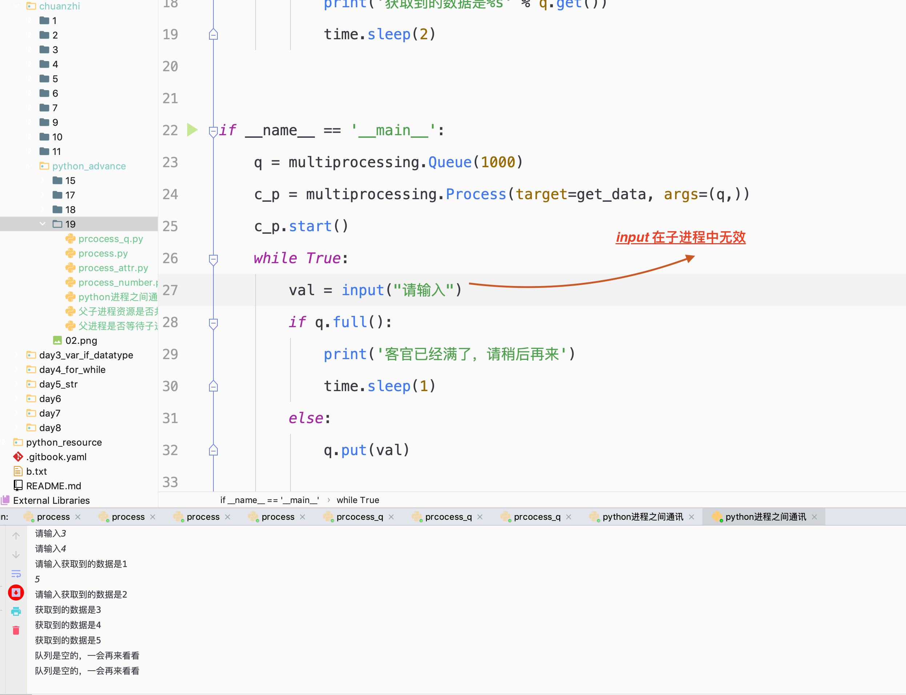

## GIl

参考: http://python.jobbole.com/87743/

 由于历史原因，龟叔在python中引进了GIL，保证每一个进程任何时候只有一个线程来执行, 保证线程安全，
 
 - 每次从 CPython 中去除 GIL 的尝试会耗费单线程程序太多性能，尽管去除 GIL 会带来多线程程序性能的提升，但仍是不值得的
 

 
 
### 写代码千万别写成全局的代码 加个 if __name__ == '__main__':

### 一般进程池的数量要小于 cpu 的数量！进程多了也分不到资源