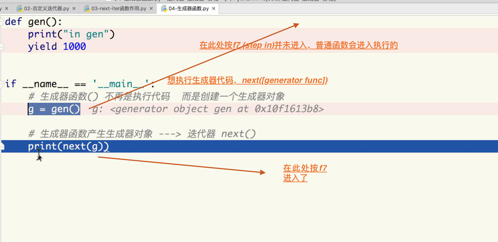
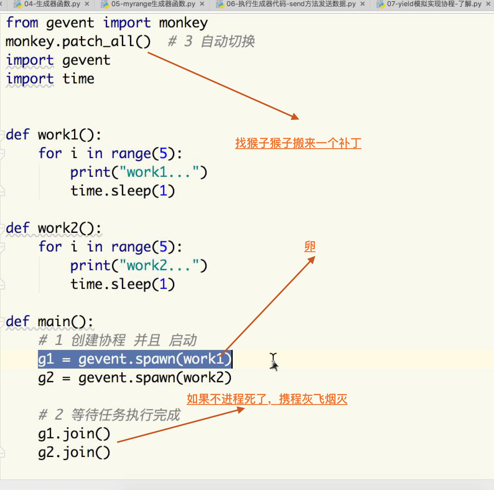

## 求其上，取其中，求其中，取其下


## python tnadao 改成了 django

## 复习

> 一个进程内部至少含有一个线程


## 迭代器 获取位置，返回值，对遍历统一封装减少难度

> 字典等都有自己的迭代对象, 还有字符串等....


- 可迭代对象: 可以被迭代的对象
```python
from collections import Iterable
isinstance([obj], Iterable) 
```

- 迭代器： 获取位置，返回值


```python 

from collections import Iterator
isinstance([obj], Iterator)

```

> 迭代器一定是可迭代对象，可迭代对象不一定是迭代器

实现 '\__iter__, \__next__' 方法， \__init__  进行数据获取


```python3

# 判断是否是这个类型
isinstance([object], [type])

# 判断一个对象是否是可迭代(iterable)
from collections import Iterable
class MyData(object):
    # 只有在一个类中实现了 __iter__方法，这个对象才是可迭代对象
    def __iter__(self):
        """"返回可迭代对象提供的迭代器, 现在没有迭代器对象"""
        pass
isinstance(MyData(), Iterable)

```

### 迭代器 


## for 迭代实现原理


### 魔术方法如 \__next__ 我们不直接调 我们可以 通过等价的 next 函数来使用


> 每一种元素都有自己的迭代器

```python
In [3]: 'adada'.__iter__()
Out[3]: <str_iterator at 0x10a855a58>

In [4]: [1,2].__iter__()
Out[4]: <list_iterator at 0x10a707278>

In [5]:

```

- for i in xx, 中的 i 是由 next 返回的

```python
from collections.abc import Iterable


class DataIterator:
    def __init__(self, data):
        self.data = data
        self.index = -1

    def __next__(self):
        self.index += 1
        if self.index >= len(self.data):
            raise StopIteration
        return self.data[self.index]

    def __iter__(self):
        return self


class Data:
    def __init__(self):
        self.data = [1, 3, 7, 9, 8]

    def __iter__(self):
        return DataIterator(self.data)


if __name__ == '__main__':
    print('If Data is iterable %s' % isinstance(Data(), Iterable))
    d = iter(Data())
    # for i in Data():
    #     print(i)
    while True:
        try:
            i = next(d)
            print(i)
        except StopIteration as e:
            print('迭代完成')
            break

```


## 生成器(由于生成迭代器麻烦，所以官方提供了一种生成器，完成迭代器的功能)

> 思想 生成器是一种特殊的迭代器，它支持迭代器的所有操作

### 生成器

### 生成器表达式(存10000万个数据，它知道你生成的规律，就可以每次next时根据规则生成下个)


```python
[x for x in range(10000)] # 浪费了大量的空间
(x for x in range(10000)) # 节省了大量的空间 
```

### 生成器函数 与 生成器对象

- 函数中含有 yield 关键字





- 因为先执行 yield 没哟执行  = 赋值 所以没人收，所以第一次 send(None)


> attention

- 在Python3 生成器函数中可以有  return , python2 中不可以
- 在生成器函数中 一旦调用 return 生成器就抛出异常
- 生成器函数可以有多个yield 即多个返回值

### 生成器代码的第二种执行方式


```python

def g_func():
    print('I am starting')
    yield 1000
    print('after one yield')
    yield 1001


if __name__ == '__main__':
    d = g_func()
    """
    Output:
    I am starting
    1000
    after one yield
    1001
    """
    for i in d:
        print(i)
    print(next(d))
    print(next(d))

```
## 协程


### 如下，使用yield 手动执行 很 low


### 于是有人研究出了 greenlet 但是这种方式依旧很 low4
> pip3 install greenlet




### 于是又有人研究出来工作中用的 gevent(可以自动切换)

### 协程下载图片


## 进程线程携程


## Tip

- c 原生  多线程 一个线程跪了，其他也会跪，

## FAQ 

### python 线程池，以及 GIL 机制与多线程, 为什么还会用到互斥锁
> 由于 cpython gil存在 Python 线程不能使用多核 (那线程的好处)


## 所谓 可迭代对象，迭代器，可迭代对象提供数据给迭代器，for 调用 迭代器 \__next__  得到元素

## 对比 node.js 的 generator

### 迭代器不建议 直接 \__iter__ 这样调，但是反向说明这样也是可以调用的

### 一个函数内部套用一个函数 一定是 内部的函数先执行

## python 解释器
默认 CPython, IPython, PyPy, Jython, IronPython
https://www.liaoxuefeng.com/wiki/001374738125095c955c1e6d8bb493182103fac9270762a000/001407375700558864523211a5049c4983176de304549c8000

## python gil

https://www.liaoxuefeng.com/wiki/001374738125095c955c1e6d8bb493182103fac9270762a000/001386832360548a6491f20c62d427287739fcfa5d5be1f000
启动与CPU核心数量相同的N个线程，在4核CPU上可以监控到CPU占用率仅有160%，也就是使用不到两核。

即使启动100个线程，使用率也就170%左右，仍然不到两核。

但是用C、C++或Java来改写相同的死循环，直接可以把全部核心跑满，4核就跑到400%，8核就跑到800%，为什么Python不行呢？

因为Python的线程虽然是真正的线程，但解释器执行代码时，有一个GIL锁：Global Interpreter Lock，任何Python线程执行前，必须先获得GIL锁，然后，每执行100条字节码，解释器就自动释放GIL锁，让别的线程有机会执行。这个GIL全局锁实际上把所有线程的执行代码都给上了锁，所以，多线程在Python中只能交替执行，即使100个线程跑在100核CPU上，也只能用到1个核。

GIL是Python解释器设计的历史遗留问题，通常我们用的解释器是官方实现的CPython，要真正利用多核，除非重写一个不带GIL的解释器。

所以，在Python中，可以使用多线程，但不要指望能有效利用多核。如果一定要通过多线程利用多核，那只能通过C扩展来实现，不过这样就失去了Python简单易用的特点。

不过，也不用过于担心，Python虽然不能利用多线程实现多核任务，但可以通过多进程实现多核任务。多个Python进程有各自独立的GIL锁，互不影响。

小结
多线程编程，模型复杂，容易发生冲突，必须用锁加以隔离，同时，又要小心死锁的发生。

Python解释器由于设计时有GIL全局锁，导致了多线程无法利用多核。多线程的并发在Python中就是一个美丽的梦。

### python 既然有 gil 何必需要互斥锁
gil 只是保证同一时间只运行一个线程，两个线程切换快很有可能争夺到一个资源，gil 是解释器级别
互斥锁是程序级别

### gil 体现好处的部分
https://www.cnblogs.com/frchen/p/5740606.html
Python的多线程在多核CPU上，只对于IO密集型计算产生正面效果(释放锁)；而当有至少有一个CPU密集型线程存在，那么多线程效率会由于GIL而大幅下降。

### 计算密集vs IO 密集
CPU密集型（CPU-bound）也叫计算密集型
CPU密集型 vs IO密集型
我们可以把任务分为计算密集型和IO密集型。

计算密集型任务的特点是要进行大量的计算，消耗CPU资源，比如计算圆周率、对视频进行高清解码等等，全靠CPU的运算能力。这种计算密集型任务虽然也可以用多任务完成，但是任务越多，花在任务切换的时间就越多，CPU执行任务的效率就越低，所以，要最高效地利用CPU，计算密集型任务同时进行的数量应当等于CPU的核心数。

计算密集型任务由于主要消耗CPU资源，因此，代码运行效率至关重要。Python这样的脚本语言运行效率很低，完全不适合计算密集型任务。对于计算密集型任务，最好用C语言编写。

第二种任务的类型是IO密集型，涉及到网络、磁盘IO的任务都是IO密集型任务，这类任务的特点是CPU消耗很少，任务的大部分时间都在等待IO操作完成（因为IO的速度远远低于CPU和内存的速度）。对于IO密集型任务，任务越多，CPU效率越高，但也有一个限度。常见的大部分任务都是IO密集型任务，比如Web应用。

IO密集型任务执行期间，99%的时间都花在IO上，花在CPU上的时间很少，因此，用运行速度极快的C语言替换用Python这样运行速度极低的脚本语言，完全无法提升运行效率。对于IO密集型任务，最合适的语言就是开发效率最高（代码量最少）的语言，脚本语言是首选，C语言最差。

总之，计算密集型程序适合C语言多线程，I/O密集型适合脚本语言开发的多线程。


