## python 提高 

## 解释器

- cpython使用 c 实现的解释器(官方解释器，语法标准等在此上实现，应用广)，Jython java 实现的，pypy python 实现的

### gil global interrupt lock

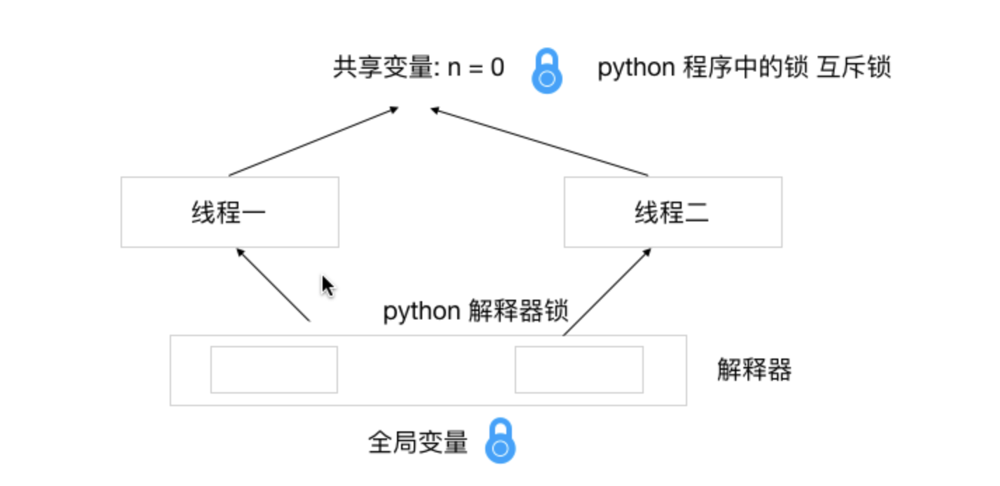

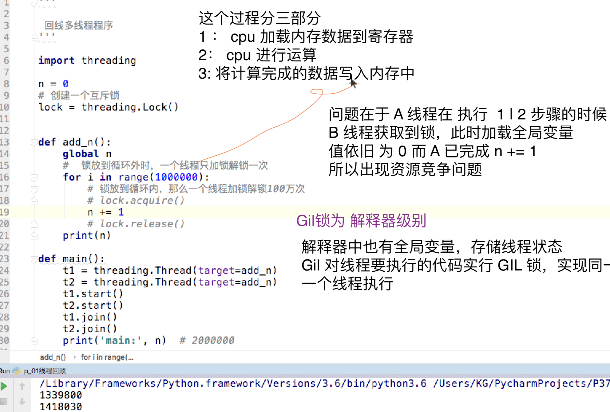

## 计算与IO密集型

- 风扇转 cpu 运算占用率高，如高清视频解码, 科学计算

- python 无法利用多线程的优势(在 GIL， 以及cpython解释器下), 线程通过申请 gil 锁，得到片刻执行，频频切换，看似是一起执行

### GIL 锁释放时机

> 由于系统的调度单位是线程，所以在多核cpu下 同一时间只执行一个线层代码是发挥不出 cpu 核心的好处的

- 遇到 io 等待
- 时间片结束
- 执行代码到 执行100条字节码

### Gil 锁影响解决办法

- 使用 进程 一个进程一把锁 
- 使用协程，总资源相同，协程去分
- 换解释器

### python 中默认的拷贝方式是浅拷贝

#### 有四种实现浅拷贝的方式

> 四种方式对比呢 co 工切

1. copy.copy
2. obj.copy (字典列表等都有 copy 方法)
3. 工厂方法 (list, dict)
4. 切片 (list[:])

## 拷贝

```python
In [15]: from copy import deepcopy

In [16]: l = [1,2,3,[5,6,7]]

In [17]: c_l = l.copy()

In [18]: id(c_l) == id(l)
Out[18]: False

In [19]: l[3][1] = 12

In [20]: c_l
Out[20]: [1, 2, 3, [5, 12, 7]]

In [21]: l
Out[21]: [1, 2, 3, [5, 12, 7]]

In [22]: d_l = deepcopy(l)

In [23]: l[3][1]
Out[23]: 12

In [24]: l[3][1]  = 100

In [25]: l
Out[25]: [1, 2, 3, [5, 100, 7]]

In [26]: d_l
Out[26]: [1, 2, 3, [5, 12, 7]]

# 对于基础数据类型In [31]: a = 100

In [32]: c = copy.copy(a)

In [33]: c
Out[33]: 100

In [34]: id(a) == id(c)
Out[34]: True

```

### 不可变数据类型的 拷贝，是直接去使用对象的地址，因为没有必要再创建一个，所以copy 时候
id 相同

## 模块，包
一个 py 文件是一个模块，一个包是用来管理模块的（默认含有\__init__.py 文件）

### 搜索模块的过程

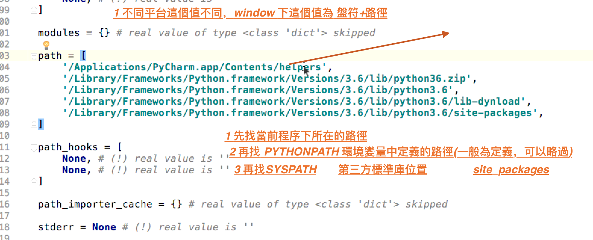

#### 路径功能分析

```python 
# lib 目录下（home 目录/pythonXX.XX/lib）
path = [
    '/Applications/PyCharm.app/Contents/helpers',
    '/usr/local/Cellar/python/3.7.0/Frameworks/Python.framework/Versions/3.7/lib/python37.zip',
    '/usr/local/Cellar/python/3.7.0/Frameworks/Python.framework/Versions/3.7/lib/python3.7',
    '/usr/local/Cellar/python/3.7.0/Frameworks/Python.framework/Versions/3.7/lib/python3.7/lib-dynload',
    '/usr/local/lib/python3.7/site-packages',
] 
```

### 导入模块的过程
> 解释器先搜索模块，搜索步骤如上
> 解释器会先到sys 模块下 的 modules(字典) 去找找有没有当前要导入的模块(不存在说明没有导入过)
> 如果没有，则创建一个该模块的空对象，放入 modules 中，然后对该模块进行初始化(如何初始化, 把当前这个模块定义的属性(哪里定义的属性??? 系统中找到的??)，，记录到dict中)，将模块的成员


> 在字典中存在： 那么就直接将该对象的引用取出直接使用

### 导入其他文件夹下模块方法

```python
import sys
# 将需要导入的模块的文件 加入 sys.path 列表中，使其可以搜索到
sys.path.append([your_path])
import [your_module]
```

### 重新加载模块

> 二次动态加载模块的前提，在程序没有结束的情况下(????) 因为服务器上python 是不能随便停掉的，而在运行过程中

#### 就一个 while True?????? 工作中这么用??

# 问题能讲清楚?? 出错了能把错误的原因写一下，动态加载就一个 while true?
# 纯理论???? 纯念大纲? importlib 为什么不行? 怎么用? 工作经验?
# module 中找不到，进行初始化 这个过程是什么样的?? 根据找到模块进行执行，作为初始化
# gil 全局线程状态竞争，哪个状态流程是什么样的？？

循环引用出错的原因是创建完空模块后，对模块初始化时，又遇到了另外一个模块的导入。这时重复执行创建空模块初始化操作。


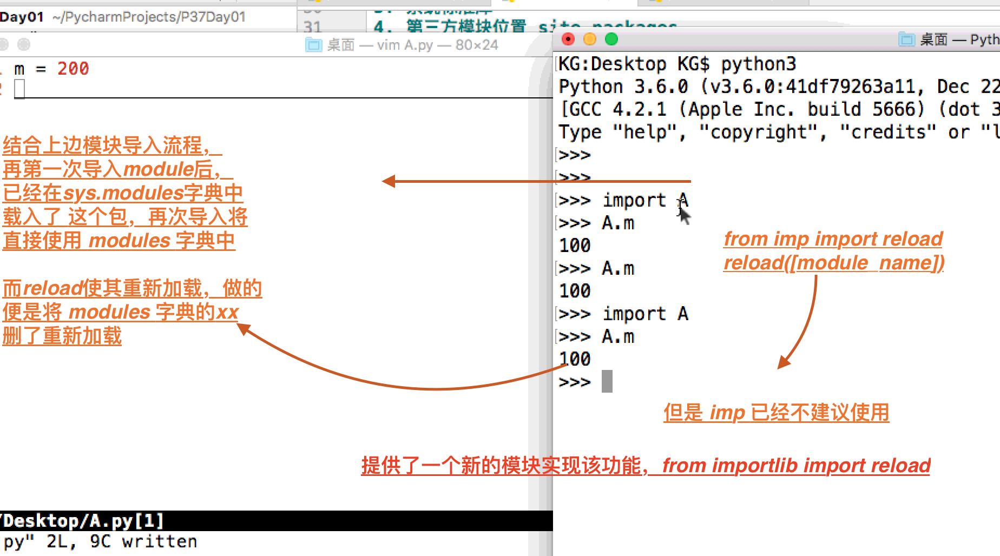

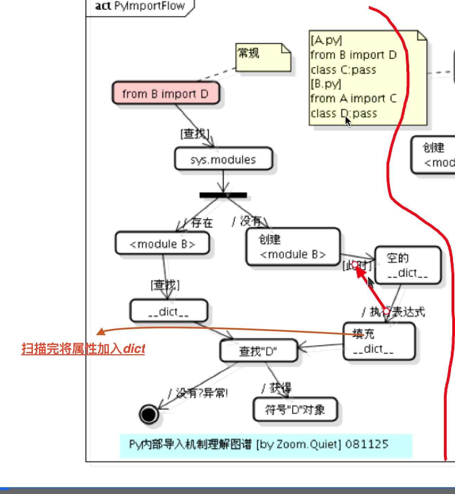

## with 使用

> 不是所有的自定义类都可以放到 with 语句中，只有实现了 上下文管理器中的 \__enter__ 和 
\__exit__ 才可以使用

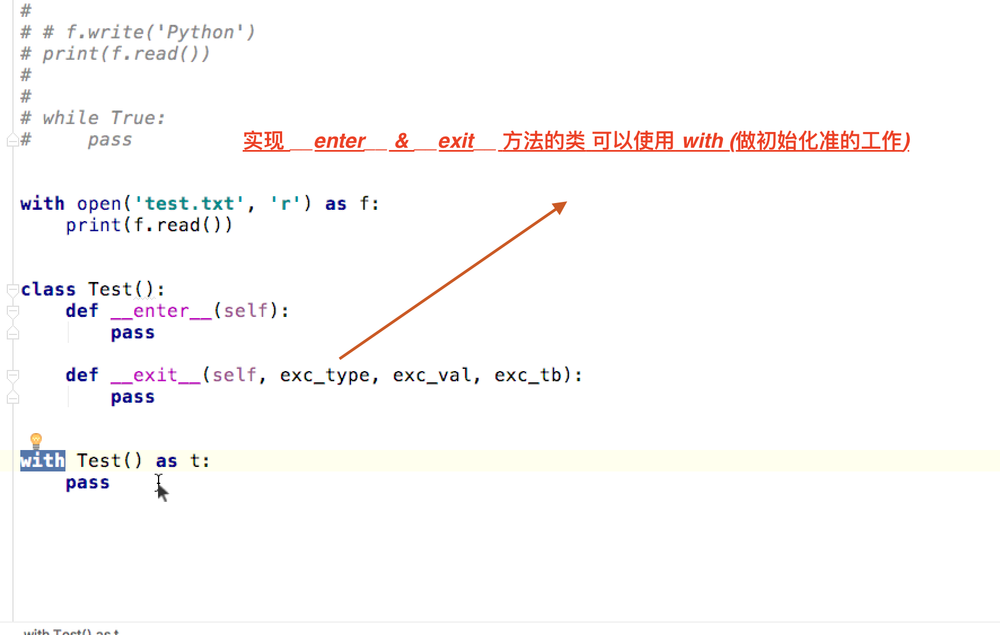

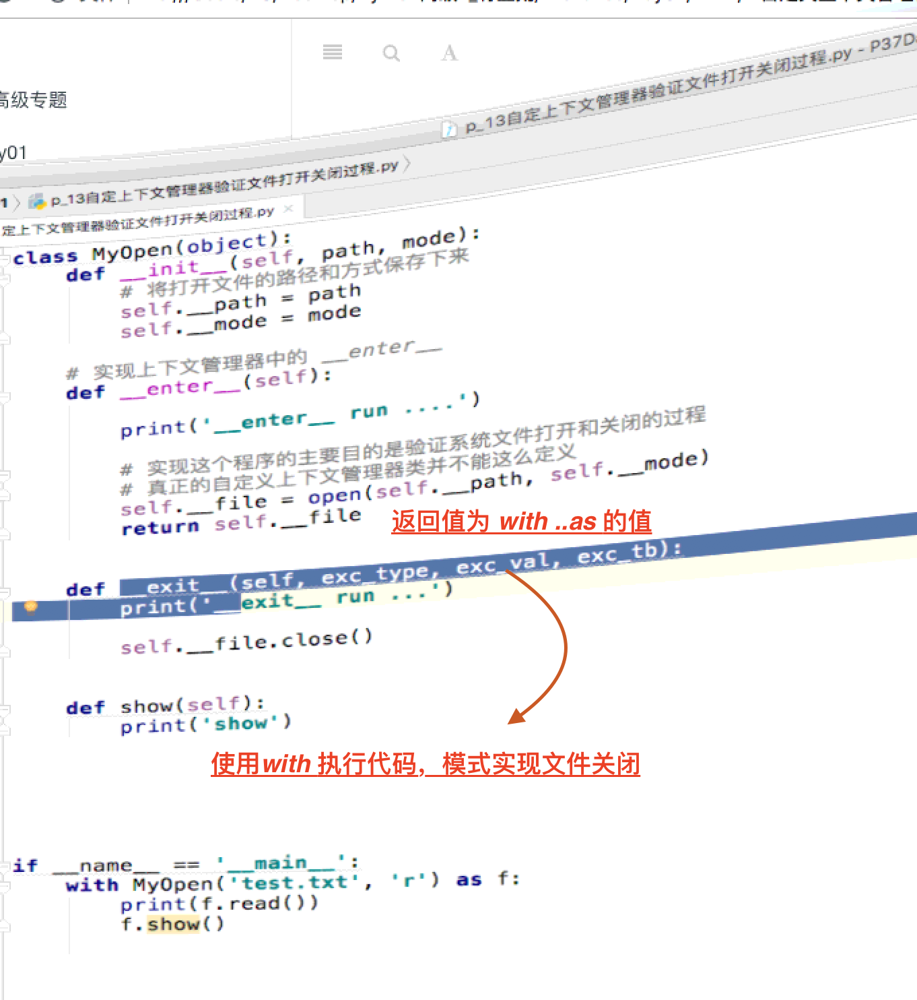

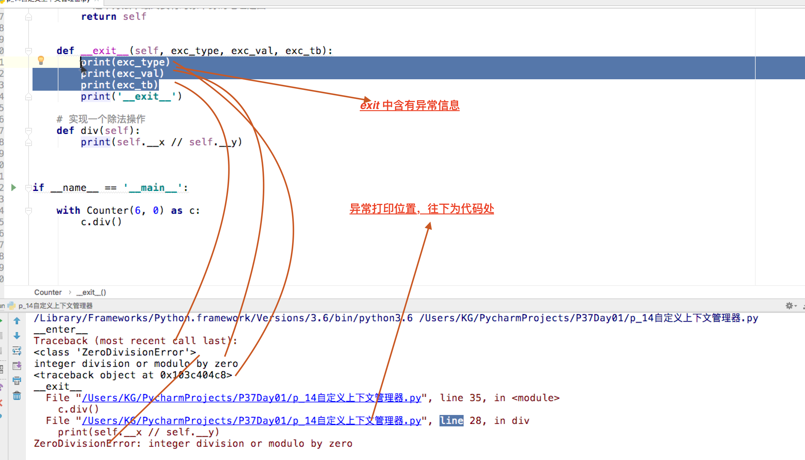

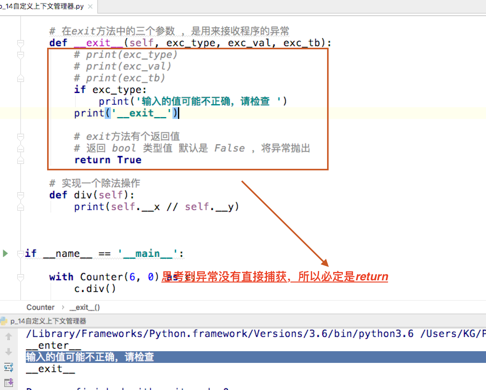

```python

class Util:

    def __init__(self, x, y):
        self.x = x
        self.y = y

    def __enter__(self):
        return self

    def div(self):
        return self.x/self.y

    def __exit__(self, exc_type, exc_val, exc_tb):
        if exc_type:
            print("输入错误")
        return True


with Util(6, 0) as cal:
    res = cal.div()
    print(res)


```

## FAQ

- 程序运行为磁盘加载到内存的过程

## 循环引用问题

> 循环引用导致的原因，是 模块初始化未完成

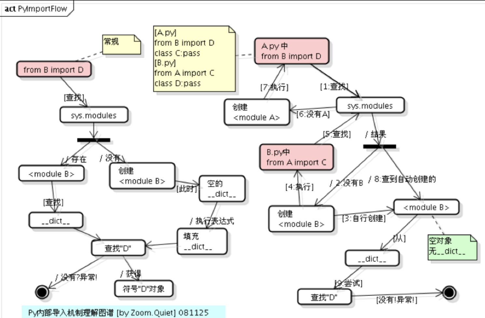

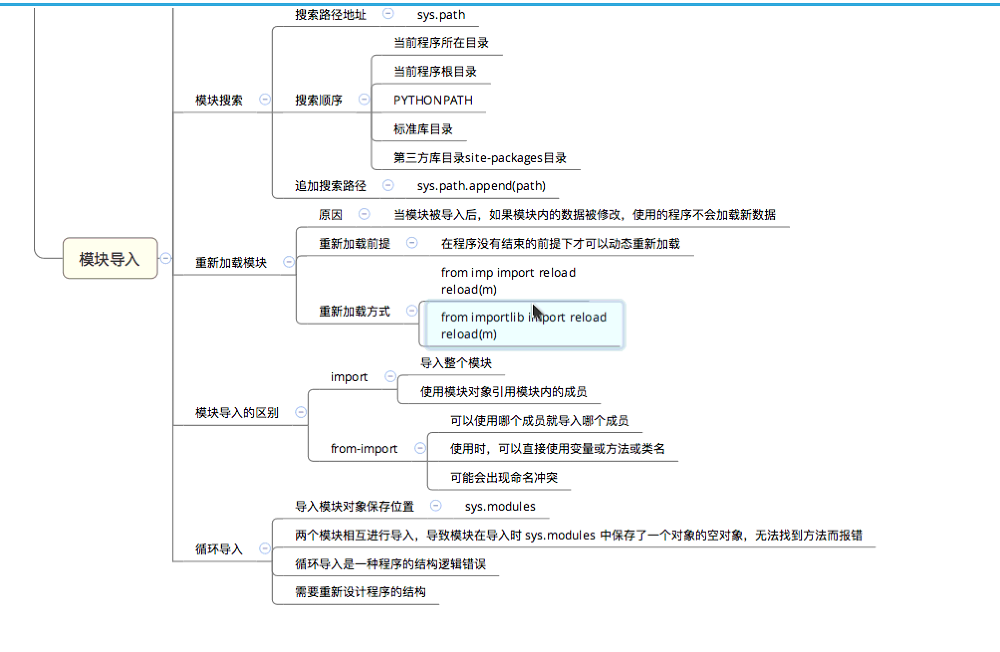

```python
# AA.py
from BB import * 
def ashow():
    print('A - show') 
bshow()

# -----------
# 运行 AA 
Traceback (most recent call last):
  File "/Users/ly/Programmer/study/python_code/chuanzhi/python_advance/21/AA.py", line 8, in <module>
    from BB import *
  File "/Users/ly/Programmer/study/python_code/chuanzhi/python_advance/21/BB.py", line 7, in <module>
    from AA import *
  File "/Users/ly/Programmer/study/python_code/chuanzhi/python_advance/21/AA.py", line 15, in <module>
    bshow()
NameError: name 'bshow' is not defined
# BB.py
from AA import * 
def bshow():
    print('A - show') 
ashow() 

```

### 注意循环引用以下这种情况
```python

# AA.py
from BB import * 
def ashow():
    print('A - show') 
bshow()

# BB.py
from AA import * 
def bshow():
    print('A - show') 
ashow()

# 此时输出  A - show
# 执行流程为 A 中 import B ， module中初始化空的B, -> import A
# A 执行完成，并入 \__dict__, 继续完成 最初 Main 中的 import B, 扫描B代码时
# 打印了 ashow(), 此时 Main AA 中导入 B 完成，执行完Main AA 程序关闭

```

### 动态reload问题，先当while true 模拟表示可以

### 使用 pypy, jpython 支持的三方库少，cpython的三方库多？

# 410 - 418 重新检查

# python book, 从book中找答案~~

