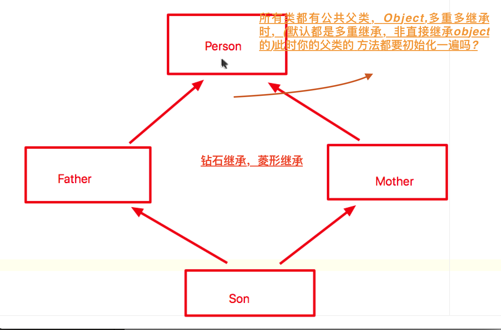
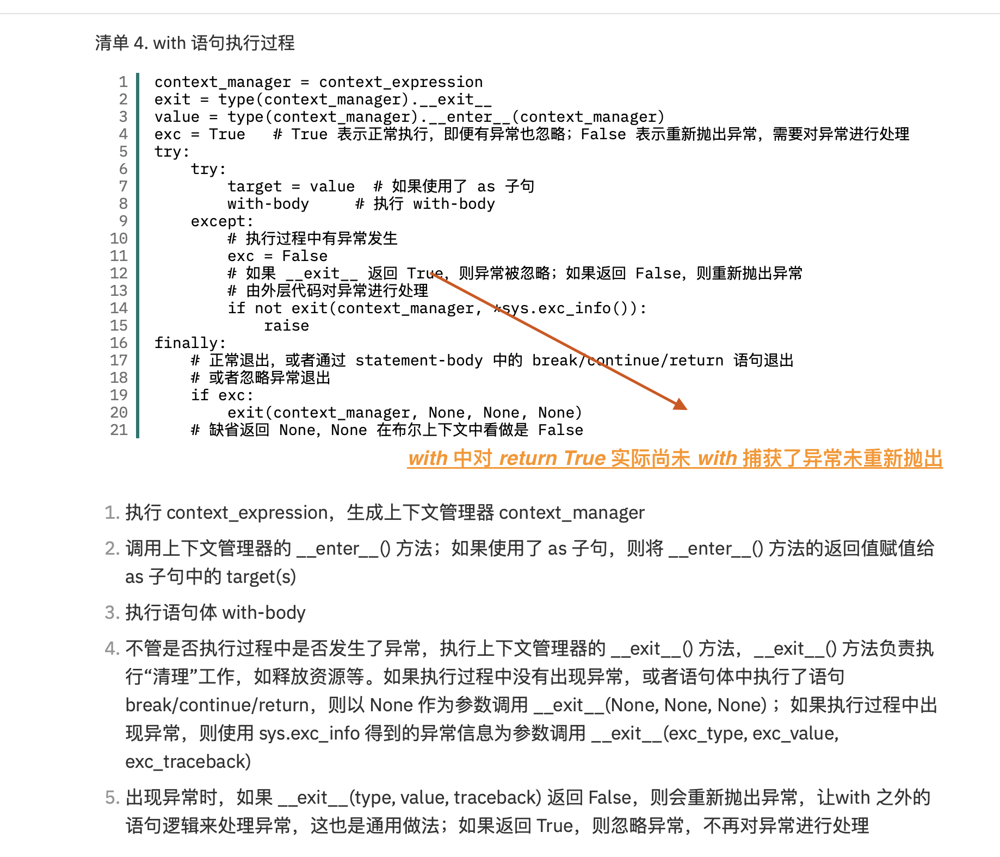

|  内容   |      预习      |  课上疑问 | 完成  
|:----------:|:-------------:|:------:|:------:|
| set & get & property |  √ | 1(i1) |  √  
| 魔术方法和魔术属性      |  √ | 2(i2) |  √  
| 继承深入              |  √ | 1(i3) |   √ 

```
# ---------------- i1 ------------------
@ 1 放入 del del 变成删除 私有属性
@ 2 最后一个参数
@ 3 property 不能只提供 set 方法? 可以
@ 4 property 概念 


在 Python 中，提供了一个叫做 property 的类，通过对这个创建这个类的对象的设置，
在使用对象的私有属性时，可以不在使用属性的函数的调用方式，而像普通的公有属性一样
去使用属性，为开发提供便利。

# ------------------i2 --------------------
@1 老师定义 以__开始结尾的 是魔术变量方法
@2 doc string 以 ''' [中间] ''', """[这样不行吗]"""

# ------------------i3 --------------------
@1 super() 没讲把 

```


## set get , 规范尽可能使用

**但是加** get set 后，写法相对麻烦了些，于是 语法糖 property上场

> 用的人想简单点，设定的人想用  set get， 于是便有了语法糖

### property 

在 Python 中，提供了一个叫做 property 的类，通过对这个创建这个类的对象的设置，在使用对象的私有属性时，可以不在使用属性的函数的调用方式，而像普通的公有属性一样去使用属性

```python
# 查看 property 源码 Typical use is to define a managed attribute x:
    
    class C(object):
        def getx(self): return self._x
        def setx(self, value): self._x = value
        def delx(self): del self._x
        # 如下
        x = property(getx, setx, delx, "I'm the 'x' property.")
    
    Decorators make defining new properties or modifying existing ones easy:
    
    class C(object):
        # 如下
        @property
        def x(self):
            "I am the 'x' property."
            return self._x
        @x.setter
        def x(self, value):
            self._x = value
        @x.deleter
        def x(self):
            del self._x
    """

```

## 魔术属性和方法 

> 老师定义 以__开始结尾的
> doc string 以 ''' [中间] ''', """[这样不行吗]"""

- 魔术属性

类中的 \__dict__ 属性保存了类的所属模块,类中全局变量，方法，DocString 等内容

对象中的 \__dict__ 属性 用来保存对象的属性


```python
__dict__


```

## super 继承


### call(主要用在系统实现装饰器上)

但是可以在类中实现 __call__ 方法，使自定义类的实例对象成为可调用对象。

```python
    class Test(object):

    def __init__(self):
        print(' Init Run ...')


    def __call__(self):
        print("Call Run ...")


    # 通过方法__call__，使得实例a可以被调用，callable(t)返回为True
    t = Test()
    print(callable(t))
    t()
    输出结果：
    Init Run ...
    True
    Call Run ...

```
这种让对象以函数调用形式执行的方式称为仿函数

### len & str


### 使用 property 装饰器简化对象属性的操作

1. @property 只能放在 get 方法上
2. 当使用装饰器简化属性操作时，村取其方法不需要再使用 set/get 最为前缀
3. 如果需要设置 set 方法，那么需要使用 @[funcname].setter
4. 需要将 @property 定义的 get 放在上边
5. @[funcname].deleter

## mro, mro 是保证类的执行只有一次? 是的

> 在多继承下，由于每个父类都指向 object, 而直接使用 父类名 .\__init__ 执行的时候，会使父类的方法执行多次，
> 而在使用 super 的时候 则会根据 mro 码表进行查询，只执行一次
> 继承和搜索方法都是根据 mro 码表




> 类的继承顺序是会影响到 mro 的


### mro 表补


## 闭包

### js & python 闭包构建工具
```
闭包构建步骤
定义外层函数
定义内层函数
内部函数使用 外部函数参数或变量
将内部函数返回

```

### LEGB

- local
- e Enclosed 
- g global
- b build 

## with 执行原理



## 魔术方法总结


## \__iter__


## FAQ

- 3：16 继承问题

老师讲 因为属性私有 ，子类继承了，但是由于父类是私有的，所以访问不到

### super(Parent, self).\__init__  的问题

self 传递是为了查找mro, Parent指定?


```python
class My:
    def __init__(self, name):
        self.__name = name
        # print(self.__class__.mro())
        print(self.__dict__)


m = My(123)
print(m._My__name)
```

### reload 实际开发应用场景, 该文件之后找不到

while true 文件提示找不到

## python 中的魔术变量

> 对魔术变量的概念很模糊

The question: I've been focusing recently on double-underscored __magic__ stuff, and after finding this excellent treatise by Rafe Kettler on magic functions I was able to expand that part of the language definition quite a bit. However, I've had a bit less luck on finding a good list of built-in magic variable names, or magic attributes, like __class__ or __doc__. I've gone through the Data Model section of the docs, but it leaves a little bit to be desired for my purposes, and seems to focus mainly on magic method names.

菜鸟教程上对 \__str__ 这样的称为类的专有属性，但是 \__xx__ 形式又是魔术方法或变量

分开来记把

类的专有方法  ps id lg cam sm art

课上的魔术方法和属性

mdc mdc bi