|  内容   |      预习      |  课上疑问 | 完成  
|:----------:|:-------------:|:------:|:------:|
| 装饰器 |   级别(3)     |    |  √  
| 正则      |   级别(2) |    |  √  


## 装饰器(由解释器解释执行)


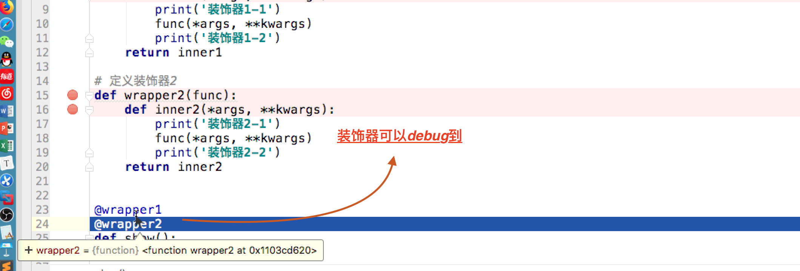
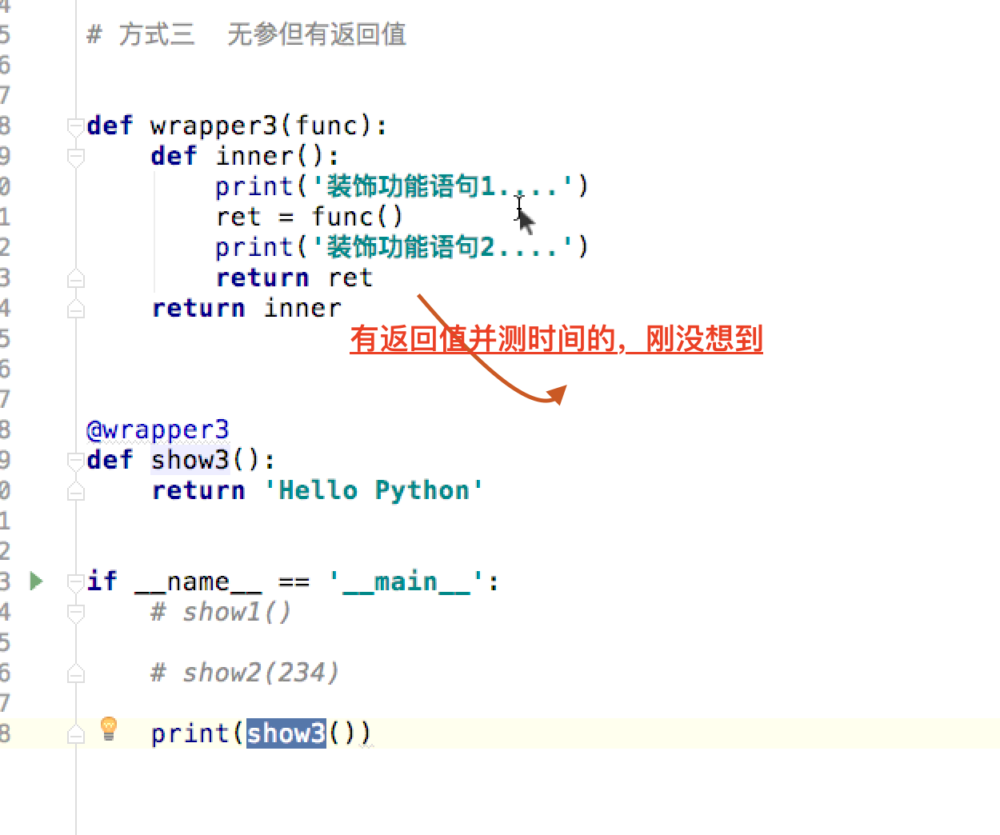
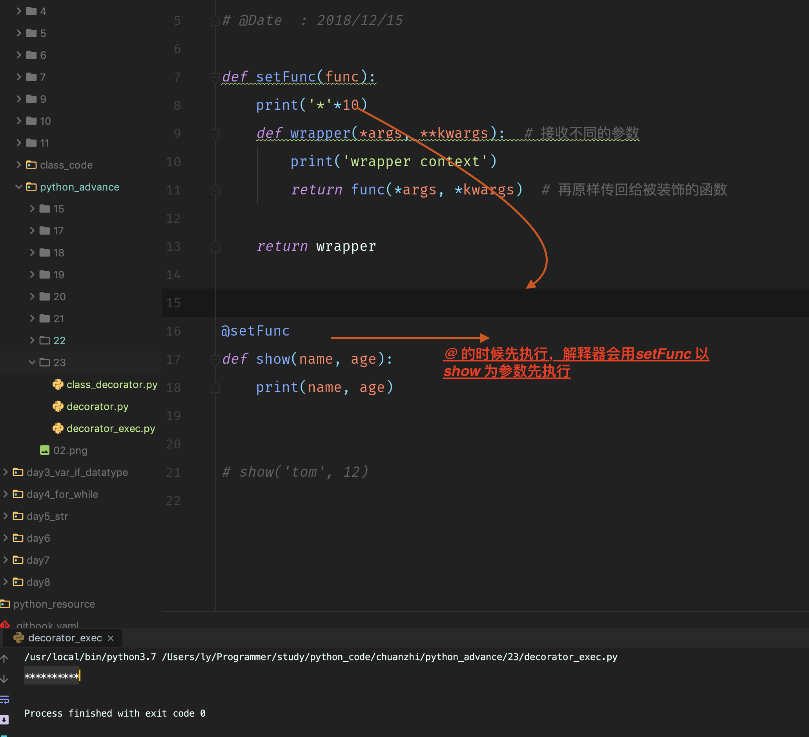
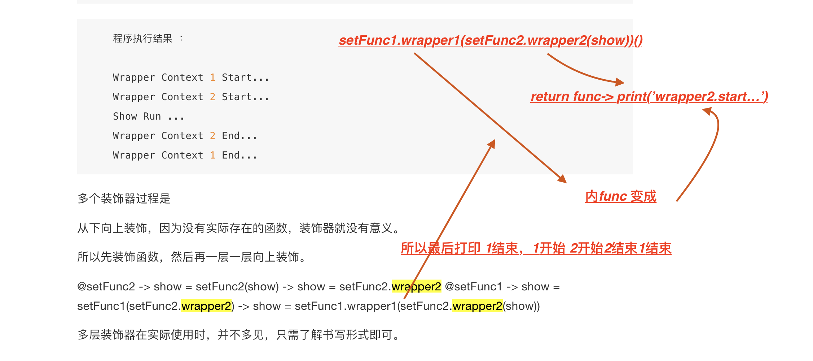

### 装饰器与路由

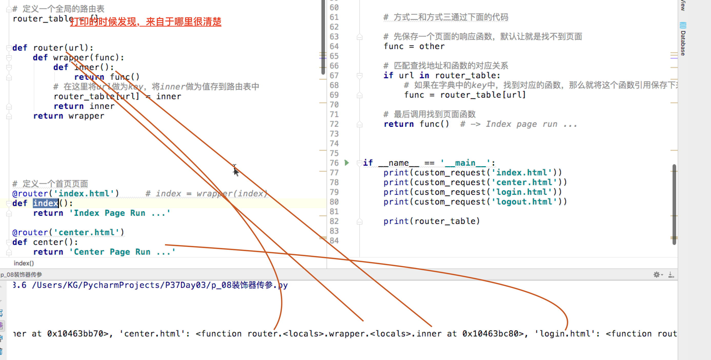

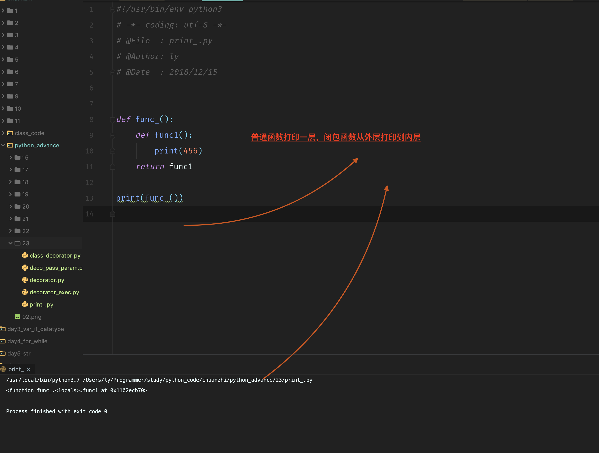

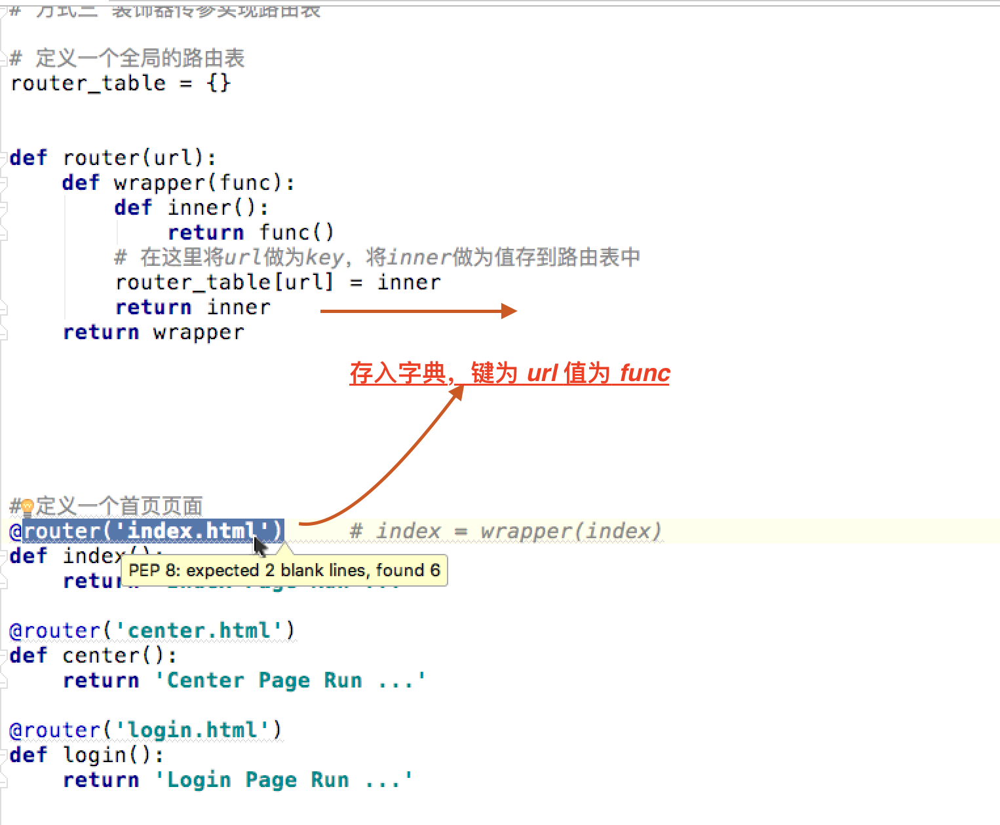

### 有参有返回值, (万能)装饰器
```python
import time
def record_time(func):
    print('decorator am start')

    def wrapper(*arg, **kwargs):
        start = time.time()
        print('传入参数为 %s', arg)
        # 这里赋值一下返回便可以既记录时间又可以有返回值了
        res = func(*arg, **kwargs)
        end = time.time()
        print('函数执行时间为', end - start)
        return res
    print('decorator end')
    return wrapper
    
# 课件写法
    def setFunc(func):
        def wrapper(*args, **kwargs):   # 接收不同的参数
            print('wrapper context')
            return func(*args, *kwargs) # 再原样传回给被装饰的函数
        return wrapper

    @setFunc
    def show(name, age):
        print(name,age)

    show('tom',12)


```

### 类装饰器

```python
    class Test(object):
        # 通过初始化方法，将要被装饰的函数传进来并记录下来
        def __init__(self, func):
            self.__func = func
        # 重写 __call__ 方法来实现装饰内容
        def __call__(self, *args, **kwargs):
            print('wrapper context')
            self.__func(*args, **kwargs)


    # 实际通过类的魔法方法call来实现
    @Test  # --> show = Test(show) show由原来引用函数,装饰后变成引用Test装饰类的对象
    def show():
        pass


    show()  # 对象调用方法,实际上是调用魔法方法call,实现了装饰器
```

### 多个装饰器, 如果外层为 1，内部为2 执行过程为 1221, 也就是 相当于内层先包装了，外层再包装了内层一层...

> 所以外层先开始，外层内部调用装饰完成的函数后，外部函数中调用了内部函数，再把外部函数内，调用函数的代码执行完成

```python


```

### 装饰器的执行过程
在执行 @xxx 时 ，实际就是将 原函数传递到闭包中，然后原函数的引用指向闭包返回的装饰过的内部函数的引用。

> 核心

```python 
func = wrapper(func)
```


## 正则表达式

> [] 可以  [1-92-9a-z] 表示 任意 1-9 或 2-9 或 a-z 之间的任意一个  [^a-z]

默认是一个一个元素来的

### 构成元素

- 原子（普通字符，如英文字符）

- 元字符（有特殊功用的字符）

- 以及模式修正字符组成。（+ ? *... 也就限定符限定前边符号）


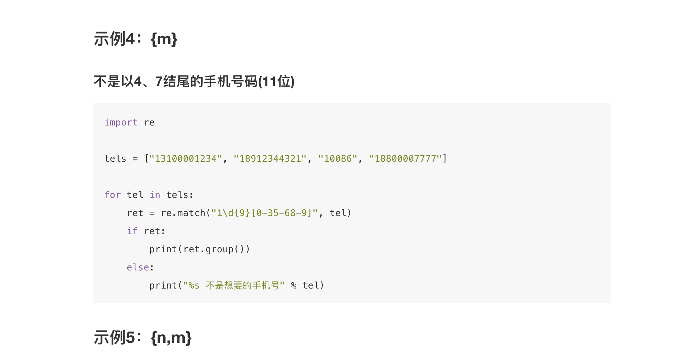

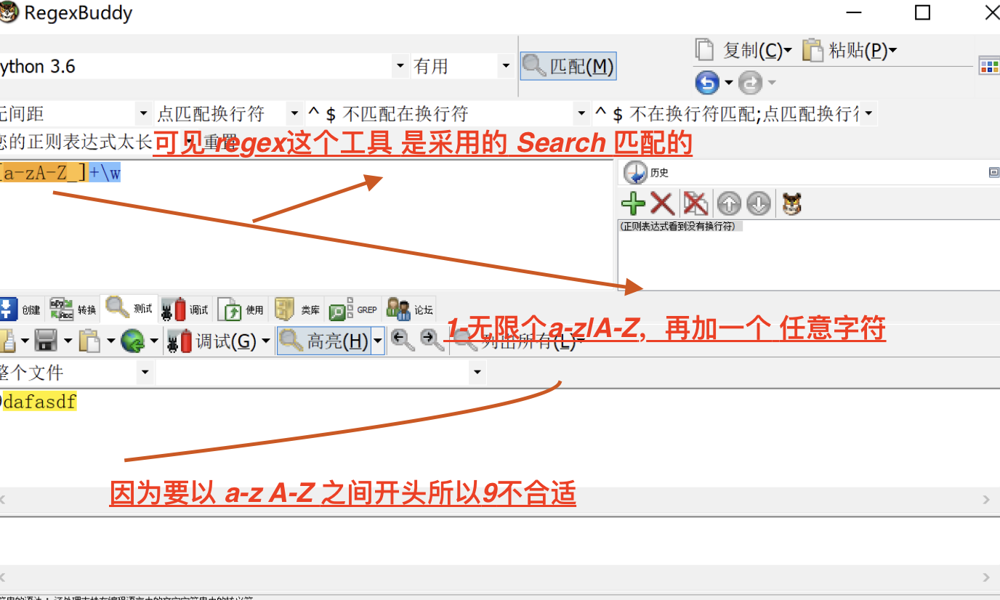

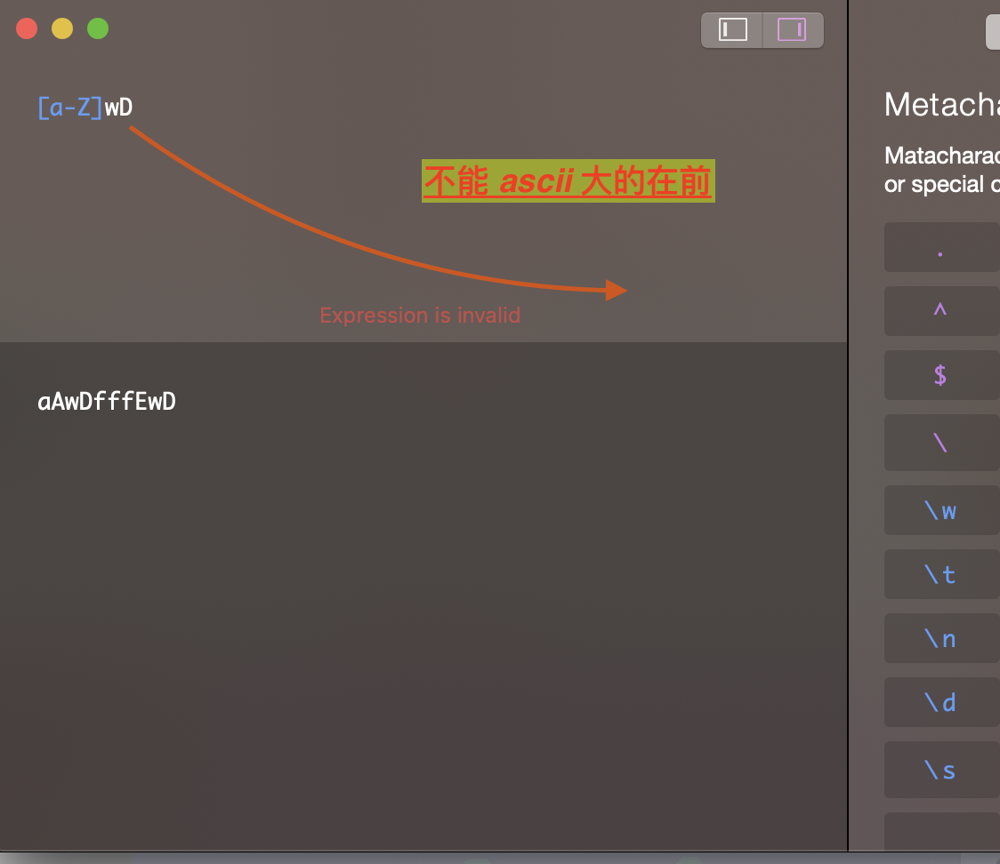

```python
\num	引用分组num匹配到的字 # 不转义?， num表示数字哦，也就是表示数字的时候
\w 表示匹配字符 别把 \ 漏掉了

import re
# 通过引用分组中匹配到的数据即可，但是要注意是元字符串，即类似 r""这种格式
ret = re.match(r"<([a-zA-Z]*)>\w*</\1>", "<html>hh</html>")
print(ret.group())
# 而 r 在这里的作用就是  保证 \1 的 \ 不代表转义字符来使用 前一个分组
ret = re.match(r"<([a-zA-Z]*)>\w*</\1>", test_label)


```

### 常用正则记忆


## Tip

### python regex 同 php linux 对比牢记


## TODO:

### pycharm debug 详解， 慕课网或者搜索

## FAQ

> 软件的原因， 默认search模式
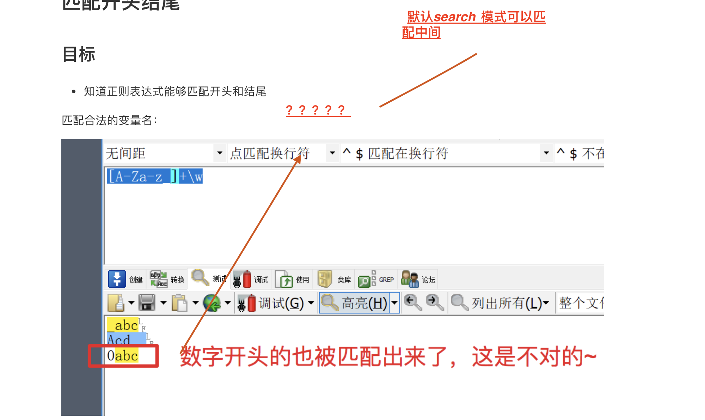

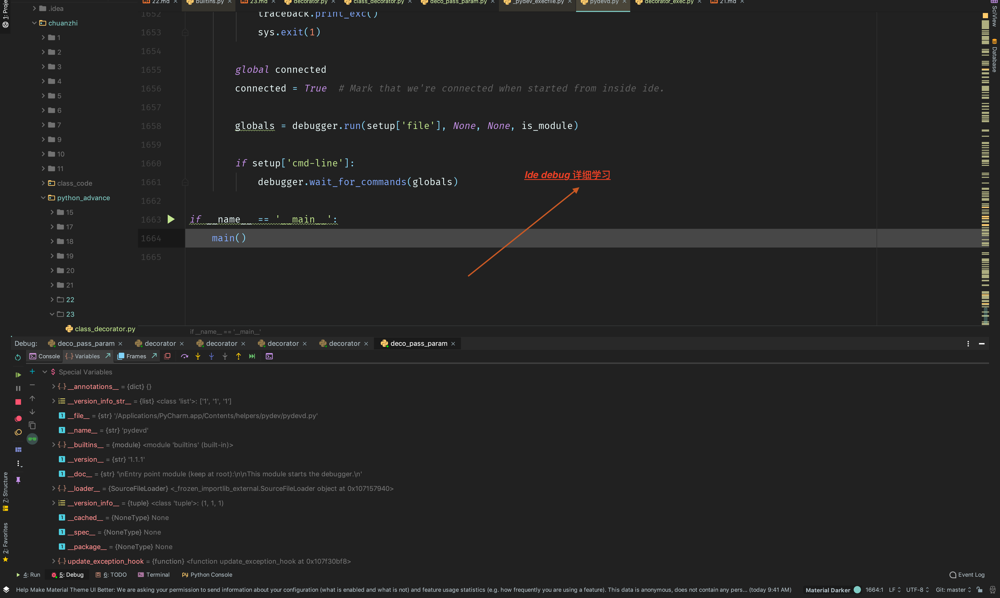

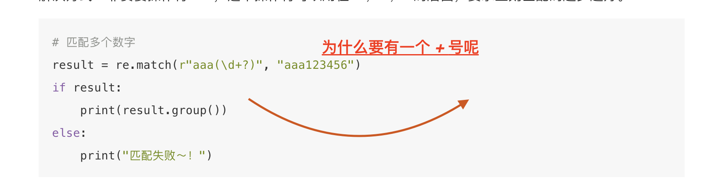

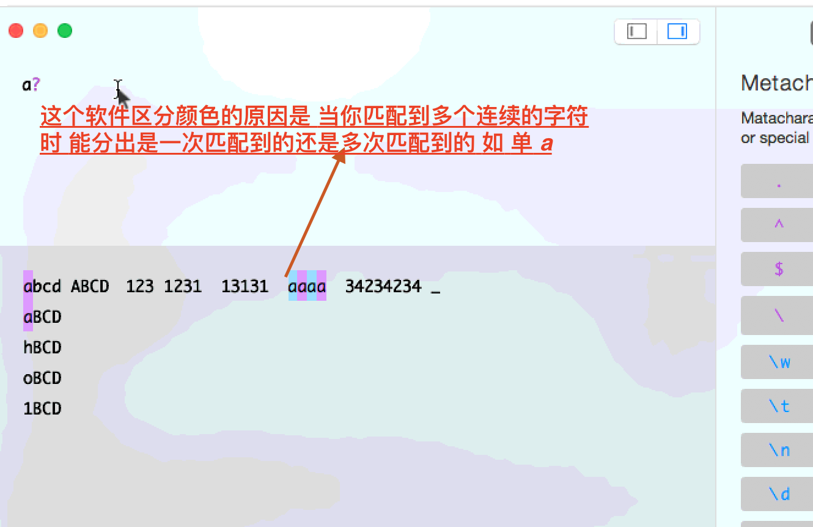
