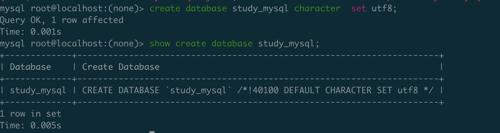
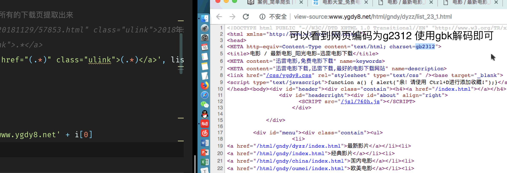

## 正则
### 正则补充 | 用法

```python

# 匹配 0 - 100 之间的数
In [23]: res = re.match("\d?\d$", "100") 

In [24]: res  

In [25]: res = re.match("\d?\d$|100", "100")

In [26]: res
Out[26]: <re.Match object; span=(0, 3), match='100'>

In [27]:

```

### () 示例 提取电话前后

```python
# 提取区号和电话号码
result = re.match("(\d{3,4})-(\d{7,8})", "010-12345678")
# 判断匹配结果
if result:
    print(result.group(1))
    print(result.group(2))

else:
    print("匹配失败！")
```

### 反向引用  \n,使用反向引用时 需要添加 \\\r 或者 r""

```python
In [60]: res = re.match('(abc).\1', 'abcdabc')

In [61]: res


In [63]: res = re.match(r'(abc).\1', 'abcdabc')

In [64]: res
Out[64]: <re.Match object; span=(0, 7), match='abcdabc'>

In [71]: res = re.match('(abc).\\1', 'abcdabc')

In [72]: res
Out[72]: <re.Match object; span=(0, 7), match='abcdabc'>


```

### 分组 

> 分组起别名与 \n 效果是一样的


```python
In [105]: res = re.match(r'<(?P<name>\w*>)<(?P<name1>\w*>).*</(?P=name1)</(?P=name)', str_)
```

```python
# 为什么 不加 r \w 可以 \1 不可以， 如果加 r 的话 不会对 \w 造成影响吗??
ret = re.match(r"<([a-zA-Z]*)>\w*</\1>", "<html>hh</html>")
print(ret.group())
```


### re 模块高级用法

> attension
```python
if __name__ == '__main__':
    res = re.search("asd", 'asdefasd')
    print(res.group())# output asd 只匹配到了 第一个 asd

```

re.match(pattern, string, flags)
第一个参数是正则表达式,如果匹配成功，则返回一个Match，否则返回一个None；
第二个参数表示要匹配的字符串；
第三个参数是标致位，用于控制正则表达式的匹配方式，如：是否区分大小写，多行匹配等等。

```python
re.search # 会在指定字符串内搜索，搜索到返回否则返回None
re.match # 只检测是否在开始位置匹配
re.findall # 查找所有返回列表
re.sub(pattern, repl, string, count) # 将匹配的字符串替换，并返回替换后的结果

In [110]: res = re.match(r'\d+', 'nihao123')

In [111]: res

如：print(re.match(‘super’, ‘superstition’).span()) 会返回(0, 5)

print(re.match(‘super’, ‘insuperable’))   则返回None
如：print(re.search(‘super’, ‘superstition’).span())返回(0, 5)

print(re.search(‘super’, ‘insuperable’).span())返回(2, 7)

# findall 
In [115]: res = re.findall(r'\d+', '123nihao123')

In [116]: res
Out[116]: ['123', '123']

# sub
import re

ret = re.sub(r"\d+", "10000", "阅读次数:9999次,转发次数:883次,评论次数:3次")
print(ret)

# 方法 2 
#coding=utf-8
import re

def add(temp):
    strNum = temp.group()
    num = int(strNum) + 1
    return str(num)

ret = re.sub(r"\d+", add, "python = 997")
print(ret)

ret = re.sub(r"\d+", add, "python = 99")
print(ret)

```

### 正则补充  ()

#### 对比正则中 * 与 + 的区别


### 练习 完成 

```python

str_ = '''
<div> ... </div
'''
 re.sub(r'<\w*>|</\w*>|\n| ', '', str_)

```

### python 中的贪婪非贪婪


### 提取 img 标签中的 src 地址，注意此处使用分组，在结果处可以使用 group(1) 拿到所要取的返回值

```python


```

## FAQ

### 为什么 不加 r \w 可以 \1 不可以， 如果加 r 的话 不会对 \w 造成影响吗??
### 加 r 貌似 一定不会错

### 花了15分钟

```python
 # res = re.search("src=(.*\.jpg|png)", add)
    # $ 表示一行结尾自然匹配不出！
    res = re.search(r"src=(.*)>$", add)
```

### $结尾表示除了前边匹配上的余下的都是此结尾标识

### python 中想正则一个 \ 需要 四个


https://segmentfault.com/q/1010000007462348/a-1020000009828555
```python
import re


# 后边转义为一个 前边转义为两个
# 前两个和后两个分别用于在编程语言里转义成反斜杠
# 转换成两个反斜杠后再在正则表达式里转义成一个反斜杠。

首先，假设正则是这样子的\d，由于Python将\字符看做是转义字符，为了使Python将这一段里的右斜杠看成是普通字符，所以要对这个斜杠进行转义，成了\\d。

然后\\d由于要被放到文本里，如果直接用文本\\d的话，显示出来的是文本\d，这样直接把这个文本放到正则解析器里去的话，\d就会成为被正则解析器认为是一个控制字符。所以文本里需要\\\\d。

具体如下：
字符串\\\\d中，第一和第三个右斜杠被Python视为转义符号，所以实际字符串表示的是\\d。
此字符串\\d被传入正则解析器，正则解析器的Python代码将第一个\视为转义符号，得到\d。
res = re.search('\\', '\\')
print(res.group())
```

```python
    # 四根 \\\\ 解释器先 解释 剩 \\, 字符串再解释(在 print 的时候) \\ -> \
    # 正则匹配后 如在控制台输出 res.group() 与 print(res.group())
   str_ = 'c:\\\\ww\\aa'
    res = re.match('c:\\\\\\\\ww\\\\aa', str_)
    print(res.group())
    # output c:\\ww\aa
```

### python r \b \w  .问题 可以问老师~
https://zhidao.baidu.com/question/1834411255849093540.html
b在正则中表示单词间隔。但由于\b在字符串里本身是个转义

```python
因为\b 有两种解释，而\w 只有一种。

\b的两种解释是：
'\b', 如果前面不加r, 那么解释器认为是转义字符“退格键backspace”;

r'\b', 如果前面加r, 那么解释器不会进行转义，\b 解释为正则表达式模式中的字符串边界。


而相比于\b, \w 只有第二种解释，并没有对应的转义字符，所以不加r, 也不会出错。

```

## 数据库 mysql -hlocalhost -P3306 -uroot -p

### 数据库退出的三种方式

- exit quit ctrl+d

### LAMP 推动了 MySQL 的发展，mysql 被oracle 收购了

### mysql 数据库又叫关系型数据库， 也就是二维数组，也就是表

### 数据库 默认表以及作用 

内存管理数据

优点：存取速度快 缺点：断电后数据不能保存

文件管理数据

优点：数据可以持久化保存 缺点：读取速度慢，数据组织格式不好控制

数据库管理数据

优点：统一的数据组织格式 读取速度快 容量大 缺点：需要专门的管理软件 需要一定的学习成本

### 数据库语言

- ddl 
- dml
- dcl
- dql

## FAQ

### ps -ef 可以看到其他用户运行的进程，端口不可以


### 数据库操作

#### curd 

C Create 创建
R Read/Retrieve 查询
U Update 修改
D Delete 删除

```mysql
 create database testdb2 character set utf8;


```



#### 修改数据库编码

```mysql
  alter database testdb charset=utf8;

```

#### 数据库表操作

```mysql
create table 表名(

  字段1 字段类型,
  字段2 字段类型,
  字段3 字段类型……);
  
  
```

##### 显示创建表时的信息

```mysql
  show create table stu;

```


##### 为已存在的表添加字段

```mysql
      alter table stu add gender char(4);
```

##### 修改数据库表字段类型

```mysql
  alter table stu modify sname varchar(20);
```

##### 修改数据列并改名

```mysql
  alter table stu change sid snumber smallint;

```

##### 删除字段

```mysql
  alter table stu drop gender;

```
### mysql 字段类型

### 数据库操作

##### 查询

```mysql
select * from stu;

```

##### 插入

- 不指定字段插入所有

```mysql
insert into tStudent values(1,'tom',20)

```

- 插入指定字段

```mysql
insert into stu(sage,sname) values(20,'jack');

```

- 插入多条数据

```mysql
insert into stu values(2,'rose',20),(3,'tony',22);

```

##### 修改数据

update 表名 set 字段=值 [条件]
- 更新所有数据
```mysql
update stu set sAge=25;

```

- 更新满足条件数据
```mysql
update stu set sname='alice' where name='tony';

```

##### 删除数据

作用：将数据从数据表中删除

语法1：truncate 表名

不需要加条件，也不能加条件，删除全部数据，重置自动编号到默认值，没有事务，速度快。 
相当于 truncate stu,但是delete操作有事务操作，所以速度慢，而且不会重置自动编号。

语法2：delete from 表名 [条件]

```mysql
truncate stu;
delete from stu;
    
```

- 删除满足条件数据

```mysql
delete from stu where snumber = 1;

```

### mysql 约束

- 主键约束，外键约束，自增，默认约束，非空约束

### 取 html 标签中的内容

```python
re.sub(r"<[^>]*>|&nbsp;|\n| ", "", test_str)

```

### 正则贪婪问题

```python
a?? 表示0个 a 因为 前一个 ? 表示一个或 0 个 后？ 取少 则是 0 个
```

```python
add = """""" 
    # ? 表示尽可能少的匹配 * 这里至少可以匹配到最近的 一个 "
    return re.search('.*src="(.*?)"', add)

```

### 贪婪模式

https://blog.csdn.net/qq_33447462/article/details/51485900

## etc 下都是配置文件

## ！爬取电影天堂的时候，右键查看source 查看电影天堂的 网页编码。。
爬取数据后，解码时使用一致的编码
## GBK:汉字编码字符集,向下与GB2312兼容(支持生僻字的字符集)
> 所以使用 gbk2312 解码后再随便编码即可



## mysql 自带的库以及作用 

https://blog.csdn.net/cainiao000001/article/details/80502549

四个系统自带库为：information_schema、mysql、performance_schema、sys； 
5.6版本自带的库为：information_schema、mysql、performance_schema、test。

1.information_schema 
库，它保存着关于MySQL服务器所维护的所有其他数据库的信息。(如数据库名，数据库的表，表栏的数据类型与访问权 限等。) 

2.mysql 
mysql的核心数据库，类似于sql server中的master表，主要负责存储数据库的用户、权限设置、关键字等mysql自己需要使用的控制和管理信息。(常用的，在mysql.user表中修改root用户的密码)。

其中 user 表

(root,%)，表示可以远程登录，并且是除服务器外的其他任何终端

(root,localhost)，表示可以本地登录，即可以在服务器上登陆

(root,127.0.0.1 )，表示可以本机登陆，即可以在服务器上登陆

(root,sv01)，表示主机名为sv1可以登陆，sv01具体指的哪台机器，可以在cat /etc/hosts查看

(root,::1) ，表示本机可以登陆， 看密码都是相同嘛，具体::1代表意义，待查


3.performance_schema 
主要用于收集数据库服务器性能参数。并且库里表的存储引擎均为PERFORMANCE_SCHEMA，而用户是不能创建存储引擎为PERFORMANCE_SCHEMA的表。MySQL5.7默认是开启的。 

4 sys
Sys库所有的数据源来自：performance_schema。目标是把performance_schema的把复杂度降低，让DBA能更好的阅读这个库里的内容。让DBA更快的了解DB的运行情况。 

5 test 
test mysql是一个参考数据库
# mysql 回滚呢? Node.js 学了其实还是要动手

# 该上思维导图了 不然记忆太乱了, 思前怎么又忘了


# 对比阅读 正则你看一遍当学了，与你动手


