## 数据库

> mysql@5.6 默认 character latin1, 5.7 默认 utf8

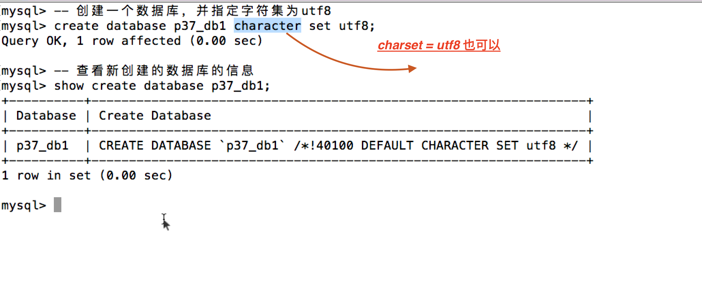

```sql
# 创建时指定编码

create database [name] character set utf8
create database [name] charset = utf8 

alert database [name] charset utf8

```

### mysql 注释的三种写法

```sql
需要特别注意  --   这种注释后面要加一个空格


#DELETE FROM SeatInformation  


/*DELETE FROM SeatInformation */
-- DELETE FROM SeatInformation
```

### 查看当前使用的数据库

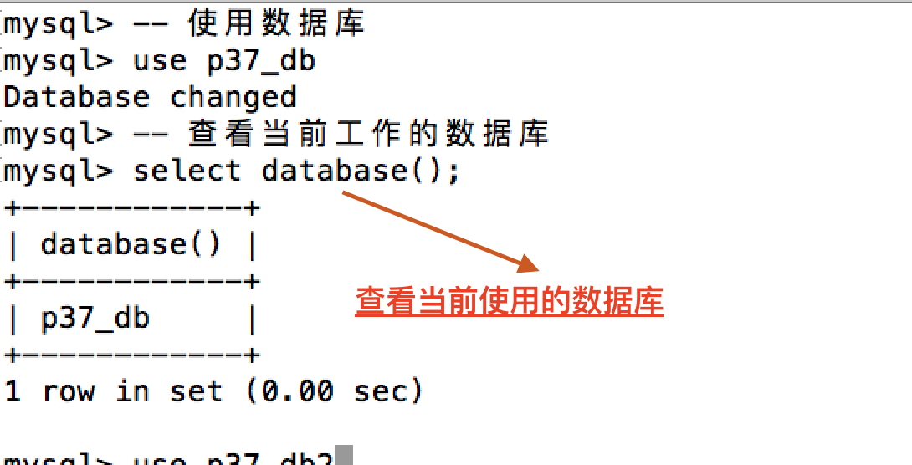

### 查看表

desc

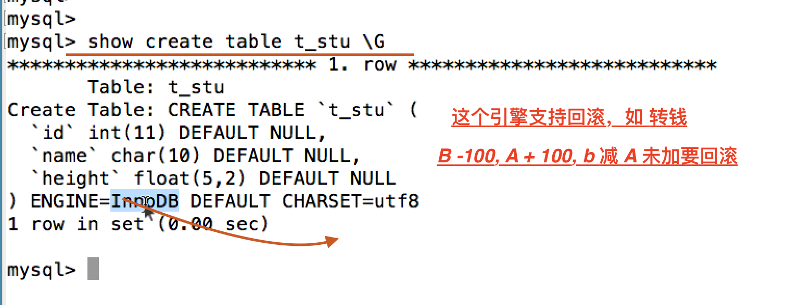

### 添加新的列

```sql
alter table test modify name varchar(20);
```

### 修改表数据类型

```sql
alter table [table_name] modify [column] [new_type]
alter table [table_name] change [column] [new_name] [new_type]
```

### 删除数据表的某个字段
```sql
alter table test drop sex;
```

### value 和 values 区别

插入单条数据的时候 value 快些，插入多条数据的时候 values快些

## mysql 数据类型

> 计算机中没有负数这一说，只是用补码表示，使用一个字节表示符号位

### char 与 varchar

> 如发朋友圈，你不确定发几个，所有用 varchar 好些，用时间换空间

> 但是varchar 的速度稍慢

> 但是如果名字最多也就20个字 用char即可, 这个时候也浪费不了多少，
> 用空间换取了时间


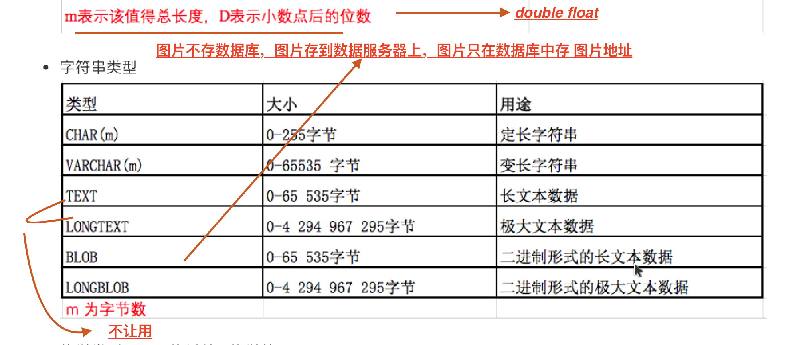
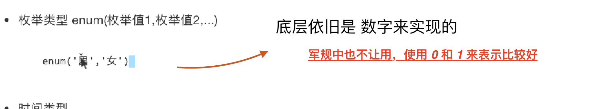

## mysql 约束

- 主键约束 自带 唯一 非空, 因为 一张表中主键只能有一个 所以自带唯一性约束
- auto_increment 一个表中只能有一个 一般配合主键使用，不能用于 str类型
- 唯一性约束 
- 非空约束(not null) 设置字段不能为 null
- 默认值约束 字段 default 默认值
- 外键约束 存在外键的表为子表
先清子表数据，才能清主表数据，先删子表，才能删主表
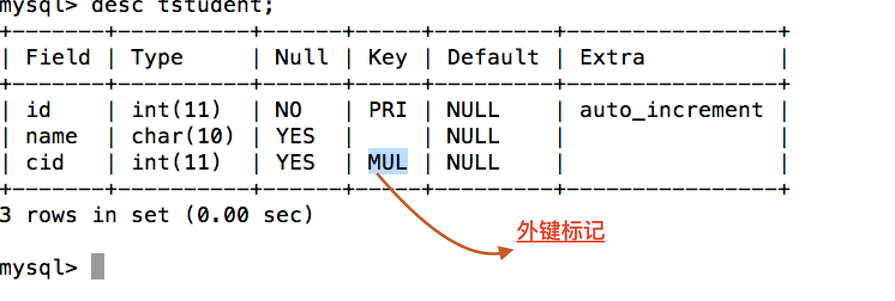
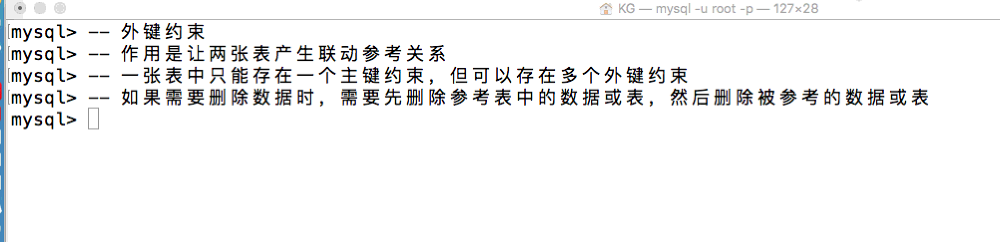
- unsigned  保证都是正数 这样 这样 int(1) 可以到 255
- zerofill 当字段小于最小宽度时 0 填充，如只要 1 位，前边写 0
> 新增字段添加默认值后

```sql
mysql root@localhost:sch> alter table test add language varchar(10) default 'chinese'
Query OK, 0 rows affected
Time: 0.023s
mysql root@localhost:sch> insert into test(name, sex) value('wwaaaawww', 1)
(1062, u"Duplicate entry 'wwaaa' for key 'name'")
mysql root@localhost:sch> insert into test(name, sex) value('ww11', 1)
Query OK, 1 row affected
Time: 0.001s
mysql root@localhost:sch> select * from test;
+----+-------+-----+----------+
| id | name  | sex | language |
+----+-------+-----+----------+
| 1  | www   | boy | chinese  |
| 3  | www11 | boy | chinese  |
| 6  | wwwww | boy | chinese  |
| 7  | wwaaa | boy | chinese  |
| 9  | ww11  | boy | chinese  |
+----+-------+-----+----------+
5 rows in set
Time: 0.005s
mysql root@localhost:sch>
```

## mysql 函数如 select database()

```sql
mysql root@localhost:sch> select version()
+-----------+
| version() |
+-----------+
| 5.6.41    |
+-----------+
1 row in set
Time: 0.006s
mysql root@localhost:sch>

```
    

## mysql dml

### 修改 在原字段值上操作写原字段即可
```sql
update [table_name] set [column] = [value] where xxx 
update test set name = name +3 where id = 1

```

### 删除

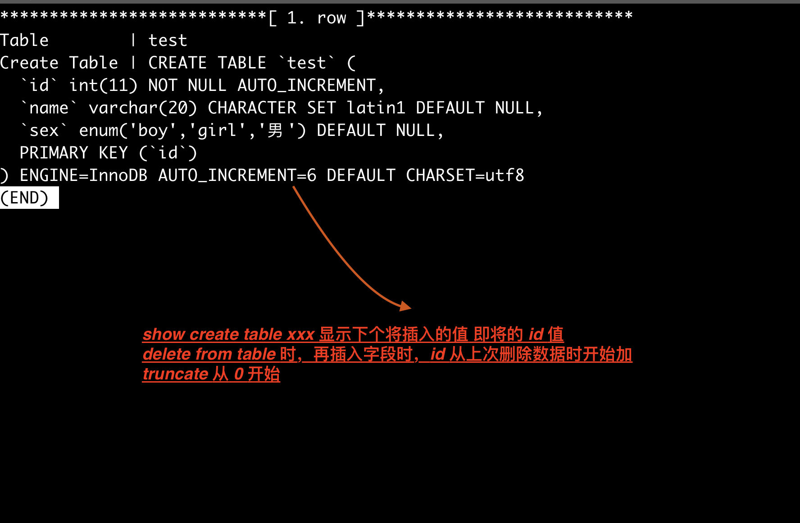

- truncate 

不需要加条件，也不能加条件，删除全部数据，重置自动编号(新插入一条数据时，可能id 不是1，而是之前的值继续加，主键自增时)到默认值，没有事务，速度快。


- delete 

相当于 truncate stu,但是delete操作有事务操作，所以速度慢，而且不会重置自动编号。


```sql
delete from table_name where xx
# 删除所有
delete from table_name

```

## 数据库备份

- 增量备份，螺旋备份

> 导出数据库 导出名称不加 sql 也可以
# ！！导出来后重命名 下就可以了 重命名不会影响文件内容

```sql
# 导出
  mysqldump -uroot -p School > school_bak.sql

# 导入 需要先建数据库
  mysql -uroot -p sch < school_bak.sql

# 使用 source 导入 | 登陆后 先建数据库并选中
source /Users/ly/sch

```

## sql 查询

```sql
select * form table # 第一步 from table 选表，第二部 select *
```

### 查询 部分数据

### 查询数据并起别名
```sql
select name as '姓名' from table_name where id < 5
```

### 别名

as | 空格 都可以

```sql
select id as d name nn from table_name
```

### 去重查询，看某个字段无重复数据时候

#### 单字段去重
```sql
select distinct c_address from t_student;
```

#### 多字段去重

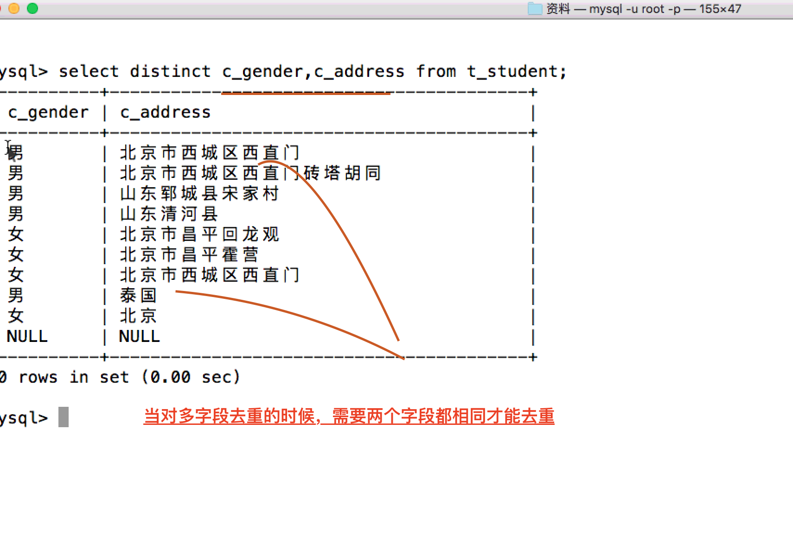


## mysql 军规

## FAQ 
### alter + table_name, update 不加 table_name
## 试试float 和 double 最大位
## enum 按顺序 1，..?  是的
```sql
mysql root@localhost:sch> alter table test add sex enum('boy', 'girl', '男')
Query OK, 0 rows affected
Time: 0.036s
mysql root@localhost:sch> insert into test value(null, 2, 1)
Query OK, 1 row affected
Time: 0.001s
mysql root@localhost:sch> insert into test value(null, 2, 2)
Query OK, 1 row affected
Time: 0.001s
mysql root@localhost:sch> insert into test value(null, 2, 3)
Query OK, 1 row affected
Time: 0.001s
mysql root@localhost:sch> select * from test;
11 rows in set

查出来是 boy girl 男

```
## 为什么计算机不用 符号位表示正负 还要加个 补码
## 那个 int[宽度] 既然宽度不限制 宽度有什么用，而varchar[50]又有什么用
### 11:40 - 11:46 重听 负数补码问题, 10:50 有一句 不一定相等, 10:46 -10:52 重听
#### 11：40 - 11：54重听


- 为什么是 -128 补码又是什么


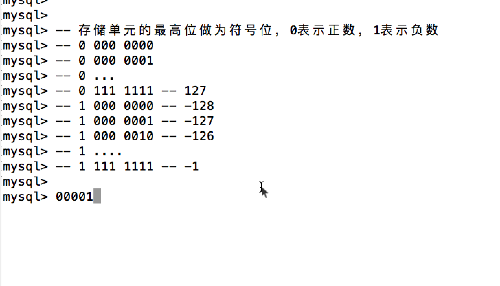

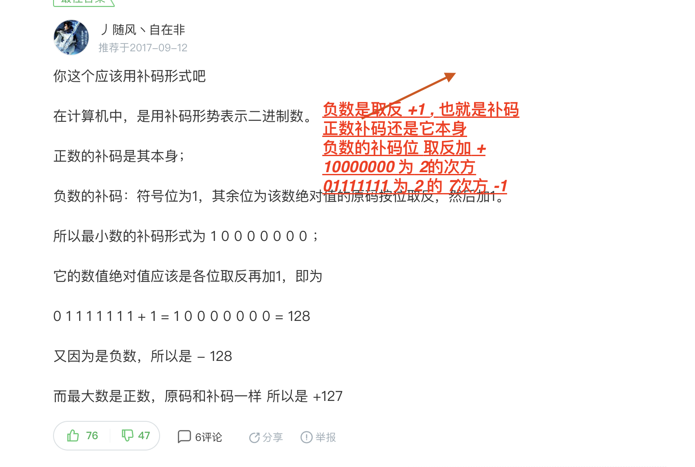


### float(5, 2) 5 表示的 宽度 2 表示的是位数

## 当表示与钱有关的时候 不能用小数(1 小数有损失，2 小数计算慢)

> 之前cpu 浮点运算能力

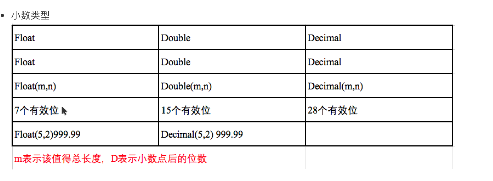
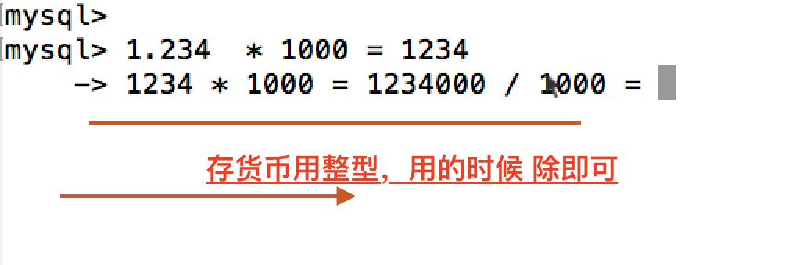
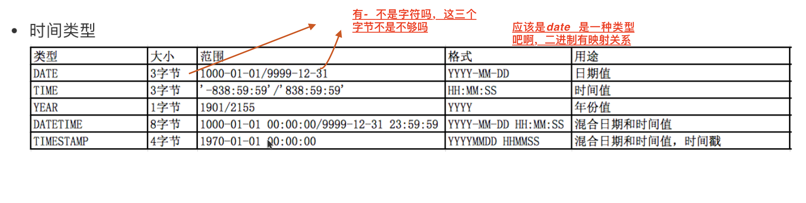

## 当使用 0 插入 数据库 id 时候，会自动使用 show createtable 里的 auto_increment 的值
```sql
# id 值会取 auto increment 的值
insert into table_name(id, name) value(0 , 1)
```

### 数据库的三种完整性

关系的完整性主要包括域完整性、实体完整性和参照完整性三种。
1．域（列）完整性  
     域完整性是对数据表中字段属性的约束，通常指数据的有效性,它包括字段的值域、字段的类型及字段的有效规则等约束，它是由确定关系结构时所定义的字段的属性决定的。限制数据类型,缺省值,规则,约束,是否可以为空,域完整性可以确保不会输入无效的值.。
2．实体（行）完整性
      实体完整性是对关系中的记录唯一性，也就是主键的约束。准确地说，实体完整性是指关系中的主属性值不能为Null且不能有相同值。定义表中的所有行能唯一的标识,一般用主键,唯一索引 unique关键字,及identity属性比如说我们的身份证号码,可以唯一标识一个人. 
3．参照完整性
      参照完整性是对关系数据库中建立关联关系的数据表间数据参照引用的约束，也就是对外键的约束。准确地说，参照完整性是指关系中的外键必须是另一个关系的主键有效值，或者是NULL。参考完整性维护表间数据的有效性,完整性,通常通过建立外部键联系另一表的主键实现,还可以用触发器来维护参考完整性


# 4:09 - 4:11 重听，主键 加 unique 了?  排序大的 在前?
# 那个为什么排序大的在前

# 为什么 varchar(20) 就只截取 20 个字符了 不是变长吗，int（）) 又为什么不影响

# 0 站位 -！

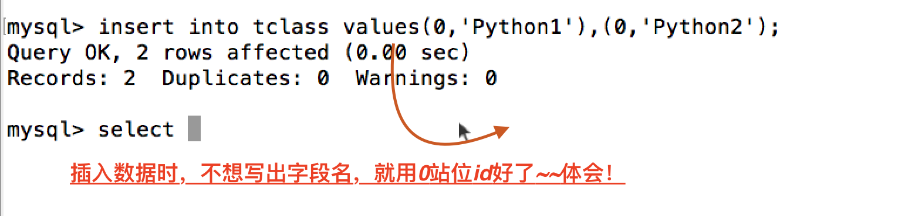
