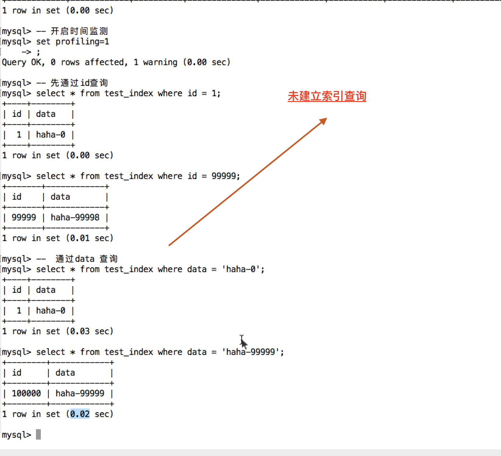

## sql


### 逻辑运算符 or not and 

```sql

select * from t_name where xx or|add|not xx 

```

### 模糊查询

> 比如要搜 带有 8888 手机号 %8888% 即可


> 使用 _ 表示一个位置

### 范围查询

> 非连续范围使用 in

```sql
# 显然 in 比 or 简便
mysql root@localhost:school> select * from exam where age in (18, 15,
                          -> 27)
+----+-----+------+
| id | age | name |
+----+-----+------+
| 0  | 27  | 河神 |
| 0  | 18  | 河神 |
+----+-----+------+
2 rows in set
Time: 0.006s
mysql root@localhost:school> select * from exam where age = 15 or age
                          -> = 18
+----+-----+------+
| id | age | name |
+----+-----+------+
| 0  | 18  | 河神 |
+----+-----+------+
1 row in set
Time: 0.005s
mysql root@localhost:school>
```

> 连续数字范围使用 between

```sql
mysql root@localhost:school> select * from exam where age between 18 a
                          -> nd 30
+----+-----+------+
| id | age | name |
+----+-----+------+
| 0  | 20  | 河神 |
| 0  | 25  | 河神 |
| 0  | 27  | 河神 |
| 0  | 18  | 河神 |
+----+-----+------+
4 rows in set
Time: 0.006s
mysql root@localhost:school> select * from exam where age >= 18 and ag
                          -> e <= 30
+----+-----+------+
| id | age | name |
+----+-----+------+
| 0  | 20  | 河神 |
| 0  | 25  | 河神 |
| 0  | 27  | 河神 |
| 0  | 18  | 河神 |
+----+-----+------+
4 rows in set
Time: 0.006s
mysql root@localhost:school>
```

### 判断空和非空

```sql
0 , null, 'null' 都无法判断需要使用 mysql 提供的 is null | is not null
mysql root@localhost:school> select * from exam
+----+-----+--------+
| id | age | name   |
+----+-----+--------+
| 0  | 10  | <null> |
| 0  | 10  | <null> |
| 0  | 10  | <null> |
| 0  | 10  | <null> |
| 0  | 0   | <null> |
| 0  | 0   | <null> |
| 0  | 0   | <null> |
| 0  | 0   | <null> |
| 0  | 1   | 江河   |
| 0  | 1   | 江河1  |
| 0  | 1   | 江河2  |
| 0  | 1   | 江河3  |
| 0  | 1   | 悟空   |
| 0  | 1   | 悟饭   |
| 0  | 1   | 河水   |
| 0  | 1   | 河神   |
| 0  | 20  | 河神   |
| 0  | 25  | 河神   |
| 0  | 27  | 河神   |
| 0  | 18  | 河神   |
+----+-----+--------+
20 rows in set
Time: 0.006s
mysql root@localhost:school> select * from exam where name = null
+----+-----+------+
| id | age | name |
+----+-----+------+
0 rows in set
Time: 0.011s
mysql root@localhost:school> select * from exam where name = 'null'
+----+-----+------+
| id | age | name |
+----+-----+------+
0 rows in set
Time: 0.005s
mysql root@localhost:school> select * from exam where name = 0
```

> 判断空 field is null 
> 判断非空 field is not null

0 不代表 Null, Null, 'Null'

is not null(一步完成) 与  not field is null(两步完成，先 is null 判断再not)

### 排序

```sql
select * from exam [where ...] order by id desc, age [asc 可省略]

```


### 分页查询

#### 计算公式，前提条目数相同
```sql
limit (page-1)*count, count 
```

### 聚合函数

> 通常配合分组来一起使用


### 分组加条件
```sql
select * from exam group by name having name = '悟空';
```

## 分组

### 单独分组没有意义，需要和聚合函数一起使用 | where 不可以吗

### 要查询分组中的其他内容的时候 用 group_concat() 拼接分组中指定字段的内容

```sql
# 可以看到每一组中的 年龄值
mysql root@localhost:school> select name, group_concat(age)
                          ->  from exam group by name
+--------+------------------------+
| name   | group_concat(age)      |
+--------+------------------------+
| <null> | 10,0,0,0,0,10,10,10    |
| 悟空   | 1                      |
| 悟饭   | 1                      |
| 江河   | 1                      |
| 江河1  | 1                      |
| 江河2  | 1                      |
| 江河3  | 1                      |
| 河水   | 1                      |
| 河神   | 18,18,18,27,25,20,1,29 |
+--------+------------------------+
9 rows in set
Time: 0.007s
mysql root@localhost:school>
```

### 聚合函数和分组的使用

## 多表查询

> 公司中数据库不可能只放入一张表中国

### 多表默认连接方式 笛卡尔积

#### 如下是 查询条件，on 是连接条件, 如上是先进行笛卡尔积查询，再进行 where 筛选，不是真正的连接


## FAQ
### goroup having 先分组再过滤? 对分组结果进行筛选

### char vs varchar vs test ， varchar 设置的表示最大长度，长度以内自动边长
> varcahr 中设置的数字表示字符位数
取数据的时候，char类型的要用trim()去掉多余的空格，而varchar是不需要的，
https://www.cnblogs.com/jingmin/p/9101162.html


### int 宽度问题


）varchar(30)中30的涵义

4.0版本以下，varchar(50)，指的是50字节，如果存放UTF8汉字时，只能存16个（每个中文3字节）

   5.0版本以上，varchar(50)，指的是50字符，无论存放的是数字、字母还是UTF8中文（每个中文3字节），都可以存放50个

https://blog.csdn.net/u013129109/article/details/79649971
最大存储30个字符；varchar(5)和(200)存储hello所占空间一样，但后者在排序时会消耗更多内存，因为order by col采用fixed_length计算col长度(memory引擎也一样)
Varchar存储可变长字符串，小于255字节时需要1个额外字节(大于255需要2个额外字节)存储长度，最大长度为65532字节(所有列总和)

For example, a VARCHAR(255) column can hold a string with a maximum length of 255 characters(字符而非字节). 对于latin1，’abcd’的L为4，存储需要5个字节；对于ucs2(双字节字符)，则需要10个字节存储(最大长度为510>255，故需要额外2个字节)


### 默认显示方式 笛卡尔积 两次 mn 不是以 mxn nxm 顺序排序?


### 内连接查询

#### ? inner join 和直接两表查询 出来对比 2:41 - 2:42 一闪而过，没有解释


）varchar(30)中30的涵义

4.0版本以下，varchar(50)，指的是50字节，如果存放UTF8汉字时，只能存16个（每个中文3字节）

   5.0版本以上，varchar(50)，指的是50字符，无论存放的是数字、字母还是UTF8中文（每个中文3字节），都可以存放50个

https://blog.csdn.net/u013129109/article/details/79649971
最大存储30个字符；varchar(5)和(200)存储hello所占空间一样，但后者在排序时会消耗更多内存，因为order by col采用fixed_length计算col长度(memory引擎也一样)
Varchar存储可变长字符串，小于255字节时需要1个额外字节(大于255需要2个额外字节)存储长度，最大长度为65532字节(所有列总和)

For example, a VARCHAR(255) column can hold a string with a maximum length of 255 characters(字符而非字节). 对于latin1，’abcd’的L为4，存储需要5个字节；对于ucs2(双字节字符)，则需要10个字节存储(最大长度为510>255，故需要额外2个字节)


### 默认显示方式 笛卡尔积 两次 mn 不是以 mxn nxm 顺序排序?

## sql 文件，其实是表，！！ 不是数据库，sql 导入相当于创建完数据库后，执行导入表文件的sql

## 左连接，左外连接 ..

以左表去连接，每一条去连接，(可能左表一条对应多条，当找不到符合条件右表数据时，补 NULL)

### 左连接以左表为基准，右连接，以右表为基准

## 子查询

### 标量子查询

### 列级子查询 子查询返回的结果是一列多行


### 行级子查询 一行多列


```sql
select * from t_student where c_age = (select max(c_age) from t_student) and c_class_id = (select min(c_class_id) from t_student)
```

### 自连接查询， 自己连接自己


## mysql 军规

5.3 以前 默认不使用 innodb 作为默认引擎，5.3 以后使用

### 进制使用外键
### 使用 Not null 和 默认值空 （14）必须把字段定义为NOT NULL并且提供默认值
### 禁止使用小数村塾金钱
### 必须使用 varchar(20) 存储手机号


解读：

a）涉及到区号或者国家代号，可能出现+-()

b）手机号会去做数学运算么？

c）varchar可以支持模糊查询，例如：like“138%”

一行一列

### 禁止使用 select *

### 禁止使用全字段插入，插入表时候 需要表明字段


## 设计几个数据库！！多点表如之前项目

### 视图

> 当写的 sql 非常复杂，涉及的表很多，每次都编码很容易出错，


```sql

mysql> show tables;
+------------------+
| Tables_in_school |
+------------------+
| exam             |
| order_info       |
| t_class          |
| t_score          |
| t_student        |
| t_teacher        |
| test             |
| v_a              |
+------------------+
8 rows in set (0.01 sec)

mysql> select * from v_a
    -> ; 
```

## 索引

### 如字典，为无序的存储定义一种数据存储关系

#### 查看表中已有索引
```sql
show index from [table_name]
```





## 时间监测

```sql
# 查询h使用时间
show profiling = 1
show profile 
mysql root@localhost:school> select * from t_student;
33 rows in set
Time: 0.011s
mysql root@localhost:school> select * from t_class;
+------+--------------------------+------------------+
| c_id | c_name                   | c_desc           |
+------+--------------------------+------------------+
| 1    | 软件工程18级一班         | 2018年入学的班级 |
| 2    | 软件工程18级二班         | 2018年入学的班级 |
| 3    | 计算机科学与技术18级一班 | 2018年入学的班级 |
| 4    | 计算机科学与技术18级二班 | 2018年入学的班级 |
| 5    | 网络工程18级一班         | 2018年入学的班级 |
| 6    | 网络工程18级二班         | 2018年入学的班级 |
+------+--------------------------+------------------+
6 rows in set
Time: 0.006s
mysql root@localhost:school> show profiles;
+----------+----------+-------------------------+
| Query_ID | Duration | Query                   |
+----------+----------+-------------------------+
| 1        | 0.000813 | SHOW WARNINGS           |
| 2        | 0.001859 | select * from students  |
| 3        | 0.000183 | select * from t_student |
| 4        | 0.000176 | select * from t_class   |
+----------+----------+-------------------------+
4 rows in set
Time: 0.007s
mysql root@localhost:school>

```
## 默认主键没有索引吗? 还是要新建? 那laravel 为表建索引了吗