## 昨日

### 聚合函数如果统计 某个字段 非(*) 将不统计 Null，常与分组一起用

### 左右连接，以左右表为基准数据至少和左右表相同


## mysql 用户管理

> 正常开发只有查询权限而且对查询权限有限制，如外包到银行，不能看到所有用户信息，
再比如工资表

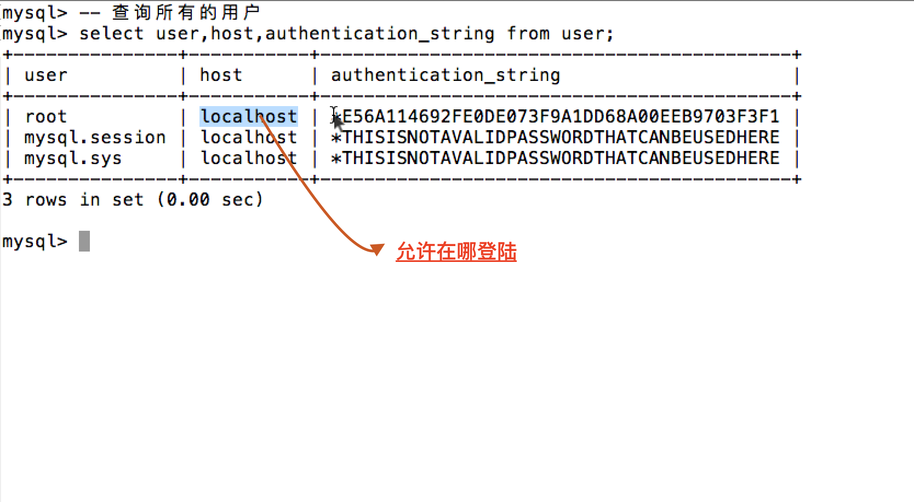

- 权限列表

常用权限： create、alter、drop、insert、update、delete、select
全部权限： all privileges

- 赋予权限

grant 权限列表 on 数据库 to '用户名'@'访问主机' identified by '密码';
```sql
# 会自动加密 密码吗
grant select on school.t_student to 'testuser1'@'localhost' identified by '123123';| testuser  | localhost             | *E56A114692FE0DE073F9A1DD68A00EEB9703F3F1 |

# 发现确实是加密了
| testuser1 | localhost             | *E56A114692FE0DE073F9A1DD68A00EEB9703F3F1 |
+-----------+-----------------------+-------------------------------------------+

# 使用新用户登陆后发现 只能看到一张表了

mysql> show tables;
+------------------+
| Tables_in_school |
+------------------+
| t_student        |
+------------------+
1 row in set (0.00 sec)

# 进行查询操作可以，但是进行编辑操作报错了
mysql> update t_student set c_name = 'dd' where c_id =1
    -> ;
ERROR 1142 (42000): UPDATE command denied to user 'testuser1'@'localhost' for table 't_student'

mysql>

## 查看用户权限

mysql> show grants for 'testuser1'@'localhost'
    -> ;
+------------------------------------------------------------------------------------------------------------------+
| Grants for testuser1@localhost                                                                                   |
+------------------------------------------------------------------------------------------------------------------+
| GRANT USAGE ON *.* TO 'testuser1'@'localhost' IDENTIFIED BY PASSWORD '*E56A114692FE0DE073F9A1DD68A00EEB9703F3F1' |
| GRANT SELECT ON `school`.`t_student` TO 'testuser1'@'localhost'                                                  |
+------------------------------------------------------------------------------------------------------------------+
2 rows in set (0.00 sec)

## 更新用户权限，更新完需要刷新，不然无效

-- 将testuser权限改为对所有库有所有权限 
grant all privileges on *.* to 'testuser'@'localhost' with grant option;

flush privileges;

## 修改密码, 修改密码后同样需要刷新

update mysql.user set password=password('111111') where user='testuser1'

## 删除用户
drop user 'testuser'@'localhost'; 
或 delete from user where user='用户名';
``` 
- 授权
```sql

```
## 主从服务器 

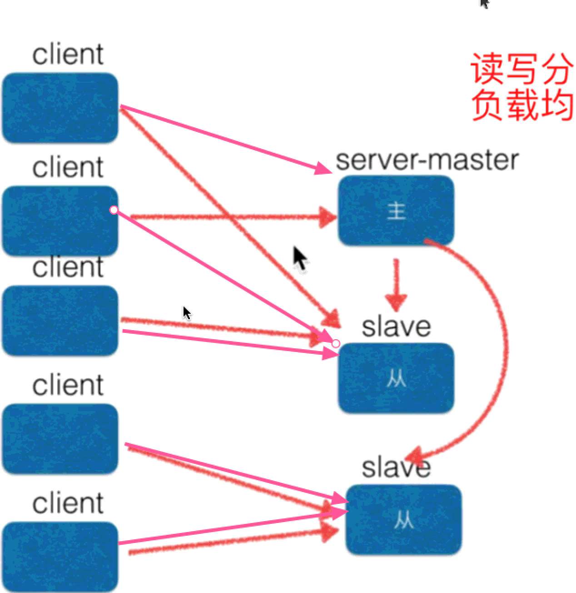

## 事务

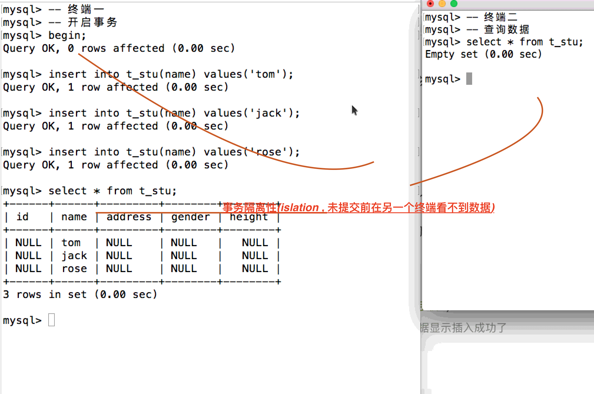
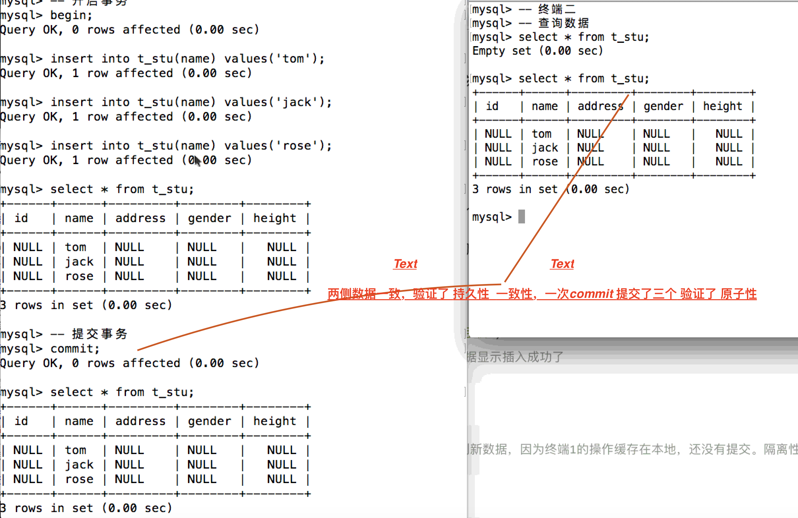
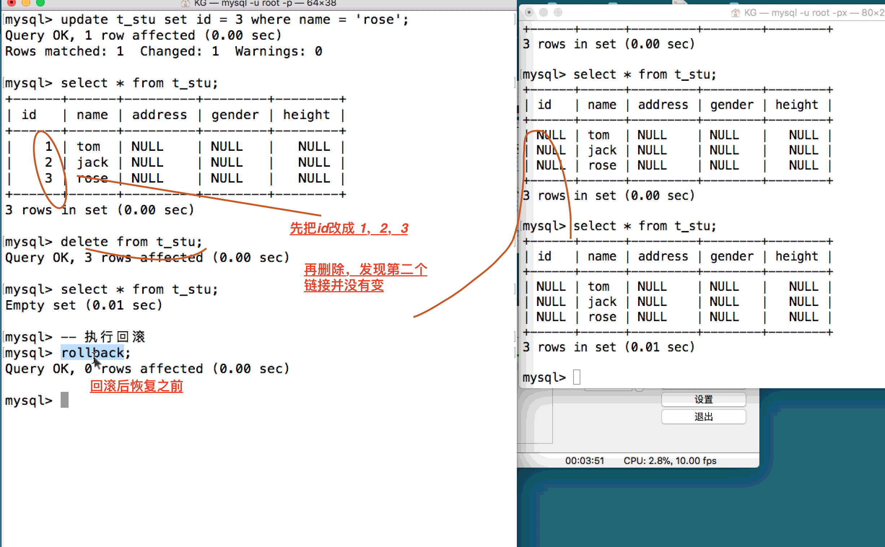

### 事务的四大特性 AICD

> 执行一系列的 sql 语句要么完全不执行，要么都执行

原子性(Atomicity)

一个事务必须被视为一个不可分割的最小工作单元，整个事务中的所有操作要么全部提交成功，要么全部失败回滚，对于一个事务来说，不可能只执行其中的一部分操作，这就是事务的原子性

一致性(Consistency)

数据库总是从一个一致性的状态转换到另一个一致性的状态。（在前面的例子中，一致性确保了，即使在执行第三、四条语句之间时系统崩溃，支票账户中也不会损失200美元，因为事务最终没有提交，所以事务中所做的修改也不会保存到数据库中。）

隔离性(Isolation)

通常来说，一个事务所做的修改在最终提交以前，对其他事务是不可见的。（在前面的例子中，当执行完第三条语句、第四条语句还未开始时，此时有另外的一个账户汇总程序开始运行，则其看到支票帐户的余额并没有被减去200美元。）

持久性(Durability)

一旦事务提交，则其所做的修改会永久保存到数据库。（此时即使系统崩溃，修改的数据也不会丢失。


### mysql 内部是怎么实现事务的

```sql
1. start transaction;
2. select balance from checking where customer_id = 10233276;
3. update checking set balance = balance - 200.00 where customer_id = 10233276;
4. update savings set balance = balance + 200.00 where customer_id = 10233276;
5. commit;
```

## 数据库编程

### 五部曲

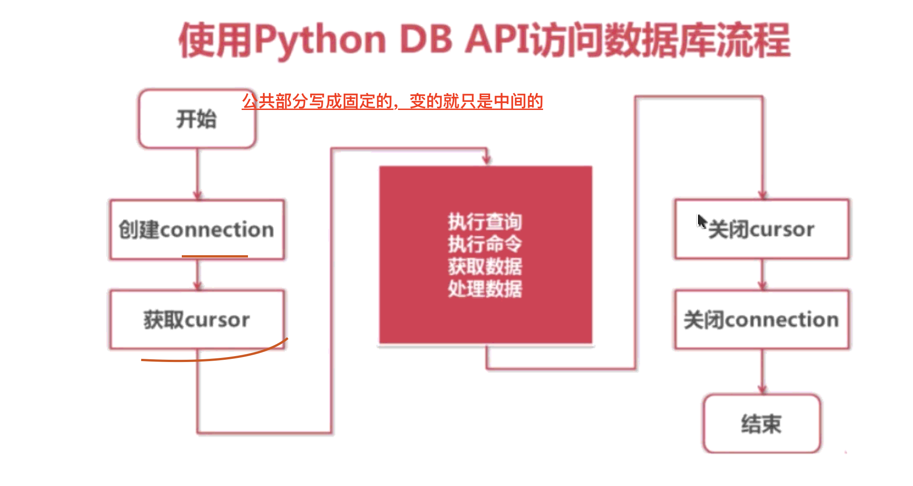

```sql
获取Cursor对象 cur = conn.cursor()
使用游标执行SQL语句 cur.execute(operation , [parameters]) 执行SQL语句，
返回受影响的行数，主要用于执行insert、update、delete语句
# 返回受影响行数
mysql root@localhost:school> update book set name = 777 where id = 3;
Query OK, 1 row affected

```

### 游标控制 (absolute, relative), || cur.rownumber = n, 通过 cur.rowcount 来获取影响的结果(当前sql获取条数影响条数等写下)
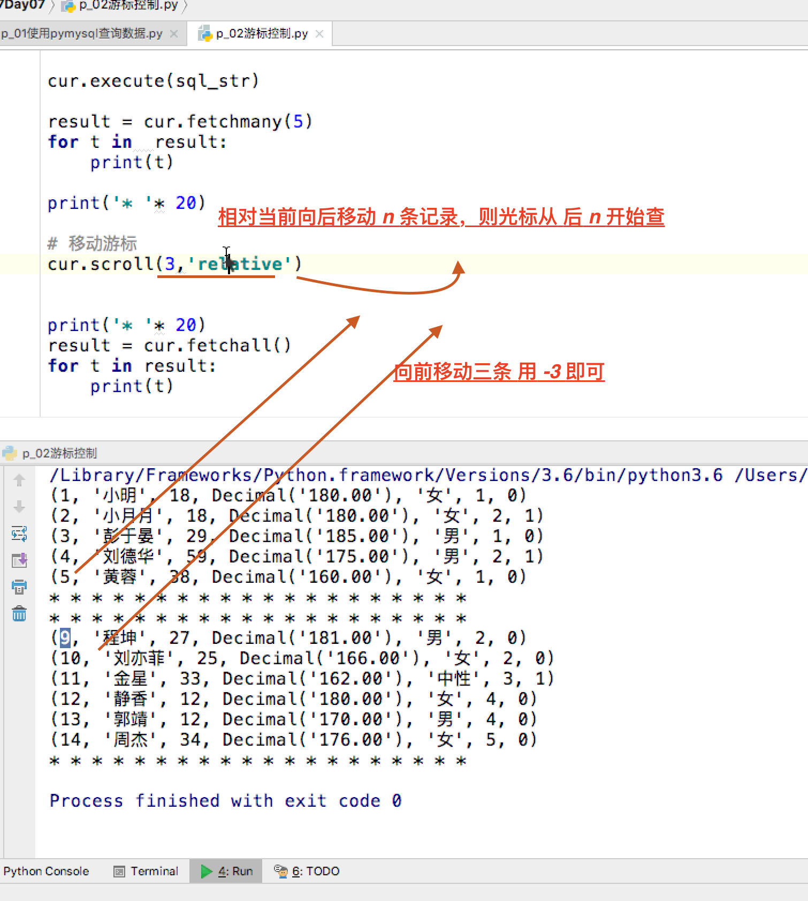

### 增删改查 | Connection 参数: uhppcd

connect 有三种形式

```python
from pymysql import connect
from pymysql import Connect
from pymysql import Connection

connect = Connection = Connect

```

### 自动提交
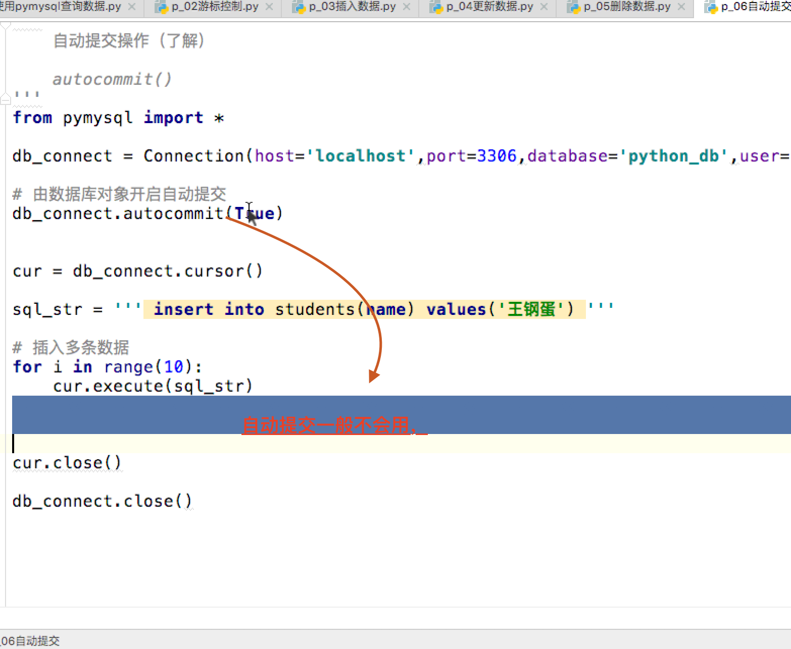

auto_commit

> 当创建游标对象时，会开启一个隐式的事务环境，对数据库操作完后，要手动提交，
> 若不提交，则关闭数据库时，会自动执行回滚

#### 新增数据
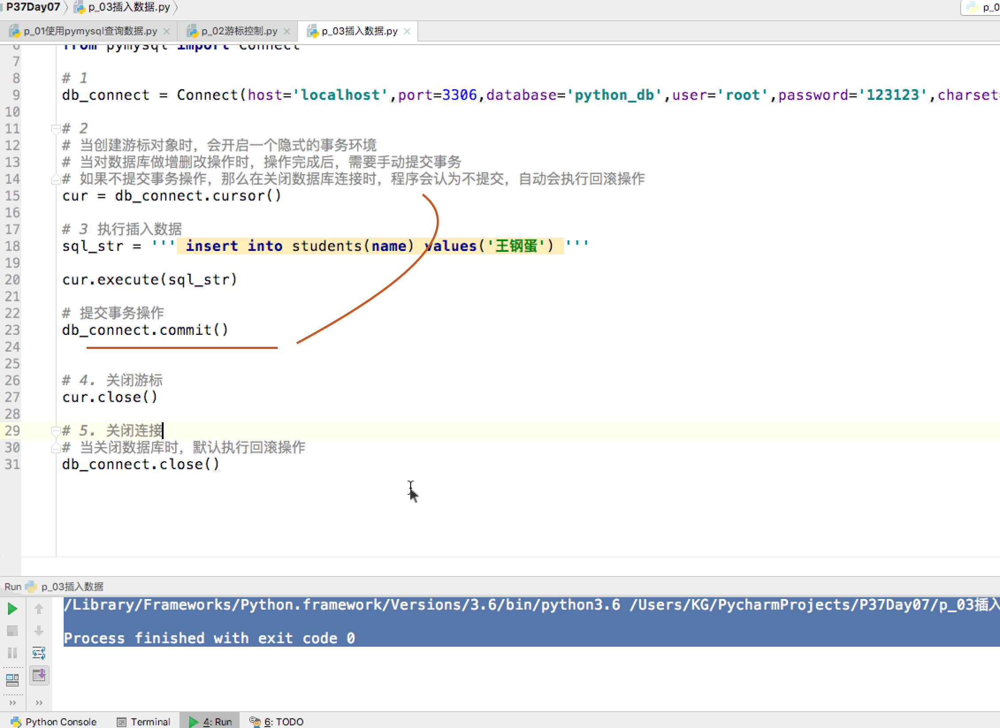

#### 修改数据

```python
from pymysql import Connect
```

### 事务使用 

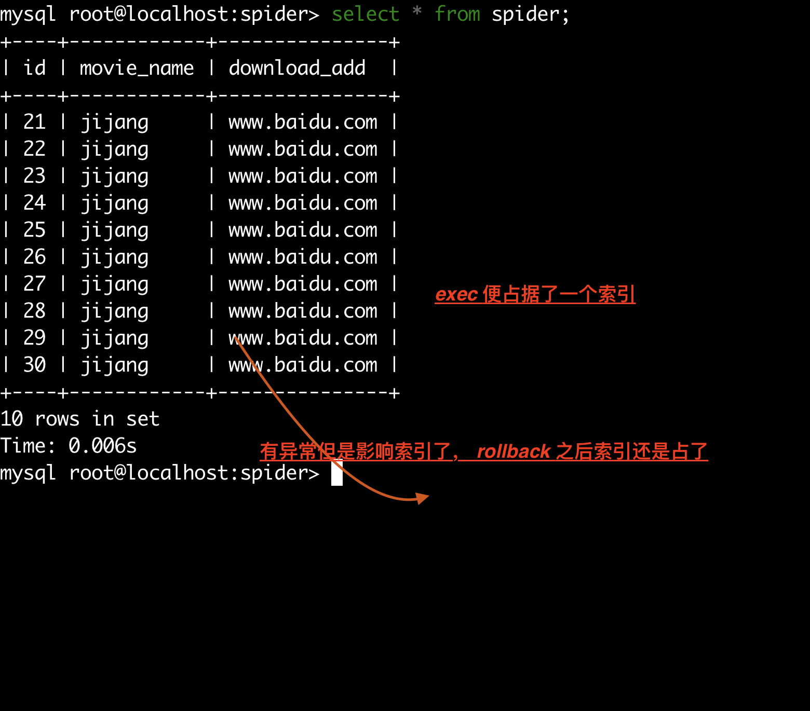

```python
 try:
        for i in range(10):
            res = cursor.execute(sql)
        if random.randint(3, 5) == 3:
            raise Exception('miss exception')
    except Exception as e:
        print('处理了异常')
        # db.rollback()
    else:
        print('无异常正常提交')
        db.commit()
    finally:
        cursor.close()
        db.close()
```

### sql 注入

> 用户恶意输入 对 sql 进行拼接

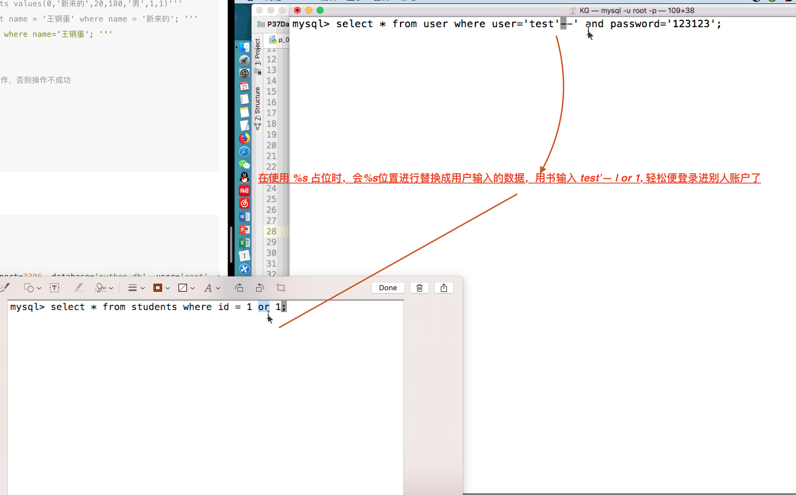

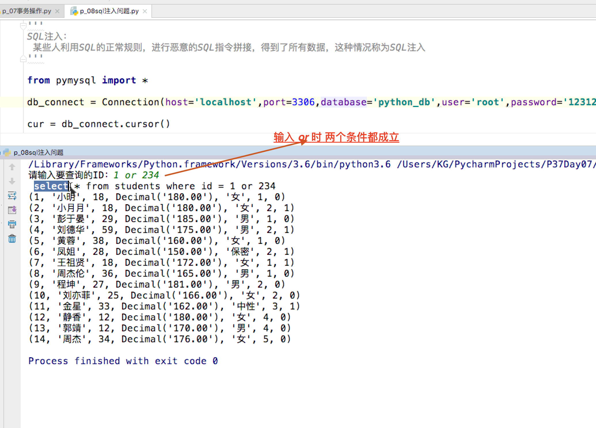

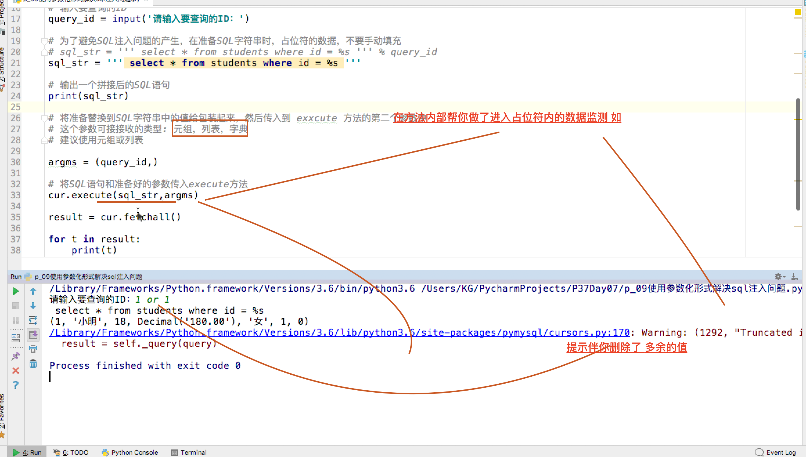

### 小项目

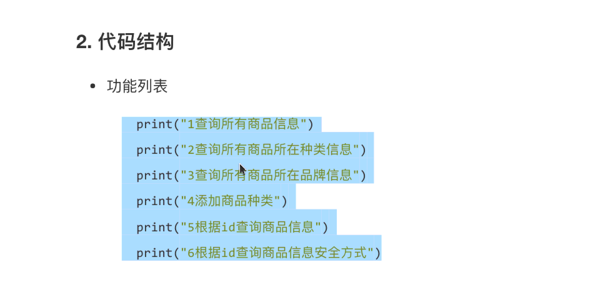

vpn 随时更换Ip


###

## FAQ
### 查看connection 源码部分， 因为 connect = Connection 点击的时候不是方法 所以调转不到 __init__ 要找到方法
### 爬取
### tmux 底部
###  默认主键没有索引吗? 还是要新建? 那laravel 为表建索引了
### 听之与看之之差
### 读取的内容写入数据库
### 索引主键默认带索引了吗 唯一呢，查询次数， 还有索引查询， 以及为什么字符 数子一直 usewhere 字符只查一次
### python pymysql Connection 中 port 是用 %d 站位的 所以不能传入 str

## exec sql 

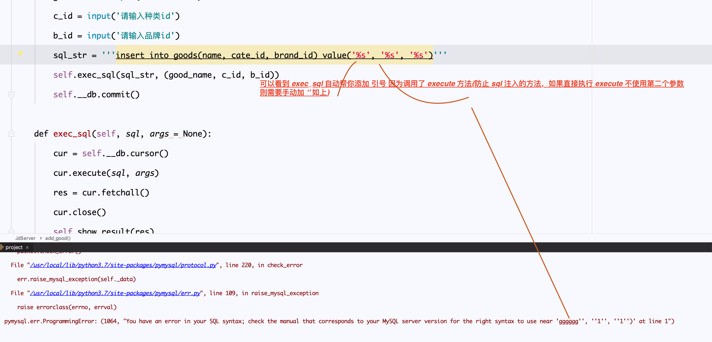

### mysql 字段也有编码, 初始建立库的时候设置 库的编码，字段编码就不用操心了
> 更改编码格式

```python 
alter table student convert to character set utf8;
```


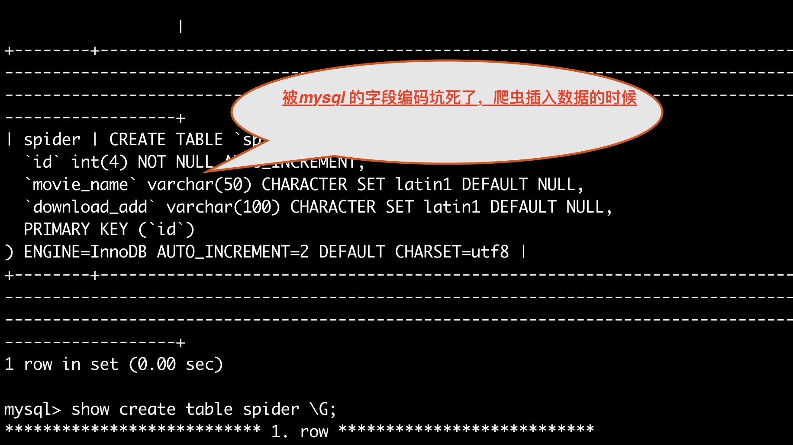
