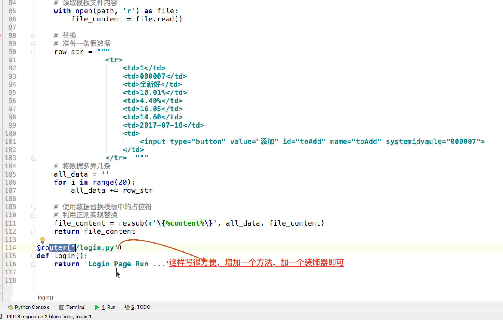
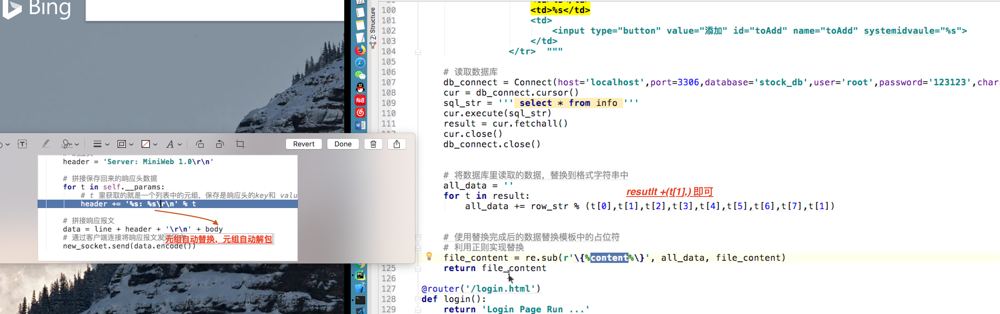

### m 9:14 到教室， 9:00 上课

#### 函数回调


## mineweb 项目, 基础web框架搭建


## 404时可以重定向到首页，~


```python
```

### 代码优化

-1 封装


-2 代码分离，让服务器和应用的功能分离开(如电脑各个插槽式硬件)


> i1


> 在服务器实现信息保存


```python
# 再比如厨子和服务员 同时一个人做，一个出问题影响两个 
实现过程: 1.WebServer 文件只用来提供请求的接收和响应 
2.WebFrame 文件只用来提供请求数据的处理和返回 3.文件之间利用一个函数来传递请求数据和返回的信息
```

## 下午

### flask django 都是基于 wsgi 实现的


### 优化抽取函数


# ！ 封装函数时，就思考 入口参数，和 返回参数即可！

### v5 使用装饰器传参实现路由





### 为了 seo 伪装成


### Framework

- 通过模板格式化数据
- 路由
- 结合 wsgi 提供函数
> 后边 flask, Django 使用也类似于此


### v7 利用现有框架实现现有数据填充

#### 使用正则替换


# 键盘记忆 zxcvbnm....,,,

## 数据库是每次建立连接 每次关闭,,m,'';'

## 每日源码阅读逻辑提升

### 两层 正则不转义 r 让正则不转义 ，字符串依旧转义  { 没有特殊意义 r 有无 \\{ 表示一个意思




#! important


