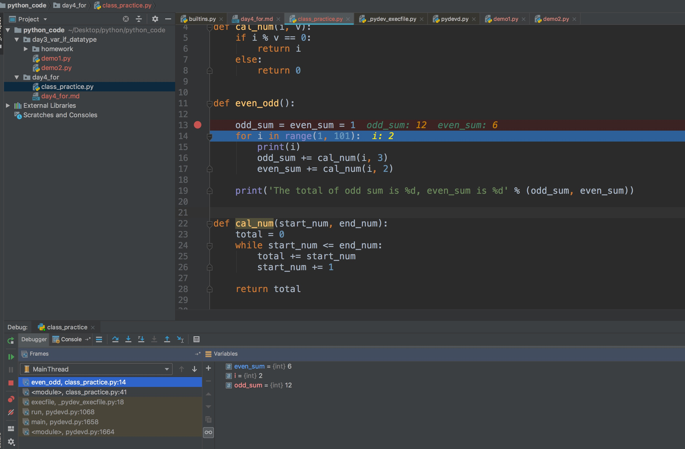

## Python 循环

### while loop

> python while 可以和 else 搭配使用

> continue语句被用来告诉Python跳过当前循环块中的剩余语句，然后继续进行下一轮循环。

> break 结束循环

> * for 循环 while 循环有 else, 在 break 时不执行

```python3
count = 0
while count < 5:
   print (count, " 小于 5")
   count = count + 1
else:
   print (count, " 大于或等于 5")
```

- 当循环只有一条语句时，应该将 while 和 语句放在
```python3
while (flag): print ('welcome!')
```

### for loop

```

for <variable> in <sequence>:
    <statements>
else:
    <statements>

```

### range 函数

- 指定区域
- 指定步长

  - 遍历数组

  ```python3
  a = ['Google', 'Baidu', 'Runoob', 'Taobao', 'QQ']
  for i in range(len(a)):
      print(i, a[i])
  ```

```python3
for i in range(0, 10, 3) :
    print(i)

# output 0 3 6 9    

```

## python debug





## Tip

- atom a 创建文件， Shift + a 创建文件夹

- python 中的 三目

```python
expr=判断表达式 and expr1 or expr2
```

- and 返 false 或值， or 返两个值

## Faq

- \#!/usr/bin/python3 作用 : 找 python 解释器

- 为何 break 都不讲

- Python pass是空语句，是为了保持程序结构的完整性。

- 在Linux/Unix系统中，你可以在脚本顶部添加以下命令让Python脚本可以像SHELL脚本一样可直接执行：

  表示从 "PATH 环境变量"中查找 python3 解释器的位置, 路径没有被写死, 而是在"环境变量"中寻找 python3 解释器的安装路径, 再调用该路径下的解释器来执行脚本
```sh

$ chmod +x hello.py

```

- python 类变量 类变量：类变量在整个实例化的对象中是公用的。类变量定义在类中且在函数体之外。类变量通常不作为实例变量使用。

  - 注意类变量只要定义在 类 的结构体中 即可，如下

```

#!/usr/bin/python3

class MyClass:
    """一个简单的类实例"""
    i = 12345
    def f(self):
        return 'hello world'

# 实例化类
x = MyClass()

# 访问类的属性和方法
print("MyClass 类的属性 i 为：", x.i)
print("MyClass 类的方法 f 输出为：", x.f())

```

  - python 类的方法必有有一个 self(并非固定，写成其他也可以的但是必须是第一个参数) 的参数

  - self 指的是类的实例，代表当前对象的地址，而 self.class 则指向类

```python
  class Test:
  def prt(runoob):
      print(runoob)
      print(runoob.__class__)

t = Test()
t.prt()
```

```
# 执行结果
<__main__.Test instance at 0x100771878>
__main__.Test

```

  - 实例化类

```python
# 实例化类
p = people('runoob',10,30)
```

  - 基类必须与派生类在同一个作用域内

  - 继承方法

```
  class student(people):
      def __init__(self,n,a,w,g):
        #调用父类的构函
        people.__init__(self,n,a,w)
        self.grade = g
```

  - 用子类调用父类重写的方法

  ```
  #!/usr/bin/python3

  class Parent:        # 定义父类
     def myMethod(self):
        print ('调用父类方法')

  class Child(Parent): # 定义子类
     def myMethod(self):
        print ('调用子类方法')

  c = Child()          # 子类实例
  c.myMethod()         # 子类调用重写方法
  super(Child,c).myMethod() #用子类对象调用父类已被覆盖的方法

  ```

  - 类的私有属性和方法

  __private_attrs：两个下划线开头，声明该属性为私有，不能在类地外部被使用或直接访问。在类内部的方法中使用时 self.__private_attrs。

  __private_method：两个下划线开头，声明该方法为私有方法，只能在类的内部调用 ，不能在类地外部调用。self.__private_methods。

  - 类的专有方法

```
__init__ : 构造函数，在生成对象时调用
__del__ : 析构函数，释放对象时使用
__repr__ : 打印，转换
__setitem__ : 按照索引赋值
__getitem__: 按照索引获取值
__len__: 获得长度
__cmp__: 比较运算
__call__: 函数调用
__add__: 加运算
__sub__: 减运算
__mul__: 乘运算
__div__: 除运算
__mod__: 求余运算
__pow__: 乘方

```

  - python 为解释形语言
  
  
  
  - 原理如下
  
  

  
  