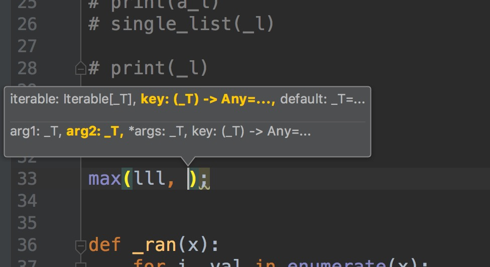
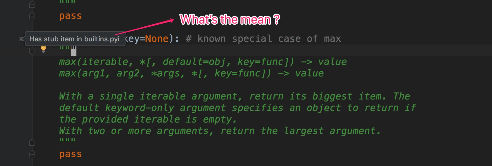
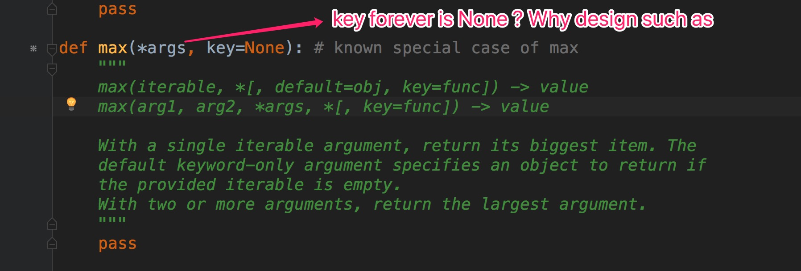

## 变量

```python

全局变量: 定义在函数外的变量
局部变量: 定义在函数内的变量
在函数内可以访问全局变量，不能修改全局变量
修改加 global 关键词 

```

### 默认参数 func(name='ly')

### 不定长参数  * func(*age) 


## 字典遍历

```python

dict = {'Name': 'Runoob', 'Age': 7}
for i,j in dict.items():
    print(i, ":\t", j)
    
 


```


## FAQ

- Python 为什么设计成 global 来修改全局变量

- Python 的 遍历 索引问题，哪个有

- 输出字典的item 时，为什么输出的时候 带了个 dict_items()

- python 中的循环深刻思考

- 2:33 源码开始结束哪里

- list.insert() 源码阅读分析

- has xxx in pyi file | 

- max((1,2,9), (8,1));

- webstorm 提示



- python pyi



- python max 源代码




- python call c Demo

- python 转 exe...

https://www.sohu.com/a/129059083_572440